# Architecture

This document explains how WebRTC-Demo is put together: the signaling server, the three clients (Web, Android, iOS), how a call is set up, how media sources are switched, and how end-to-end encryption (E2EE) and backgrounds and effects work on every platform.

- [1. Big picture](#1-big-picture)
- [2. Repository layout](#2-repository-layout)
- [3. Signaling server](#3-signaling-server)
- [4. Call lifecycle](#4-call-lifecycle)
- [5. Web client](#5-web-client)
- [6. Android client](#6-android-client)
- [7. iOS client](#7-ios-client)
- [8. Switching media sources](#8-switching-media-sources)
- [9. End-to-end encryption](#9-end-to-end-encryption)
- [10. Backgrounds and effects](#10-backgrounds-and-effects)
- [11. Data channel (chat)](#11-data-channel-chat)
- [12. Versions and build](#12-versions-and-build)
- [13. Limitations](#13-limitations)

---

## 1. Big picture

Two peers join the same room through a small Socket.IO signaling server. The server only relays control messages (SDP, ICE candidates, E2EE key). Audio, video and data channel traffic go **directly peer to peer** over WebRTC; Google's public STUN server is used to discover public addresses.

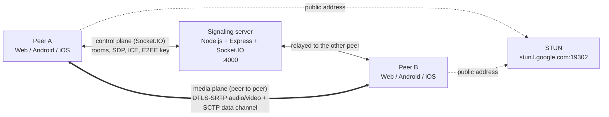

Any client can call any other client (Web ↔ Android ↔ iOS). A room holds at most **2 participants** (1:1 calls).

| Piece | Tech | Entry point |
|---|---|---|
| Signaling server | Node.js, Express, Socket.IO | `signaling-server/server.js` |
| Web client | Vue 3, TypeScript, Vite, Tailwind v4, shadcn-vue (reka-ui), Lucide, motion-v, MediaPipe Tasks Vision | `web/src/App.vue`, `web/src/call/useCall.ts` |
| Android client | Kotlin, Jetpack Compose + Material 3 Expressive, `io.github.webrtc-sdk:android`, MediaPipe Tasks Vision, socket.io-client | `android/app/src/main/java/com/example/myapplication/MainActivity.kt` |
| iOS client | Swift, SwiftUI + Liquid Glass (iOS 26), pod `WebRTC-SDK`, Vision, Core Image, Socket.IO-Client-Swift | `ios/WebRTCDemo/WebRTCDemoApp.swift` |
| iOS broadcast extension | ReplayKit, Unix domain socket | `ios/WebRTCDemoScreenBroadcast/SampleHandler.swift` |

---

## 2. Repository layout

```text
WebRTC-Demo/
├── signaling-server/          Socket.IO relay (rooms, SDP, ICE, E2EE key)
│   └── server.js
├── effects/                   Backgrounds and stickers bundled by all three apps
│   ├── backgrounds.json, stickers.json
│   └── backgrounds/, thumbnails/, stickers/
├── tools/prepare_effects.py   Turns downloads in effects-source/ into effects/backgrounds
├── web/                       Vue 3 single-page client
│   └── src/
│       ├── App.vue            Lobby ↔ call transition, theme, toasts
│       ├── call/
│       │   └── useCall.ts     Signaling, RTCPeerConnection, media sources, effects, E2EE wiring, chat
│       ├── effects/
│       │   ├── catalog.ts     Reads the effects folder, saved selection
│       │   ├── placement.ts   Sticker placement from face points, smoothing
│       │   └── EffectsProcessor.ts  MediaPipe segmentation + face landmarks, canvas compositing (loaded on demand)
│       ├── components/
│       │   ├── lobby/         Lobby screen
│       │   ├── call/          Call screen: stage, local tile, toolbar, chat, More drawer, PiP view
│       │   └── ui/            shadcn-vue components
│       ├── composables/       Picture-in-picture, safe area, layout breakpoints
│       ├── e2ee.ts            FrameCryptor-compatible frame encryption (shared with the worker)
│       └── encryptionWorker.ts  Web Worker running the E2EE transforms
├── android/app/src/main/
│   ├── java/com/example/myapplication/
│   │   ├── MainActivity.kt        Hosts the Compose lobby, starts CallActivity
│   │   ├── CallActivity.kt        Hosts the Compose call screen: permissions, pickers, MediaProjection, PiP
│   │   ├── ScreenCaptureService.kt  Foreground service required by MediaProjection
│   │   ├── call/CallViewModel.kt  Call state (StateFlow), owns PeerConnectionClient and the EGL context
│   │   ├── effects/EffectsCatalog.kt  Reads assets/effects, saved selection
│   │   ├── ui/
│   │   │   ├── lobby/LobbyScreen.kt     Room id, E2EE switch, join button
│   │   │   ├── call/                    CallScreen, CallControls (floating toolbar, sheets),
│   │   │   │                            ChatSheet, EffectsSheet, PeerPlaceholder, CallPreviews
│   │   │   ├── video/                   TextureViewRenderer, VideoRenderer (Compose), FrameSnapshotter
│   │   │   └── theme/Theme.kt           MaterialExpressiveTheme, dynamic color
│   │   └── webrtc/
│   │       ├── PeerConnectionClient.kt  Factory, capturers, sources, tracks, lifecycle
│   │       ├── WebRtcPeer.kt            One RTCPeerConnection + data channel + cryptors
│   │       ├── SignalingHandler.kt      Socket.IO events <-> WebRtcPeer
│   │       ├── E2eeManager.kt           FrameCryptor key provider
│   │       ├── Mp4VideoCapturer.kt      Video file -> SurfaceTexture capturer
│   │       └── effects/                 EffectsProcessor (GLES), SelfieSegmenter, FaceTracker,
│   │                                    BackgroundVideo, StickerPlacement
│   ├── java/org/webrtc/Camera{1,2}Helper.kt  Camera capture formats (package-private webrtc API)
│   └── assets/                     selfie_segmenter.tflite, face_landmarker.task (effects/ is copied in at build time)
└── ios/
    ├── WebRTCDemo/
    │   ├── WebRTCDemoApp.swift          @main SwiftUI app: lobby, call as a full screen cover
    │   ├── LobbyView.swift              Room id, E2EE toggle, join button
    │   ├── CallViewModel.swift          @Observable call state + Socket.IO signaling
    │   ├── CallView.swift               Call screen: remote stage, local PiP, top bar, overlays
    │   ├── CallControls.swift           Glass toolbar, share menu, "More" sheet
    │   ├── ChatView.swift               Chat sheet
    │   ├── PeerPlaceholderView.swift    Blurred last frame + speaking avatar
    │   ├── VideoView.swift              RTCMTLVideoView wrapper, FrameSnapshotter
    │   ├── PictureInPicture.swift       System PiP: AVSampleBufferDisplayLayer renderer
    │   ├── PeerConnectionClient.swift   class WebRTCClient: factory, tracks, capturers, E2EE
    │   ├── EffectsCatalog.swift         Reads the bundled effects folder, saved selection, sticker placement
    │   ├── EffectsProcessor.swift       Vision + Core Image proxy capturer delegate
    │   ├── EffectsSheet.swift           Backgrounds and filters picker with a live preview
    │   ├── FlutterBroadcastScreenCapturer.*  Screen capturer fed by the broadcast extension
    │   └── FlutterSocketConnection*.*        Unix socket server + frame reader (from flutter-webrtc)
    ├── WebRTCDemoScreenBroadcast/       ReplayKit upload extension
    └── Podfile
```

---

## 3. Signaling server

The server keeps rooms in memory and relays every message to **the other** socket in the room (`socket.broadcast.to(roomId)`). It never parses SDP or touches media.

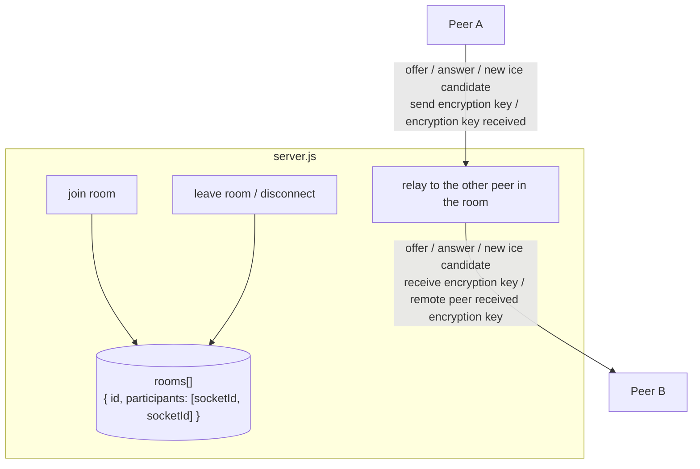

| Client emits | Server sends to the other peer | Purpose |
|---|---|---|
| `join room {roomId}` | `new user joined` (to the peer already in the room) | First joiner creates the room, second joiner triggers the call. A third one gets `message: Room is full`. |
| `offer {offer, roomId}` | `offer {offer}` | SDP offer (initial call and every renegotiation) |
| `answer {answer, roomId}` | `answer {answer}` | SDP answer |
| `new ice candidate {iceCandidate, roomId}` | `new ice candidate {iceCandidate}` | Trickle ICE |
| `send encryption key {encryptionKey, roomId}` | `receive encryption key {encryptionKey}` | 32 bytes of E2EE key material (binary attachment) |
| `encryption key received {roomId}` | `remote peer received encryption key` | Acknowledgement, logged only |
| `media state {roomId, state: {audio, video, screen}}` | `media state {state}` | The sender's microphone/camera on or off, and whether it shares content. See [section 4](#4-call-lifecycle). |
| `leave room {roomId}` | – | Web leaves without closing the socket |

Socket.IO keeps per-socket order, so a key emitted before an offer always reaches the remote peer before that offer.

---

## 4. Call lifecycle

The peer that is **already in the room** is always the offerer. The peer that joins second answers.

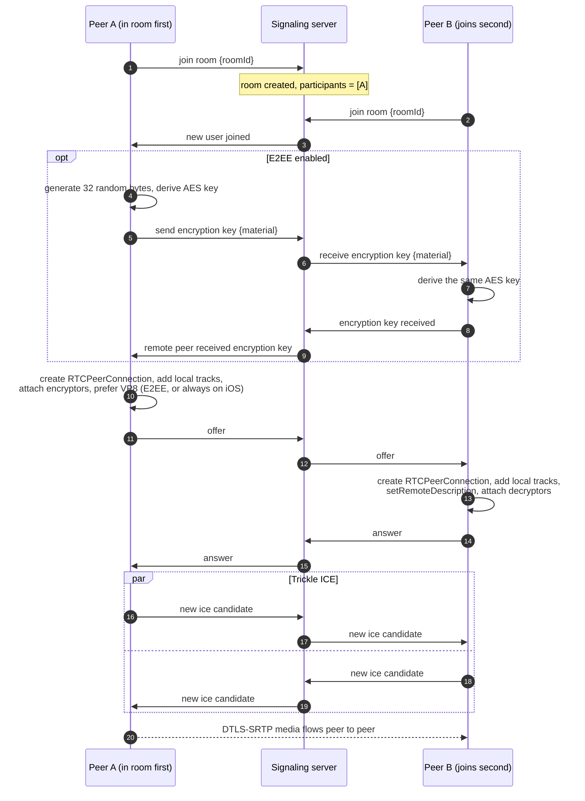

The offerer also creates the chat data channel before this first offer (see [section 11](#11-data-channel-chat)), so chat does not renegotiate.

Renegotiation reuses the same `offer` / `answer` events. None of the clients renegotiates to switch media sources (see [section 8](#8-switching-media-sources)). It only happens when an older client offered without a chat channel and one is added later.

Connection state as seen by the UI:

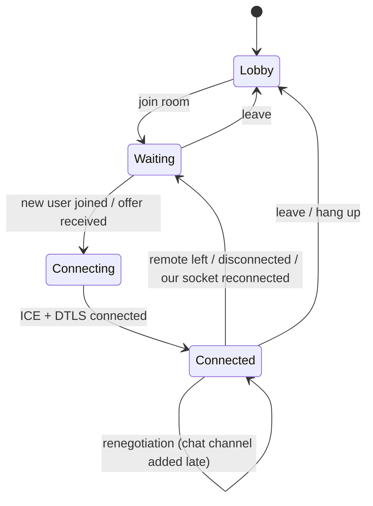

### Socket reconnects

The server removes a socket from its room when the socket disconnects. A client whose socket drops and reconnects (for example when the network goes away for a moment while Android shares its screen from the background) therefore:

1. closes its peer connection, because the server no longer counts it as being in the call;
2. emits `join room` again;
3. gets a fresh offer from the peer still in the room, which receives `new user joined` and closes its own old connection before offering.

The Android client drops offers, answers and ICE candidates emitted while the socket is offline. socket.io would otherwise flush them after the reconnect, and they would reach the new call. Callbacks from a replaced or disposed peer connection are ignored on every platform. On Android, calling a disposed native `PeerConnection` crashes the process.

### Media state

A disabled video track still sends (black) frames, so the remote side cannot tell "camera off" from a dark room by looking at the video. Each client therefore reports its own state with `media state`: on every change, and again when the peers connect so a late joiner gets the current state. `screen` is true while a screen or a video file is shared; the native clients then show the remote video letterboxed (fit) instead of cropped.

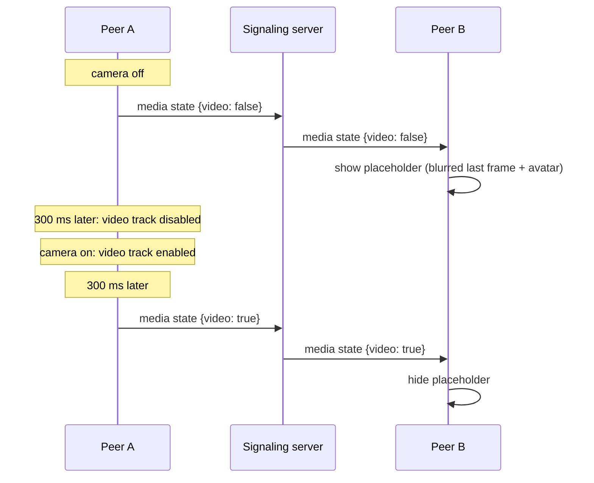

The 300 ms gap makes sure the peer never sees the black frames of a disabled track, nor the last frozen frame before the first new one arrives.

While the remote video is paused (turned off by the peer, or hidden locally), each client shows the **placeholder**: a 36 px wide copy of the last non-black frame (taken every 500 ms), blurred, behind a gradient avatar. iOS takes it in a small video sink on the CPU frame. Android reads it back from the renderer after drawing (`EglRenderer.addFrameListener`). Converting a decoder texture with `toI420()` inside a track sink blocks frame delivery on the decoder's texture thread, and froze the remote video when the decoder was recreated during a renegotiation. The avatar colors come from a hash of the room id, the same on Android and iOS. Its ring follows the remote `audioLevel` from `getStats()` (`inbound-rtp`, kind audio), polled every 250 ms only while the placeholder is visible.

Muting the peer's audio and hiding the peer's video are local only: they disable the remote track on this device and send nothing.

---

## 5. Web client

The call engine is a singleton composable, `useCall()` in `web/src/call/useCall.ts`. It owns the socket, the `RTCPeerConnection`, the local media and the chat, and exposes the state as refs. The components only render that state and call its actions. E2EE transforms run in a dedicated worker so encryption never blocks rendering.

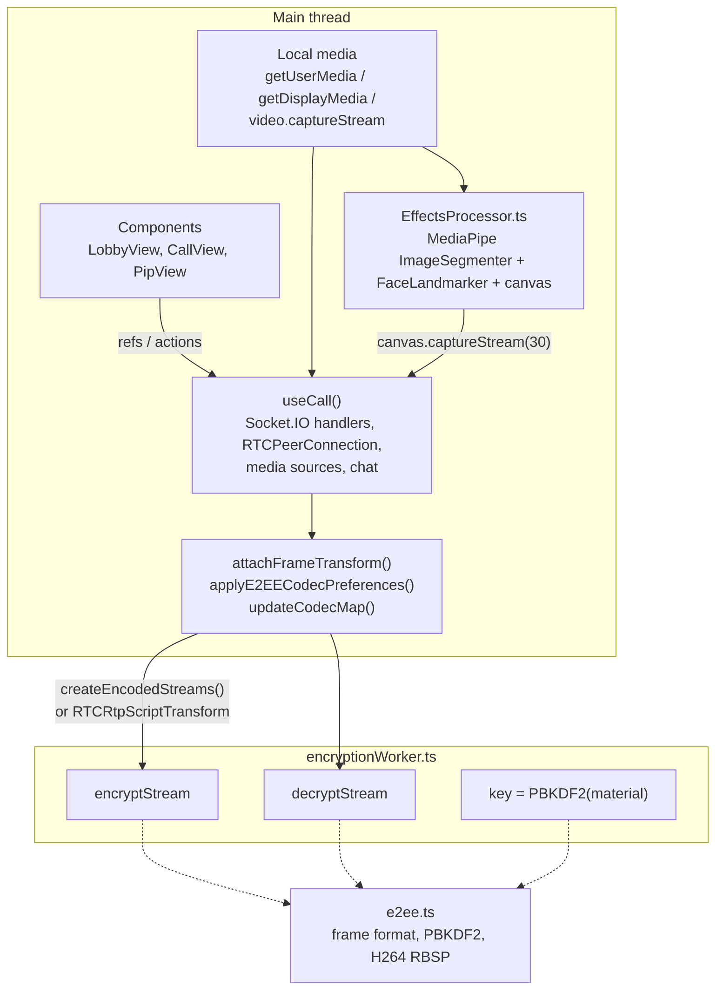

### Local media

Each source has its own track: microphone, camera, screen, video file, and the canvas track of the effects. `outgoingVideoTrack()` picks the one to send (screen or file while sharing, else the effects canvas when an effect is on, else the camera), and `syncVideo()` puts it on the video sender with `replaceTrack()` and updates the local preview. The sender (and its E2EE transform) stays the same, so no renegotiation is needed. The microphone track is never replaced, so muting keeps working while sharing.

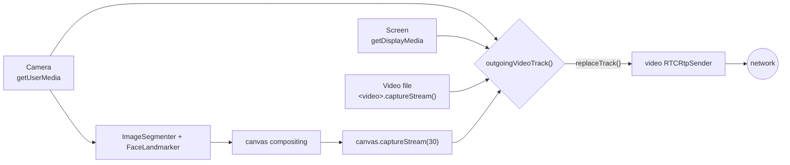

Turning the camera off stops the camera track (the light goes off). Sharing stops it as well, and stopping the share opens the camera again. The remote audio plays from one hidden `<audio>` element; every `<video>` element is muted, so the preview, the stage and the PiP window never play it twice.

MediaPipe is most of the bundle, so `EffectsProcessor.ts` is imported the first time an effect is turned on. When the tab is hidden, the compositing loop switches from `requestAnimationFrame` (paused in background tabs) to timers, so the peer keeps receiving frames while the call is in picture-in-picture.

### UI

- **Lobby.** Two columns on wide screens and on a phone held sideways (a `short:` variant, landscape with a height of 540 px or less), one column otherwise. It follows the system light or dark theme. The call screen is always dark.
- **Stage.** The remote video fills the stage; double tap (or `F`) switches between fill and fit. It starts in fit when the remote side shares a screen or when its orientation differs from the window, like the native apps. When the remote camera is off, a blurred snapshot of its last frame sits behind an avatar with an audio-level ring.
- **Local tile.** The tile is driven by motion values. Dragging projects the release velocity to choose a corner, and the tile snaps there with a spring. Its limits follow the top bar and the toolbar, which hide after 4 s without input.
- **Chat.** A side panel at 1024 px and wider, a bottom drawer below. New messages also show as bubbles above the toolbar for a few seconds.
- **Controls.** The toolbar has tooltips with shortcuts on desktop (`M` mic, `V` camera, `C` chat, `B` backgrounds and effects, `F` fit, `P` picture-in-picture). On phones, `More` opens a drawer with the remaining options. All chrome stays clear of the safe area insets.

### Picture-in-picture

`usePictureInPicture()` in `web/src/composables/usePictureInPicture.ts` uses the Document Picture-in-Picture API where it exists (Chromium desktop) and falls back to video picture-in-picture.

- **Document PiP.** `documentPictureInPicture.requestWindow()` opens an always-on-top window that stays visible over other tabs and apps. The page's stylesheets are copied into it, and `PipView` is rendered there through `<Teleport>`: the remote video, the local tile, status chips, and mic, camera and hang-up buttons on hover. Its animations are CSS only, because the tab that owns the Vue app is hidden and its `requestAnimationFrame` does not run.
- **Opening it automatically.** While a peer is connected, the page registers the `enterpictureinpicture` Media Session action. Chrome 134 and later then opens the window when the user switches to another tab, as Google Meet does. Switching to another app does not open it; the PiP button (or `P`) does.
- **Fallback.** Other browsers put the remote `<video>` itself into picture-in-picture (`requestPictureInPicture()`, or `webkitSetPresentationMode('picture-in-picture')` on iOS Safari). That window only shows the remote video.

### Hang-up detection

Besides the ICE `connectionState` (`disconnected` / `failed`), the web client treats the data channel closing on a live connection as the other side hanging up. The native clients close the channel only when they leave, and the SCTP close arrives at once, while ICE takes several seconds to notice.

### Signaling server address

The default is port 4000 on the host that serves the page. The lobby shows the address with a live connection status, and editing it reconnects the socket. `web/src/call/serverUrl.ts` normalizes the address to `scheme://host[:port]` (a path would be read as a Socket.IO namespace) and saves it in `localStorage` when it differs from the default.

---

## 6. Android client

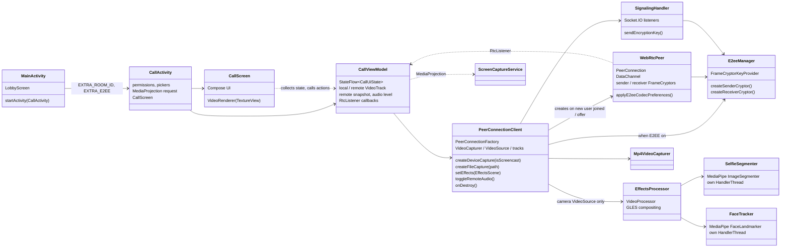

The UI is Jetpack Compose with Material 3 Expressive (`MaterialExpressiveTheme`, `HorizontalFloatingToolbar`, `LoadingIndicator`, shape morphing toggle buttons, `MotionScheme.expressive()`). `CallViewModel` survives rotation and owns the WebRTC client and the shared `EglBase`, so the call keeps running while the activity is recreated. `CallContent` is stateless and takes the two video surfaces as slots, which lets `CallPreviews.kt` render the whole screen with fake video.

Video is drawn by `TextureViewRenderer`, a `TextureView` fed by an `EglRenderer`. Unlike `SurfaceViewRenderer`, a `TextureView` can be clipped, rounded and animated with the rest of the Compose tree, which the picture-in-picture needs. The renderer always fills its view (center crop). `VideoSurface` therefore lays the renderer out at the frame's aspect ratio, just large enough to cover the screen, and "fit" scales it down with a `graphicsLayer`. Toggling fit and fill is then a GPU-only animation that never resizes the `TextureView`. iOS does the same in `StageVideoView`.

Threads that matter:

| Thread | Owner | Work |
|---|---|---|
| Main | Android | UI, `PeerConnectionClient` public calls |
| Socket.IO event thread | socket.io-client | `SignalingHandler` callbacks, `createOffer` |
| WebRTC signaling thread | webrtc-sdk | `PeerConnection.Observer` callbacks (`onAddTrack`, ICE) |
| `CaptureThread` | `SurfaceTextureHelper` | camera frames, `EffectsProcessor` GL work |
| `SegmenterInference` | `SelfieSegmenter` | MediaPipe person mask |
| `FaceTracker` | `FaceTracker` | MediaPipe face landmarks |

### Picture-in-picture

`CallActivity` declares `supportsPictureInPicture` and handles size changes itself (`configChanges`), so entering and leaving the floating window never recreates it.

- **Entering PiP.** Once a peer is connected, the PiP params set `setAutoEnterEnabled(true)` on Android 12+, and the home gesture moves the call into the window. Older versions do the same from `onUserLeaveHint`. The top bar also has a PiP button.
- **Aspect ratio.** It follows the remote frame size reported by the renderer, clamped to the 1:2.39 to 2.39:1 range the system accepts.
- **Content.** In the window `CallContent` shows only the remote video. Controls, sheets, chat bubbles and the local tile are hidden. The local tile is hidden rather than removed, so it keeps its corner.
- **Closing the window.** The activity stops without coming back (`Lifecycle.State.CREATED` when PiP mode ends). Nothing keeps the camera and microphone alive in the background, so the activity finishes and the call ends.

### Rotation

Neither activity locks its orientation. `MainActivity` is recreated on rotation. `CallActivity` handles the change itself (its `configChanges` are there for PiP), so the call, the renderers and the capturer survive it.

- **Lobby.** When the window is wider than tall and at least 560dp wide, `LobbyScreen` shows the title and the form side by side. Each pane scrolls on its own and stays centered while it fits.
- **Call chrome.** The top bar, toolbar, chat bubbles, waiting card and the local tile's corners keep clear of `systemBars ∪ displayCutout` on every side, which in landscape puts the cutout and the navigation bar on the left or right. The IME is left out on purpose: it only opens over the chat sheet, and the controls behind it should not move.
- **Sheets.** The More sheet scrolls, and the chat sheet takes the full height in landscape instead of 70%.
- **Remote fit.** The default switches to fit when the remote frame and the screen have different orientations; see the README.
- **Camera.** `Camera2Session` tags every frame with the device rotation, so the peer sees an upright picture whichever way the phone is held. The local tile follows the rotated frame size.
- **Screen share.** `ScreenCapturerAndroid` keeps the size it started with. `ScreenCaptureService` is still running while the user shares another app, so it receives `onConfigurationChanged` and calls `PeerConnectionClient.onDisplayChanged()`, which resizes the virtual display with `changeCaptureFormat` (`VirtualDisplay.resize` in this SDK, so the MediaProjection is not reused for a second display).

The signaling server address can be changed in the lobby. `settings/SignalingServer.kt` normalizes it and saves it in `SharedPreferences`; the default is `serverAddress` in `android/app/src/main/res/values/strings.xml`. `MainActivity` passes the address to `CallActivity` as an intent extra, which `CallViewModel` reads from its `SavedStateHandle`.

---

## 7. iOS client

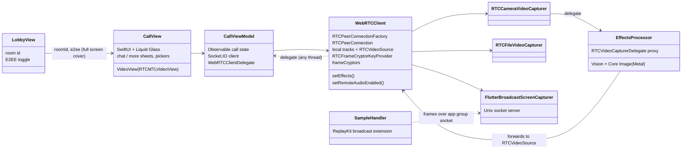

The UI is SwiftUI with Liquid Glass (`glassEffect`, `GlassEffectContainer`, `.glass` / `.glassProminent` button styles), so the deployment target is iOS 26. `CallViewModel` is an `@Observable` class; `WebRTCClient` calls its delegate from WebRTC and socket threads, and the view model hops to the main queue before touching state. `WebRTCClient` no longer owns any view: it exposes the local video track and reports the remote one through the delegate, and `VideoView` attaches an `RTCMTLVideoView` to whichever track it is given (`scaleAspectFill` for fill, `scaleAspectFit` for fit).

Screen sharing uses a ReplayKit broadcast upload extension. The extension cannot run WebRTC itself, so it sends the screen frames to the app through a Unix domain socket in the shared app group, and `FlutterBroadcastScreenCapturer` feeds them into the **same** `RTCVideoSource` the camera uses:

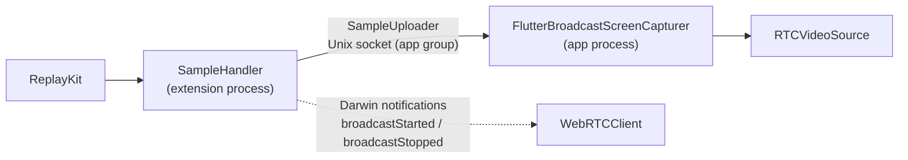

Each frame is sent as an HTTP-style message: `Content-Length`, `Buffer-Width`, `Buffer-Height` and `Buffer-Orientation` headers, then a JPEG body. On the app side, `FlutterSocketConnection` accepts the extension's connection and reads it on its own thread, and `FlutterSocketConnectionFrameReader` asks the stream for exactly the bytes still missing from the current frame, decodes the JPEG into a `CVPixelBuffer` and hands it to `RTCVideoSource`. A frame must be completed before the next read: a read of 0 bytes is reported as end of stream, the app closes the socket and the extension stops with "Screen sharing stopped".

The broadcast keeps going when the user leaves the app, which needs two things:

- **The app process stays alive.** `UIBackgroundModes` has `audio` and `voip`, and the call keeps an active `playAndRecord` audio session, so iOS does not suspend the app (and its socket server) in the background.
- **The video encoder keeps working.** H264 is encoded by the VideoToolbox hardware encoder, which iOS invalidates while the app is in the background; every frame then fails and the remote side sees a frozen picture. So iOS always puts **VP8** (software) first in its codec preferences, with or without E2EE.

The remote peer's audio can be muted locally ("Peer audio" in the More sheet): `setRemoteAudioEnabled()` disables the audio track of every receiver, including receivers added later by a renegotiation. Nothing is sent to the remote peer. Android does the same in `WebRtcPeer` with the tracks from `onAddTrack`, and web does it with `track.enabled` on the remote stream.

### Picture-in-picture

The call uses video-call PiP: an `AVPictureInPictureController` with an `activeVideoCallSourceView` content source (the remote stage) and an `AVPictureInPictureVideoCallViewController`.

- **Rendering.** The system window cannot show the `RTCMTLVideoView`, so `PictureInPictureRenderer` is added to the remote track as a second sink. Between `willStart` and `didStop` it enqueues frames into an `AVSampleBufferDisplayLayer`. Hardware-decoded `RTCCVPixelBuffer`s go in as they are. Software-decoded I420 frames, which is what VP8 produces, are copied into pooled NV12 pixel buffers. The frame rotation is applied as a layer transform.
- **Size.** The window's `preferredContentSize` follows the rotated frame size.
- **Starting.** `canStartPictureInPictureAutomaticallyFromInline` is on while a peer is connected, so leaving the app opens the window. The top bar also shows a PiP button while `isPictureInPicturePossible` is true.
- **Camera in the background.** The camera capture session turns on `isMultitaskingCameraAccessEnabled` where `isMultitaskingCameraAccessSupported`, so the peer keeps seeing you while the call is in PiP. Elsewhere iOS pauses the camera in the background.

### Rotation

The target allows portrait and both landscape orientations on iPhone, and every orientation on iPad.

- **Lobby.** With a compact vertical size class (an iPhone on its side), `LobbyView` puts the title and the form in two columns.
- **Call.** The call screen lays out inside the `GeometryReader`'s safe area, so the chrome and the local tile's corners already keep clear of the Dynamic Island and the home indicator in landscape. The sheets scroll.
- **Remote fit.** `StageVideoView` reports the rotated frame size, and `CallView` defaults to fit when it does not match the screen's orientation.
- **Camera.** `RTCCameraVideoCapturer` tags frames with the device orientation.

The signaling server address can be changed in the lobby. `SignalingServer.swift` normalizes it and saves it in `UserDefaults`; `CallViewModel` reads it when a call starts. `Info.plist` allows plain HTTP (`NSAllowsArbitraryLoads`) so any LAN server works, as `usesCleartextTraffic` does on Android.

---

## 8. Switching media sources

Each platform switches between camera, screen and video file in a different way. This matters for E2EE, because a cryptor/transform is bound to one `RtpSender` / `RtpReceiver`.

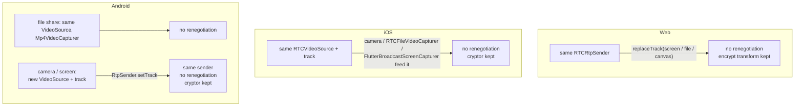

| Platform | Camera ↔ screen | Camera ↔ file | Renegotiation |
|---|---|---|---|
| Web | `replaceTrack` | `replaceTrack` | no |
| iOS | same `RTCVideoSource` | same `RTCVideoSource` | no |
| Android | new video track, `RtpSender.setTrack` | same `VideoSource`, new capturer (back to camera with `setTrack`) | no |

Android gives the screen its own `VideoSource` because only a screencast source adapts by frame rate instead of resolution. The audio track is never replaced. A renegotiation would recreate the receive streams, and so the video decoders, on both sides; on Android the remote video then froze after a few frames.

---

## 9. End-to-end encryption

### 9.1 Where encryption happens

WebRTC already encrypts media hop by hop with DTLS-SRTP. E2EE adds a second layer **on the encoded frame**, before packetization, so that anything relaying RTP (a TURN server, a future SFU) only sees ciphertext.

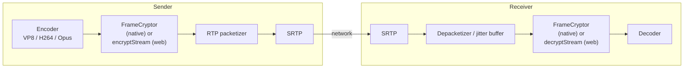

| Platform | Mechanism | Code |
|---|---|---|
| Web | Insertable Streams: `createEncodedStreams()` (Chrome) or `RTCRtpScriptTransform` (Safari, Firefox), running in a worker | `web/src/e2ee.ts`, `web/src/encryptionWorker.ts`, `attachFrameTransform()` in `call/useCall.ts` |
| Android | `FrameCryptor` + `FrameCryptorKeyProvider` from webrtc-sdk | `webrtc/E2eeManager.kt`, `webrtc/WebRtcPeer.kt` |
| iOS | `RTCFrameCryptor` + `RTCFrameCryptorKeyProvider` from webrtc-sdk | `PeerConnectionClient.swift` (E2EE extension) |

The native `FrameCryptor` uses the LiveKit frame format. The web client implements the same format byte for byte, which is what makes Web ↔ Android ↔ iOS work.

### 9.2 Frame format

```text
 ┌──────────────────────┬───────────────────────────────────┬────────────┬──────┬──────────┐
 │ unencrypted header   │ AES-128-GCM ciphertext + 16B tag  │ IV (12 B)  │ 0x0C │ keyIndex │
 └──────────────────────┴───────────────────────────────────┴────────────┴──────┴──────────┘
   additional data (AAD)                                       random/frame  IV len  1 byte
```

| Codec | Unencrypted header | Why |
|---|---|---|
| VP8 | 10 bytes on key frames, 3 bytes on delta frames | The payload header stays readable, so the packetizer and decoder can still parse frame type and size |
| H264 | up to and including the first slice NAL header + 1 byte (`...00 00 01 \| NAL type 1 or 5`) | NAL structure and SPS/PPS stay readable; the encrypted part is RBSP-escaped so it never contains a start code |
| Opus | 1 byte (TOC) | Frame configuration stays readable |

Frames that are empty, or that cannot be encrypted/decrypted (no key yet, wrong key, broken frame), are **dropped**, never forwarded in plain form.

### 9.3 Key derivation and key exchange

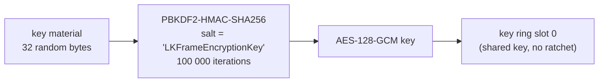

Key provider options are identical on all three platforms. If any of them differ, the peers derive different keys or produce a different trailer, and the remote side cannot decrypt:

| Option | Value |
|---|---|
| shared key mode | `true` |
| ratchet salt | `"LKFrameEncryptionKey"` |
| ratchet window size | `0` |
| uncrypted magic bytes | none |
| failure tolerance | `-1` |
| key ring size | `16` |
| discard frame when cryptor not ready | `false` |
| key derivation | PBKDF2 |
| key index | `0` |

Only the raw key material travels through signaling (as a Socket.IO binary attachment: `ArrayBuffer` on web, `ByteArray` on Android, `Data` on iOS). Each side derives the AES key locally.

### 9.4 Codec negotiation

When E2EE is on, every platform puts **VP8 first** in the video codec preferences (`setCodecPreferences`) before creating the offer or the answer, so both sides use the codec whose header layout is most robust across implementations. iOS does this on every call, see [section 7](#7-ios-client). The web client also parses the negotiated SDP (`parseCodecMap`) to map RTP payload types to codecs, because `getMetadata().mimeType` is not available in every browser.

### 9.5 Cryptor lifecycle

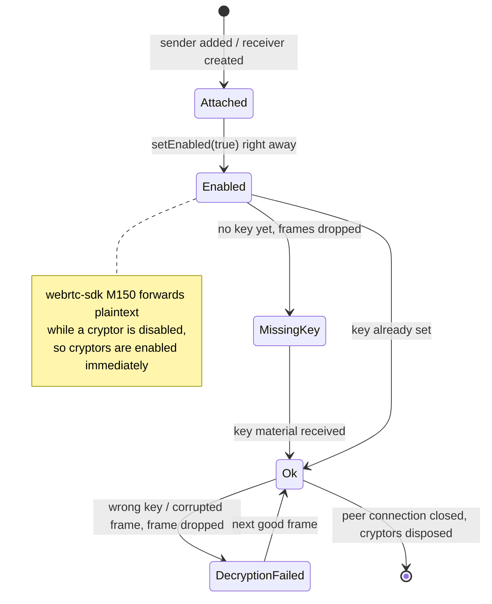

Both peers must enable E2EE. If only one does, the other side gets frames it cannot decode or decrypt, and remote video/audio stays black/silent.

---

## 10. Backgrounds and effects

Effects only process **camera** frames; screen share and file share are sent untouched. A background (none, blur, a picture or a looping video) and a face sticker can be combined.

### Shared assets

The `effects/` folder at the repository root is the single source for all three apps: Vite imports it with `import.meta.glob`, Android copies it into the APK's `assets/effects` with a generated asset source (`copyEffects` in `app/build.gradle.kts`), and iOS bundles it as a folder reference.

- `backgrounds.json` lists pictures and videos (`id`, `name`, `type`, `file`, `thumbnail`). It is written by `tools/prepare_effects.py` from `effects-source/`. Blur and none are built into each app.
- `stickers.json` lists stickers. Sizes and offsets are in units of the distance between the eyes, measured from the `anchor` (`eyes`, `nose` or `mouth`), with positive `offsetY` up the face. `height` is optional and stretches the artwork.
- An entry whose file is missing is skipped, and a saved choice that no longer exists falls back to none.

### Sticker placement

Every platform turns its face landmarks into four points (both eye centers, nose tip, mouth center) and runs the same placement code (`placement.ts`, `StickerPlacement.kt`, `StickerPlacement` in `EffectsCatalog.swift`):

- "Right" runs from one eye to the other and "up" from the mouth to the eyes, so the sticker follows a tilted head. The eye order comes from that up direction, so it does not matter which eye a detector calls left.
- The unit is the larger of the eye distance and eyes-to-mouth / 1.2, so stickers do not shrink when the head turns sideways.
- A smoother blends each placement with the previous one (40 % old) and keeps the last one through 6 missed detections.

### Starting with an effect on

The selection is saved (`localStorage`, `SharedPreferences`, `UserDefaults`). When a call starts with a saved effect, the camera frames are held (web: the first `replaceTrack` waits; Android and iOS: the processor drops camera frames) until the effect is loaded and the first mask is ready, so the peer never sees the real background first. If an effect cannot be loaded, the previous choice comes back with a toast.

| | Web | Android | iOS |
|---|---|---|---|
| Person mask | MediaPipe `ImageSegmenter` (`selfie_segmenter`), `categoryMask` | MediaPipe `tasks-vision` 1.0.0 (`selfie_segmenter`), confidence mask, 256 px input | Vision `VNGeneratePersonSegmentationRequest` (`.balanced`), every 2nd frame |
| Face points | MediaPipe `FaceLandmarker` | MediaPipe `FaceLandmarker` (`face_landmarker.task`), 384 px input | Vision `VNDetectFaceLandmarksRequest`, every 2nd frame |
| Blur | `ctx.filter = blur()` (downscaled draw on Safari) | downscale + separable Gaussian in two FBOs | `CIGaussianBlur` |
| Video background | hidden muted `<video>` | `MediaPlayer` into an OES `SurfaceTexture` | `AVPlayer` + `AVPlayerItemVideoOutput` |
| Compositing | 2D canvas | GLES fragment shader on the camera texture, sticker quad with premultiplied alpha | `CIBlendWithMask`, sticker `composited(over:)`, Metal `CIContext` |
| Output | `canvas.captureStream(30)` + `replaceTrack` | `TextureBuffer` frame (rotation 0) | `RTCCVPixelBuffer` (BGRA), original rotation |
| Hook point | separate `MediaStream` | `VideoSource.setVideoProcessor()` | proxy `RTCVideoCapturerDelegate` |

### Android pipeline

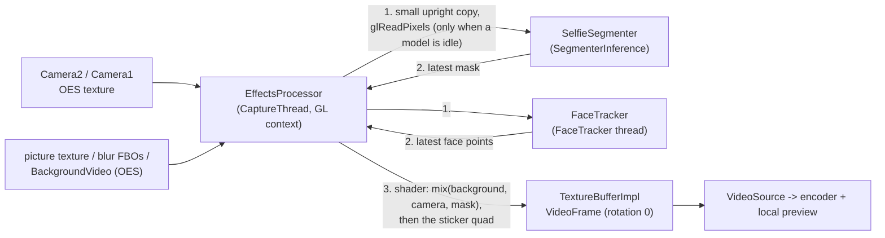

Full-resolution pixels never leave the GPU; only a small copy is read back for the models, and each model copies it before its own thread uses it. If a model is still busy, the frame uses its previous result instead of waiting.

### iOS pipeline

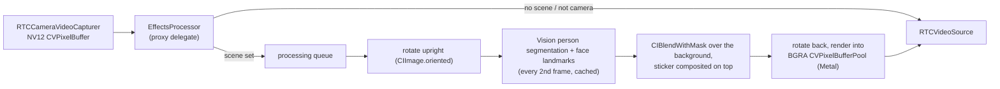

While a frame is being processed, new camera frames are dropped, so the capture queue never blocks and an unprocessed frame (with the real background) never slips through.

### Web pipeline

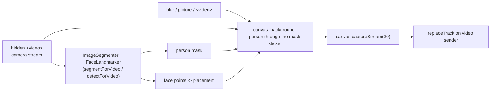

---

## 11. Data channel (chat)

The offerer (the peer already in the room) creates `"MyApp Channel"` before its first offer, so the SCTP m-line is negotiated together with audio and video. The answerer receives the channel through `ondatachannel` / `onDataChannel`. Opening the chat sheet is a UI action only.

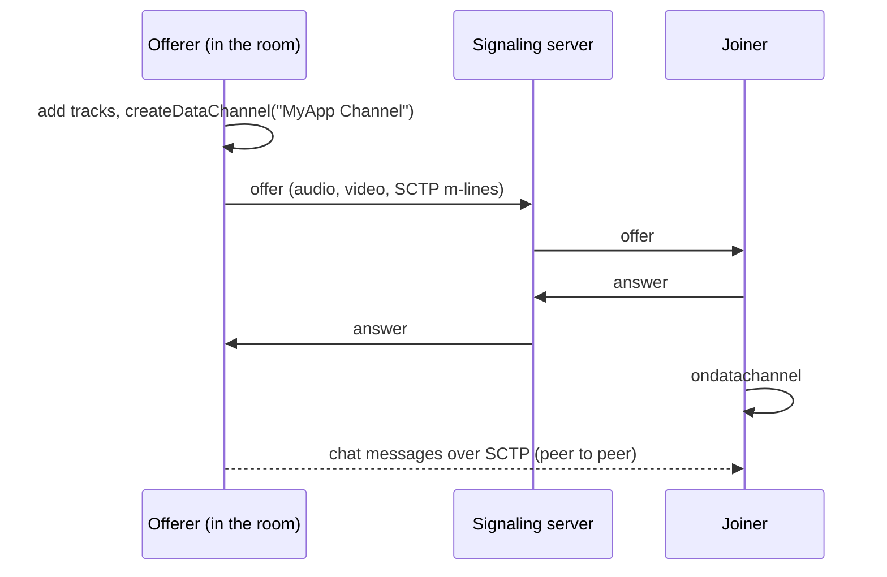

Chat used to create the channel lazily on first open, which renegotiated the call. The renegotiation offer from a peer that had only answered so far (for example iOS joining a room Android created) changed the receive parameters on the other side. Android then recreated its remote video decoder, and the remote video froze after a few frames. Each client still creates the channel on chat open, with one renegotiation, when the call has none. That only happens with an older client that offered without one.

---

## 12. Versions and build

| Component | Version | Notes |
|---|---|---|
| webrtc-sdk Android | `io.github.webrtc-sdk:android:150.7871.01` | `android/app/build.gradle.kts` |
| webrtc-sdk iOS | pod `WebRTC-SDK` `150.7871.01` | `ios/Podfile`; run `pod install --repo-update` after upgrading |
| MediaPipe Android | `com.google.mediapipe:tasks-vision:1.0.0` | models in `android/app/src/main/assets/` (`selfie_segmenter.tflite`, `face_landmarker.task`, stored uncompressed) |
| MediaPipe Web | `@mediapipe/tasks-vision` | models loaded from `storage.googleapis.com` |
| Jetpack Compose | BOM `2026.06.01`, `material3` `1.5.0-alpha18` | Material 3 Expressive is only in the 1.5 alphas. Newer Compose BOMs need AGP 9.1 and compileSdk 37 |
| Android Gradle Plugin | `8.13.2`, Gradle `9.5.1`, Kotlin `2.3.0` | compileSdk 36, minSdk 24 |
| iOS deployment target | 26.0 | Liquid Glass needs iOS 26; build with Xcode 26 |

```text
signaling-server:  npm install && npm run dev                 (port 4000)
web:               npm install && npm run dev                 (http://localhost:5173)
android:           ./gradlew :app:assembleDebug
ios:               cd ios && pod install --repo-update, then open WebRTCDemo.xcworkspace
```

---

## 13. Limitations

- **1:1 only.** Rooms hold two participants; more peers need a mesh or an SFU.
- **No TURN server.** Calls can fail behind symmetric NATs or strict firewalls.
- **Signaling is not secured.** Plain HTTP/WebSocket, no authentication; anyone with the room id can join.
- **E2EE key goes through the signaling server in plain form.** Fine for a demo; a real app should use a key agreement (e.g. ECDH) or a passphrase shared out of band.
- **E2EE is chosen in the lobby** and cannot be toggled during a call; both peers must choose the same setting.
- **iOS always sends VP8.** It is encoded in software, so it uses more CPU and battery than hardware H264; this is what keeps screen sharing alive in the background.