# Architecture

This document explains how WebRTC-Demo is put together: the signaling server, the three clients (Web, Android, iOS), how a call is set up, how media sources are switched, and how end-to-end encryption (E2EE) and virtual background work on every platform.

- [1. Big picture](#1-big-picture)
- [2. Repository layout](#2-repository-layout)
- [3. Signaling server](#3-signaling-server)
- [4. Call lifecycle](#4-call-lifecycle)
- [5. Web client](#5-web-client)
- [6. Android client](#6-android-client)
- [7. iOS client](#7-ios-client)
- [8. Switching media sources](#8-switching-media-sources)
- [9. End-to-end encryption](#9-end-to-end-encryption)
- [10. Virtual background](#10-virtual-background)
- [11. Data channel (chat)](#11-data-channel-chat)
- [12. Versions and build](#12-versions-and-build)
- [13. Limitations](#13-limitations)

---

## 1. Big picture

Two peers join the same room through a small Socket.IO signaling server. The server only relays control messages (SDP, ICE candidates, E2EE key). Audio, video and data channel traffic go **directly peer to peer** over WebRTC; Google's public STUN server is used to discover public addresses.

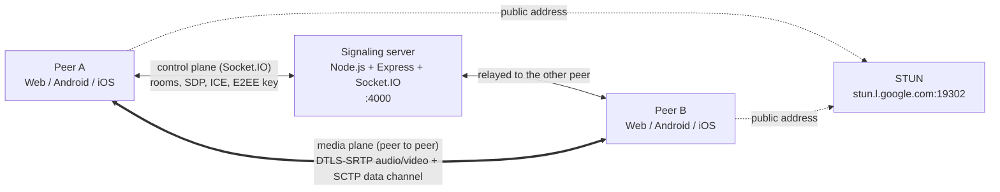

Any client can call any other client (Web ↔ Android ↔ iOS). A room holds at most **2 participants** (1:1 calls).

| Piece | Tech | Entry point |
|---|---|---|
| Signaling server | Node.js, Express, Socket.IO | `signaling-server/server.js` |
| Web client | Vue 3, TypeScript, Vite, Tailwind, MediaPipe Tasks Vision | `web/src/App.vue` |
| Android client | Kotlin, `io.github.webrtc-sdk:android`, MediaPipe Tasks Vision, socket.io-client | `android/app/src/main/java/com/example/myapplication/MainActivity.kt` |
| iOS client | Swift/UIKit, pod `WebRTC-SDK`, Vision, Core Image, Socket.IO-Client-Swift | `ios/WebRTCDemo/ViewController.swift` |
| iOS broadcast extension | ReplayKit, Unix domain socket | `ios/WebRTCDemoScreenBroadcast/SampleHandler.swift` |

---

## 2. Repository layout

```text
WebRTC-Demo/
├── signaling-server/          Socket.IO relay (rooms, SDP, ICE, E2EE key)
│   └── server.js
├── web/                       Vue 3 single-page client
│   └── src/
│       ├── App.vue            UI + signaling + RTCPeerConnection + virtual background
│       ├── e2ee.ts            FrameCryptor-compatible frame encryption (shared with the worker)
│       └── encryptionWorker.ts  Web Worker running the E2EE transforms
├── android/app/src/main/
│   ├── java/com/example/myapplication/
│   │   ├── MainActivity.kt        Lobby: room id + E2EE switch
│   │   ├── CallActivity.kt        Call UI, permissions, share menu, chat sheet
│   │   ├── ScreenCaptureService.kt  Foreground service required by MediaProjection
│   │   └── webrtc/
│   │       ├── PeerConnectionClient.kt  Factory, capturers, sources, tracks, lifecycle
│   │       ├── WebRtcPeer.kt            One RTCPeerConnection + data channel + cryptors
│   │       ├── SignalingHandler.kt      Socket.IO events <-> WebRtcPeer
│   │       ├── E2eeManager.kt           FrameCryptor key provider
│   │       ├── Mp4VideoCapturer.kt      Video file -> SurfaceTexture capturer
│   │       └── vbg/                     Virtual background (MediaPipe + GLES)
│   └── assets/selfie_segmenter.tflite
└── ios/
    ├── WebRTCDemo/
    │   ├── ViewController.swift         Lobby: room id + E2EE switch
    │   ├── CallViewController.swift     Call UI + Socket.IO signaling
    │   ├── PeerConnectionClient.swift   class WebRTCClient: factory, tracks, capturers, E2EE
    │   ├── VirtualBackgroundProcessor.swift  Vision + Core Image proxy capturer delegate
    │   └── FlutterBroadcastScreenCapturer.*  Receives frames from the broadcast extension
    ├── WebRTCDemoScreenBroadcast/       ReplayKit upload extension
    └── Podfile
```

---

## 3. Signaling server

The server keeps rooms in memory and relays every message to **the other** socket in the room (`socket.broadcast.to(roomId)`). It never parses SDP or touches media.

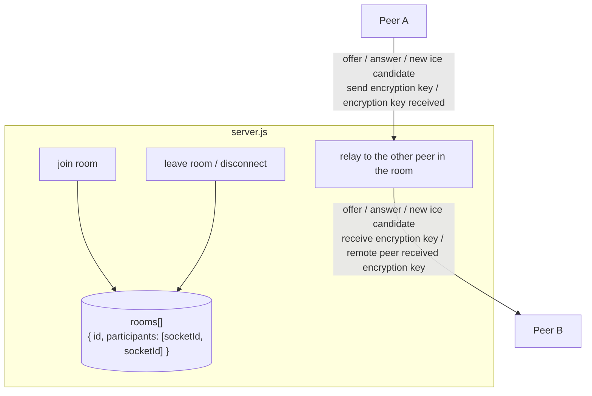

| Client emits | Server sends to the other peer | Purpose |
|---|---|---|
| `join room {roomId}` | `new user joined` (to the peer already in the room) | First joiner creates the room, second joiner triggers the call. A third one gets `message: Room is full`. |
| `offer {offer, roomId}` | `offer {offer}` | SDP offer (initial call and every renegotiation) |
| `answer {answer, roomId}` | `answer {answer}` | SDP answer |
| `new ice candidate {iceCandidate, roomId}` | `new ice candidate {iceCandidate}` | Trickle ICE |
| `send encryption key {encryptionKey, roomId}` | `receive encryption key {encryptionKey}` | 32 bytes of E2EE key material (binary attachment) |
| `encryption key received {roomId}` | `remote peer received encryption key` | Acknowledgement, logged only |
| `leave room {roomId}` | – | Web leaves without closing the socket |

Socket.IO keeps per-socket order, so a key emitted before an offer always reaches the remote peer before that offer.

---

## 4. Call lifecycle

The peer that is **already in the room** is always the offerer. The peer that joins second answers.

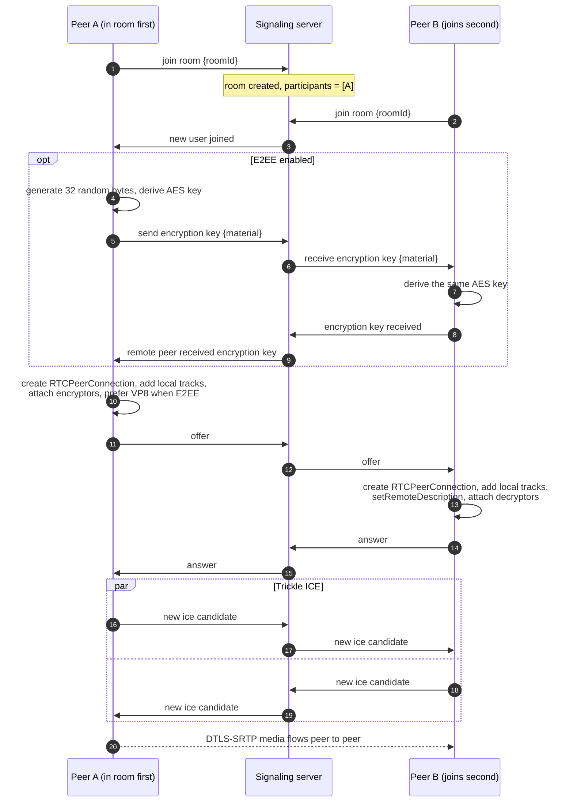

Renegotiation reuses the same `offer` / `answer` events. It happens when:

- the chat sheet is opened for the first time (a data channel is created, see [section 11](#11-data-channel-chat));
- Android switches between camera and screen share (tracks are removed and added again, see [section 8](#8-switching-media-sources)).

Connection state as seen by the UI:

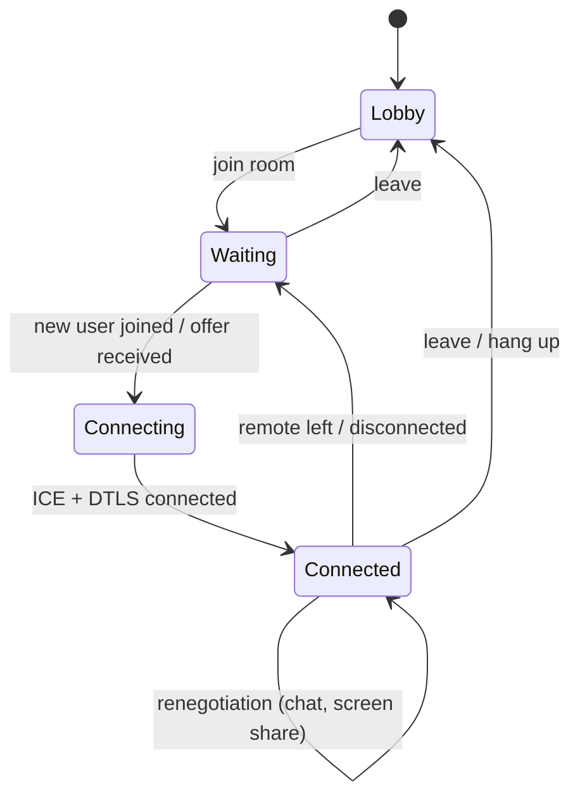

---

## 5. Web client

Everything except the crypto runs in `App.vue`. E2EE transforms run in a dedicated worker so encryption never blocks rendering.

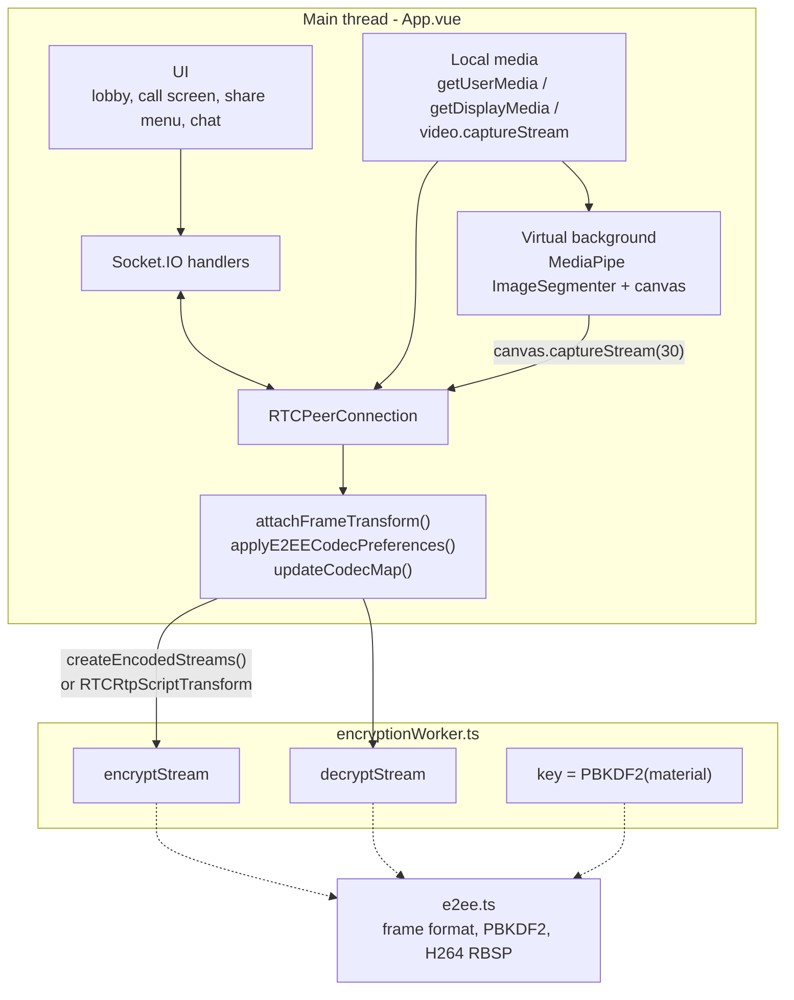

Local media pipeline. All source switches use `RTCRtpSender.replaceTrack()`, so the sender (and its E2EE transform) stays the same and no renegotiation is needed:

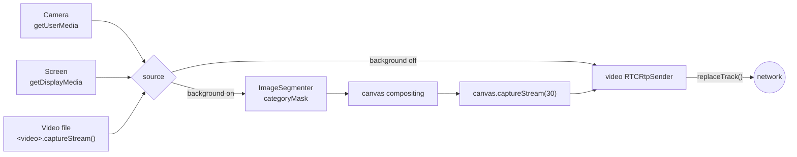

The signaling server URL is `BASE_URL` in `web/src/App.vue`.

---

## 6. Android client

```mermaid
classDiagram
    direction LR
    class MainActivity {
        room id
        E2EE switch
        startActivity(CallActivity)
    }
    class CallActivity {
        permissions
        controls, share menu, chat sheet
        RtcListener callbacks
    }
    class PeerConnectionClient {
        PeerConnectionFactory
        VideoCapturer / VideoSource / tracks
        createDeviceCapture(isScreencast)
        createFileCapture(path)
        toggleVirtualBackground()
        onDestroy()
    }
    class SignalingHandler {
        Socket.IO listeners
        sendEncryptionKey()
    }
    class WebRtcPeer {
        PeerConnection
        DataChannel
        sender / receiver FrameCryptors
        applyE2eeCodecPreferences()
    }
    class E2eeManager {
        FrameCryptorKeyProvider
        createSenderCryptor()
        createReceiverCryptor()
    }
    class VirtualBackgroundProcessor {
        VideoProcessor
        GLES compositing
    }
    class SelfieSegmenter {
        MediaPipe ImageSegmenter
        own HandlerThread
    }
    class Mp4VideoCapturer
    class ScreenCaptureService

    MainActivity --> CallActivity : EXTRA_MESSAGE, EXTRA_E2EE
    CallActivity --> PeerConnectionClient
    CallActivity ..> ScreenCaptureService : MediaProjection
    PeerConnectionClient --> SignalingHandler
    PeerConnectionClient --> WebRtcPeer : creates on new user joined / offer
    PeerConnectionClient --> E2eeManager : when E2EE on
    PeerConnectionClient --> VirtualBackgroundProcessor : camera VideoSource only
    PeerConnectionClient --> Mp4VideoCapturer
    VirtualBackgroundProcessor --> SelfieSegmenter
    WebRtcPeer --> E2eeManager
    SignalingHandler --> E2eeManager
    WebRtcPeer ..> CallActivity : RtcListener
```

Threads that matter:

| Thread | Owner | Work |
|---|---|---|
| Main | Android | UI, `PeerConnectionClient` public calls |
| Socket.IO event thread | socket.io-client | `SignalingHandler` callbacks, `createOffer` |
| WebRTC signaling thread | webrtc-sdk | `PeerConnection.Observer` callbacks (`onAddTrack`, ICE) |
| `CaptureThread` | `SurfaceTextureHelper` | camera frames, `VirtualBackgroundProcessor` GL work |
| `VirtualBgInference` | `SelfieSegmenter` | MediaPipe inference |

The signaling server address is `serverAddress` in `android/app/src/main/res/values/strings.xml`.

---

## 7. iOS client

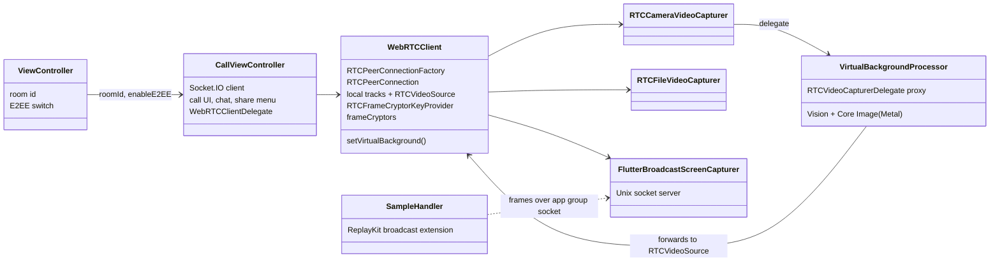

Screen sharing uses a ReplayKit broadcast upload extension. The extension cannot run WebRTC itself, so it sends the screen frames to the app through a Unix domain socket in the shared app group, and `FlutterBroadcastScreenCapturer` feeds them into the **same** `RTCVideoSource` the camera uses:

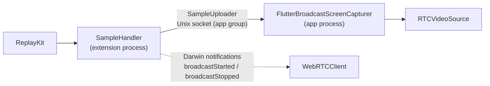

The signaling server address is `SERVER_URL` in `ios/WebRTCDemo/CallViewController.swift`.

---

## 8. Switching media sources

Each platform switches between camera, screen and video file in a different way. This matters for E2EE, because a cryptor/transform is bound to one `RtpSender` / `RtpReceiver`.

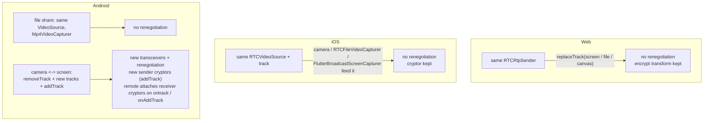

| Platform | Camera ↔ screen | Camera ↔ file | Renegotiation |
|---|---|---|---|
| Web | `replaceTrack` | `replaceTrack` | no |
| iOS | same `RTCVideoSource` | same `RTCVideoSource` | no |
| Android | new tracks on new transceivers | same `VideoSource`, new capturer | camera ↔ screen only |

---

## 9. End-to-end encryption

### 9.1 Where encryption happens

WebRTC already encrypts media hop by hop with DTLS-SRTP. E2EE adds a second layer **on the encoded frame**, before packetization, so that anything relaying RTP (a TURN server, a future SFU) only sees ciphertext.

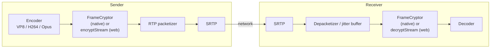

| Platform | Mechanism | Code |
|---|---|---|
| Web | Insertable Streams: `createEncodedStreams()` (Chrome) or `RTCRtpScriptTransform` (Safari, Firefox), running in a worker | `web/src/e2ee.ts`, `web/src/encryptionWorker.ts`, `attachFrameTransform()` in `App.vue` |
| Android | `FrameCryptor` + `FrameCryptorKeyProvider` from webrtc-sdk | `webrtc/E2eeManager.kt`, `webrtc/WebRtcPeer.kt` |
| iOS | `RTCFrameCryptor` + `RTCFrameCryptorKeyProvider` from webrtc-sdk | `PeerConnectionClient.swift` (E2EE extension) |

The native `FrameCryptor` uses the LiveKit frame format. The web client implements the same format byte for byte, which is what makes Web ↔ Android ↔ iOS work.

### 9.2 Frame format

```text
 ┌──────────────────────┬───────────────────────────────────┬────────────┬──────┬──────────┐
 │ unencrypted header   │ AES-128-GCM ciphertext + 16B tag  │ IV (12 B)  │ 0x0C │ keyIndex │
 └──────────────────────┴───────────────────────────────────┴────────────┴──────┴──────────┘
   additional data (AAD)                                       random/frame  IV len  1 byte
```

| Codec | Unencrypted header | Why |
|---|---|---|
| VP8 | 10 bytes on key frames, 3 bytes on delta frames | The payload header stays readable, so the packetizer and decoder can still parse frame type and size |
| H264 | up to and including the first slice NAL header + 1 byte (`...00 00 01 \| NAL type 1 or 5`) | NAL structure and SPS/PPS stay readable; the encrypted part is RBSP-escaped so it never contains a start code |
| Opus | 1 byte (TOC) | Frame configuration stays readable |

Frames that are empty, or that cannot be encrypted/decrypted (no key yet, wrong key, broken frame), are **dropped**, never forwarded in plain form.

### 9.3 Key derivation and key exchange

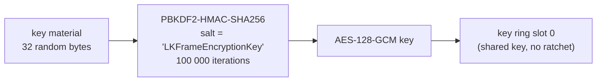

Key provider options are identical on all three platforms. If any of them differ, the peers derive different keys or produce a different trailer, and the remote side cannot decrypt:

| Option | Value |
|---|---|
| shared key mode | `true` |
| ratchet salt | `"LKFrameEncryptionKey"` |
| ratchet window size | `0` |
| uncrypted magic bytes | none |
| failure tolerance | `-1` |
| key ring size | `16` |
| discard frame when cryptor not ready | `false` |
| key derivation | PBKDF2 |
| key index | `0` |

Only the raw key material travels through signaling (as a Socket.IO binary attachment: `ArrayBuffer` on web, `ByteArray` on Android, `Data` on iOS). Each side derives the AES key locally.

### 9.4 Codec negotiation

When E2EE is on, every platform puts **VP8 first** in the video codec preferences (`setCodecPreferences`) before creating the offer or the answer, so both sides use the codec whose header layout is most robust across implementations. The web client also parses the negotiated SDP (`parseCodecMap`) to map RTP payload types to codecs, because `getMetadata().mimeType` is not available in every browser.

### 9.5 Cryptor lifecycle

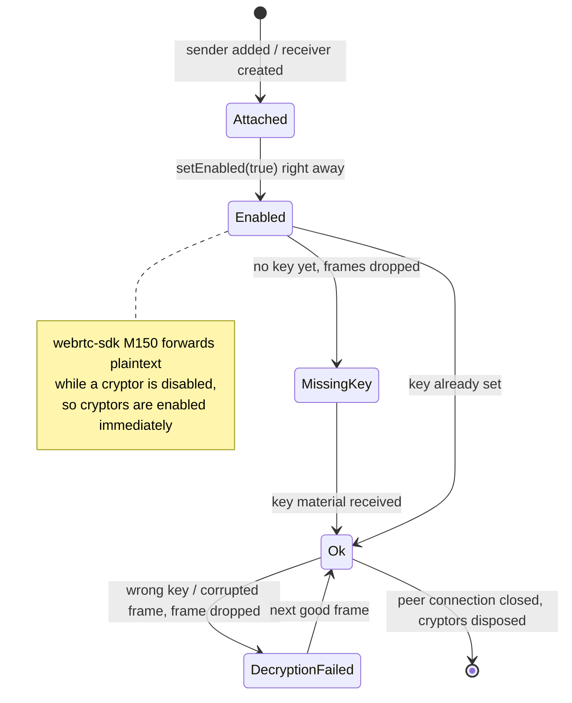

Both peers must enable E2EE. If only one does, the other side gets frames it cannot decode or decrypt, and remote video/audio stays black/silent.

---

## 10. Virtual background

Virtual background only processes **camera** frames; screen share and file share are sent untouched.

| | Web | Android | iOS |
|---|---|---|---|
| Segmentation | MediaPipe `ImageSegmenter` (`selfie_segmenter`), `categoryMask` | MediaPipe `tasks-vision` 1.0.0 (`selfie_segmenter`), confidence mask | Apple Vision `VNGeneratePersonSegmentationRequest` (`.balanced`) |
| Where it runs | main thread, `requestAnimationFrame` | dedicated `HandlerThread`, 256 px input | serial `DispatchQueue`, every 2nd frame |
| Compositing | 2D canvas, per pixel | GLES fragment shader on the camera texture | `CIBlendWithMask` on a Metal `CIContext` |
| Output | `canvas.captureStream(30)` + `replaceTrack` | `TextureBuffer` frame (rotation 0) | `RTCCVPixelBuffer` (BGRA), original rotation |
| Hook point | separate `MediaStream` | `VideoSource.setVideoProcessor()` | proxy `RTCVideoCapturerDelegate` |

### Android pipeline

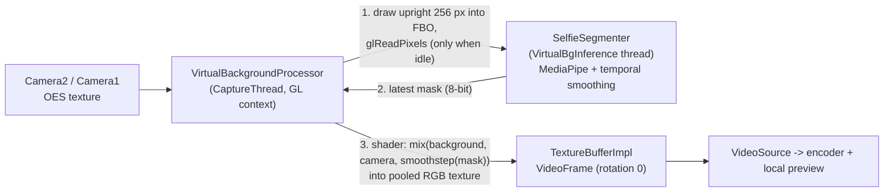

Full-resolution pixels never leave the GPU; only a 256 px copy is read back for inference. If inference is still busy, the frame keeps using the previous mask instead of waiting.

### iOS pipeline

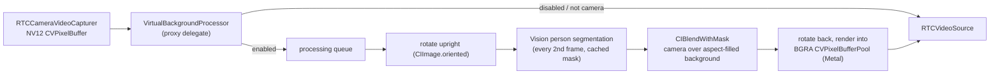

While a frame is being processed, new camera frames are dropped, so the capture queue never blocks and an unprocessed frame (with the real background) never slips through.

### Web pipeline

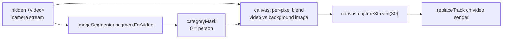

---

## 11. Data channel (chat)

The data channel is created lazily: the first time a user opens the chat sheet, that client creates `"MyApp Channel"` and renegotiates. The other side receives it through `ondatachannel` / `onDataChannel`.

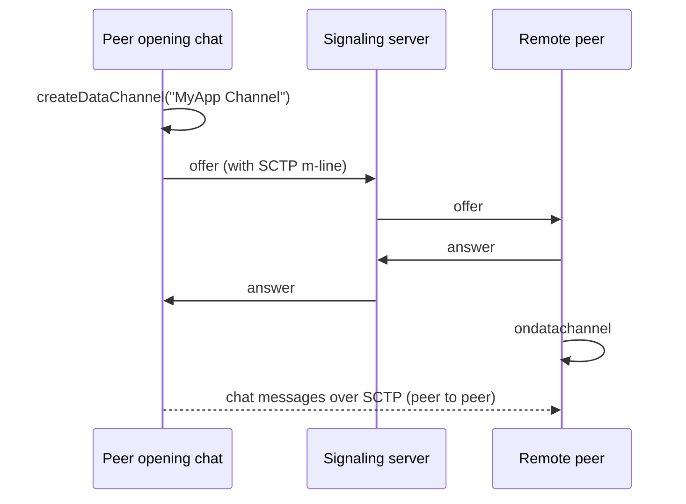

---

## 12. Versions and build

| Component | Version | Notes |
|---|---|---|
| webrtc-sdk Android | `io.github.webrtc-sdk:android:150.7871.01` | `android/app/build.gradle.kts` |
| webrtc-sdk iOS | pod `WebRTC-SDK` `150.7871.01` | `ios/Podfile`; run `pod install --repo-update` after upgrading |
| MediaPipe Android | `com.google.mediapipe:tasks-vision:1.0.0` | model in `android/app/src/main/assets/selfie_segmenter.tflite` |
| MediaPipe Web | `@mediapipe/tasks-vision` | model loaded from `storage.googleapis.com` |
| iOS deployment target | 17.5+ | Vision person segmentation needs iOS 15+ |

```text
signaling-server:  npm install && npm run dev                 (port 4000)
web:               npm install && npm run dev                 (http://localhost:5173)
android:           ./gradlew :app:assembleDebug
ios:               cd ios && pod install --repo-update, then open WebRTCDemo.xcworkspace
```

---

## 13. Limitations

- **1:1 only.** Rooms hold two participants; more peers need a mesh or an SFU.
- **No TURN server.** Calls can fail behind symmetric NATs or strict firewalls.
- **Signaling is not secured.** Plain HTTP/WebSocket, no authentication; anyone with the room id can join.
- **E2EE key goes through the signaling server in plain form.** Fine for a demo; a real app should use a key agreement (e.g. ECDH) or a passphrase shared out of band.
- **E2EE is chosen in the lobby** and cannot be toggled during a call; both peers must choose the same setting.
- **iOS screen sharing** stops when the app goes to the background (see `ios/IMPORTANT_SCREEN_SHARING_LIMITATIONS.md`).