# Architecture

This document explains how WebRTC-Demo is put together: the signaling server, the clients (Web, Android, iOS, macOS), how a call is set up, how media sources are switched, and how end-to-end encryption (E2EE) and backgrounds and effects work on every platform.

- [1. Big picture](#1-big-picture)
- [2. Repository layout](#2-repository-layout)
- [3. Signaling server](#3-signaling-server)
- [4. Call lifecycle](#4-call-lifecycle)
- [5. Web client](#5-web-client)
- [6. Android client](#6-android-client)
- [7. iOS client](#7-ios-client)
- [7b. macOS client](#7b-macos-client)
- [8. Switching media sources](#8-switching-media-sources)
- [9. End-to-end encryption](#9-end-to-end-encryption)
- [10. Backgrounds and effects](#10-backgrounds-and-effects)
- [11. Data channel (chat)](#11-data-channel-chat)
- [12. Group call (SFU, optional)](#12-group-call-sfu-optional)
- [13. Versions and build](#13-versions-and-build)
- [14. Limitations](#14-limitations)

---

## 1. Big picture

Two peers join the same room through a small WebSocket signaling server. The server only relays control messages (SDP, ICE candidates, E2EE key). Audio, video and data channel traffic go **directly peer to peer** over WebRTC; Google's public STUN server is used to discover public addresses.

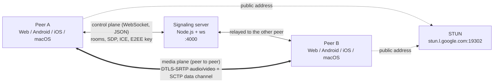

Any client can call any other client (Web ↔ Android ↔ iOS ↔ macOS). A room holds at most **2 participants** (1:1 calls).

That is the default mode and needs nothing else. **Group calls** are an optional, advanced mode: run `sfu-server/` (Go + Pion), pick "Group call (SFU)" in the lobby, and several participants (8 by default, set with `-max-participants`) join one room through a Selective Forwarding Unit. The clients still use only standard WebRTC APIs. See [section 12](#12-group-call-sfu-optional).

| Piece | Tech | Entry point |
|---|---|---|
| Signaling server | Node.js, `ws` (plain WebSocket, JSON messages) | `signaling-server/server.js` |
| Web client | Vue 3, TypeScript, Vite, Tailwind v4, shadcn-vue (reka-ui), Lucide, motion-v, MediaPipe Tasks Vision | `web/src/App.vue`, `web/src/call/useCall.ts` |
| Android client | Kotlin, Jetpack Compose + Material 3 Expressive, `io.github.webrtc-sdk:android`, MediaPipe Tasks Vision, OkHttp WebSocket | `android/app/src/main/java/com/example/myapplication/MainActivity.kt` |
| iOS client | Swift, SwiftUI + Liquid Glass (iOS 26), Swift package `WebRTC` (webrtc-sdk/Specs), Vision, Core Image, `URLSessionWebSocketTask` | `ios/WebRTCDemo/WebRTCDemoApp.swift` |
| macOS client | Swift, SwiftUI + AppKit + Liquid Glass (macOS 26), same package and shared engines, ScreenCaptureKit, AVFoundation | `ios/WebRTCDemoMac/WebRTCDemoMacApp.swift` |
| iOS broadcast extension | ReplayKit, Unix domain socket | `ios/WebRTCDemoScreenBroadcast/SampleHandler.swift` |

---

## 2. Repository layout

```text
WebRTC-Demo/
├── signaling-server/          WebSocket relay for 1:1 calls (rooms, SDP, ICE, E2EE key)
│   └── server.js
├── sfu-server/                Optional group call server: WebSocket signaling + SFU (Go, Pion)
│   ├── main.go                Flags, HTTP / WebSocket endpoints
│   ├── signaling.go           Message types, WebSocket read/write loops
│   ├── room.go                Rooms, join / leave, publish / unpublish fan-out
│   ├── participant.go         Publish + subscribe PeerConnections, RTP forwarding, PLI, renegotiation
│   ├── webrtc.go              Pion API: VP8 + Opus, interceptors, single UDP port
│   └── sfu_test.go            Pion clients publishing over loopback
├── effects/                   Backgrounds and stickers bundled by every app
│   ├── backgrounds.json, stickers.json
│   └── backgrounds/, thumbnails/, stickers/
├── tools/prepare_effects.py   Turns downloads in effects-source/ into effects/backgrounds
├── tools/make_app_icons.py    Draws the iOS, macOS and Android app icons from one design
├── web/                       Vue 3 single-page client
│   └── src/
│       ├── App.vue            Lobby ↔ call transition, theme, toasts
│       ├── call/
│       │   ├── media.ts       Local sources (mic, camera, screen, file), effects, preview; shared by both engines
│       │   ├── frameCrypto.ts E2EE key and transforms; shared by both engines
│       │   ├── useCall.ts     1:1 engine: signaling WebSocket, RTCPeerConnection, chat
│       │   └── useGroupCall.ts  Group engine: SFU WebSocket, publish + subscribe PeerConnections, active speaker
│       ├── effects/
│       │   ├── catalog.ts     Reads the effects folder, saved selection
│       │   ├── placement.ts   Sticker placement from face points, smoothing
│       │   └── EffectsProcessor.ts  MediaPipe segmentation + face landmarks, canvas compositing (loaded on demand)
│       ├── components/
│       │   ├── lobby/         Lobby screen
│       │   ├── call/          Call screen: stage, local tile, toolbar, chat, More drawer, PiP view
│       │   └── ui/            shadcn-vue components
│       ├── composables/       Picture-in-picture, safe area, layout breakpoints
│       ├── e2ee.ts            FrameCryptor-compatible frame encryption (shared with the worker)
│       └── encryptionWorker.ts  Web Worker running the E2EE transforms
├── android/app/src/main/
│   ├── java/com/example/myapplication/
│   │   ├── MainActivity.kt        Hosts the Compose lobby, starts CallActivity
│   │   ├── CallActivity.kt        Hosts the Compose call screen: permissions, pickers, MediaProjection, PiP
│   │   ├── ScreenCaptureService.kt  Foreground service required by MediaProjection
│   │   ├── call/                  BaseCallViewModel (shared state, media controls, effects),
│   │   │                          CallViewModel (1:1), GroupCallViewModel (group)
│   │   ├── effects/EffectsCatalog.kt  Reads assets/effects, saved selection
│   │   ├── ui/
│   │   │   ├── lobby/LobbyScreen.kt     Room id, E2EE switch, join button
│   │   │   ├── call/                    CallScreen, CallControls (floating toolbar, sheets),
│   │   │   │                            ChatSheet, EffectsSheet, PeerPlaceholder, CallPreviews
│   │   │   ├── video/                   TextureViewRenderer, VideoRenderer (Compose), FrameSnapshotter
│   │   │   └── theme/Theme.kt           MaterialExpressiveTheme, dynamic color
│   │   └── webrtc/
│   │       ├── LocalMedia.kt            Factory, capturers, sources, tracks, effects; shared by both engines
│   │       ├── PeerConnectionClient.kt  1:1 engine: lifecycle, signaling, peer
│   │       ├── sfu/                     Group engine: GroupCallClient
│   │       ├── WebRtcPeer.kt            One RTCPeerConnection + data channel + cryptors
│   │       ├── SignalingSocket.kt       JSON over an OkHttp WebSocket; used by both engines
│   │       ├── SignalingHandler.kt      1:1 signaling messages <-> WebRtcPeer
│   │       ├── E2eeManager.kt           FrameCryptor key provider
│   │       ├── Mp4VideoCapturer.kt      Video file -> SurfaceTexture capturer
│   │       └── effects/                 EffectsProcessor (GLES), SelfieSegmenter, FaceTracker,
│   │                                    BackgroundVideo, StickerPlacement
│   ├── java/org/webrtc/Camera{1,2}Helper.kt  Camera capture formats (package-private webrtc API)
│   └── assets/                     selfie_segmenter.tflite, face_landmarker.task (effects/ is copied in at build time)
└── ios/
    ├── WebRTCDemo.xcodeproj         iOS app, broadcast extensions and Mac app
    ├── Packages/WebRTC/             Local Swift package: the webrtc-sdk/Specs WebRTC binary
    ├── WebRTCDemo/                  iOS app; files marked (shared) are also compiled into the Mac app
    │   ├── WebRTCDemoApp.swift          @main SwiftUI app: lobby, call as a full screen cover
    │   ├── LobbyView.swift              Room id, E2EE toggle, join button (shared)
    │   ├── CallViewModel.swift          @Observable call state, owns LocalMedia + the 1:1 or group engine (shared)
    │   ├── CallView.swift               iOS call screen: remote stage, local PiP, top bar
    │   ├── CallOverlays.swift           Room pill, status chips, waiting card, recent messages (shared)
    │   ├── CallControls.swift           Glass buttons (shared), iOS toolbar and "More" sheet
    │   ├── ChatView.swift               Chat sheet / side panel (shared)
    │   ├── PeerPlaceholderView.swift    Blurred last frame + speaking avatar (shared)
    │   ├── VideoView.swift              RTCMTLVideoView wrapper (UIKit and AppKit), FrameSnapshotter (shared)
    │   ├── PictureInPicture.swift       System PiP: AVSampleBufferDisplayLayer renderer
    │   ├── LocalMedia.swift             Factory, tracks, capturers, effects; used by both engines (shared)
    │   ├── PeerConnectionClient.swift   class WebRTCClient: the 1:1 engine (shared)
    │   ├── SignalingSocket.swift        JSON over URLSessionWebSocketTask; used by both engines (shared)
    │   ├── GroupCallClient.swift        Group engine: SFU WebSocket, publish + subscribe PeerConnections (shared)
    │   ├── SFUServer.swift              SFU address: normalize, save (shared)
    │   ├── GroupCallView.swift          iOS group call screen: participant grid, people sheet
    │   ├── FrameEncryption.swift        E2EE key provider and frame cryptors; used by both engines (shared)
    │   ├── EffectsCatalog.swift         Reads the bundled effects folder, saved selection, sticker placement (shared)
    │   ├── EffectsProcessor.swift       Vision + Core Image proxy capturer delegate (shared)
    │   ├── EffectsSheet.swift           Backgrounds and filters picker with a live preview
    │   ├── FlutterBroadcastScreenCapturer.*  Screen capturer fed by the broadcast extension
    │   └── FlutterSocketConnection*.*        Unix socket server + frame reader (from flutter-webrtc)
    ├── WebRTCDemoMac/               macOS app
    │   ├── WebRTCDemoMacApp.swift       @main: single window, Settings scene, Call menu
    │   ├── MacCallView.swift            Call window: stage, draggable self view, chrome, auto-hide
    │   ├── MacCallToolbar.swift         Glass toolbar with device menus and tooltips
    │   ├── CallCommands.swift           Call menu and single-key shortcuts
    │   ├── ScreenSharePicker.swift      Display/window picker with thumbnails (ScreenCaptureKit)
    │   ├── ScreenShareCapturer.swift    SCStream -> RTCVideoSource
    │   ├── FileVideoCapturer.swift      AVAssetReader -> RTCVideoSource, looping
    │   ├── FloatingCallWindow.swift     Always-on-top mini call window (the Mac's PiP)
    │   ├── MacGroupStage.swift          Group call grid, tiles, people list
    │   ├── MacSettingsView.swift        Signaling and SFU server addresses
    │   └── MacSupport.swift             Window helpers, device model, idle tracker
    ├── WebRTCDemoScreenBroadcast/       ReplayKit upload extension
    └── WebRTCDemoScreenBroadcastSetupUI/
```

---

## 3. Signaling server

`signaling-server/server.js` is a plain Node.js HTTP server with a WebSocket endpoint on `/ws` (the `ws` package). Every message is a JSON text frame with a `type`, the same style as the SFU's protocol ([section 12](#12-group-call-sfu-optional)). The server keeps rooms in memory, pairs at most two sockets per room and relays messages to **the other** socket in the room. It never parses SDP or touches media. `GET /` answers `{"name":"signaling-server","ok":true}`, which the web lobby polls for its status dot.

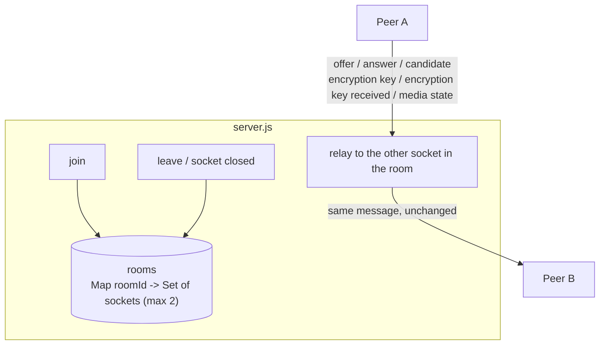

| Client sends | Server sends | Purpose |
|---|---|---|
| `join {roomId}` | `peer joined` (to the peer already in the room) | First joiner creates the room, second joiner triggers the call. A third one gets `error {message: "Room is full", fatal: true}`. |
| `offer {sdp}` | `offer {sdp}` (relayed) | SDP offer (initial call and every renegotiation) |
| `answer {sdp}` | `answer {sdp}` (relayed) | SDP answer |
| `candidate {candidate: {candidate, sdpMid, sdpMLineIndex}}` | `candidate {...}` (relayed) | Trickle ICE |
| `encryption key {key}` | `encryption key {key}` (relayed) | 32 bytes of E2EE key material, base64 |
| `encryption key received` | `encryption key received` (relayed) | Acknowledgement, logged only |
| `media state {state: {audio, video, screen}}` | `media state {state}` (relayed) | The sender's microphone/camera on or off, and whether it shares content. See [section 4](#4-call-lifecycle). |
| `leave` | – | Frees the seat; closing the socket does the same |
| – | `error {message, fatal}` | `fatal: true` ends the call on the client (room full, missing room id) |

A WebSocket keeps message order, so a key sent before an offer always reaches the remote peer before that offer. The server pings every socket every 25 s and drops one that does not answer, so a phone that lost its network frees its seat.

---

## 4. Call lifecycle

The peer that is **already in the room** is always the offerer. The peer that joins second answers.

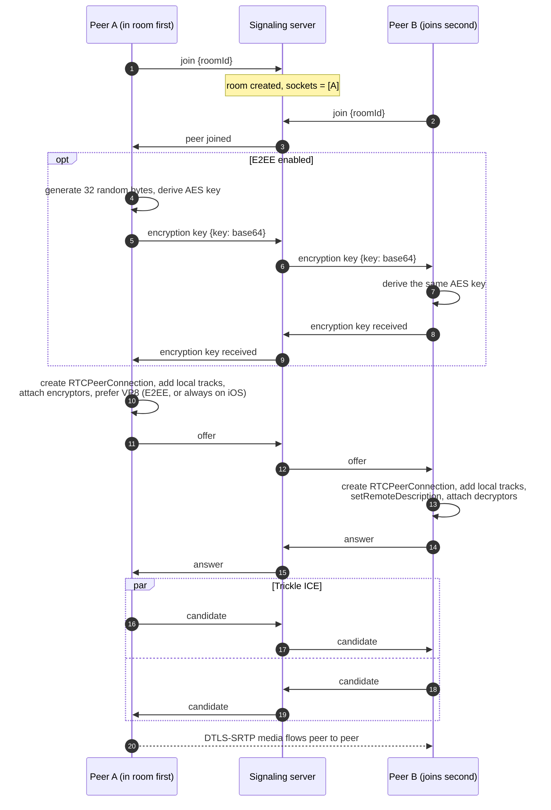

The offerer also creates the chat data channel before this first offer (see [section 11](#11-data-channel-chat)), so chat does not renegotiate.

Renegotiation reuses the same `offer` / `answer` messages. None of the clients renegotiates to switch media sources (see [section 8](#8-switching-media-sources)). It only happens when an older client offered without a chat channel and one is added later.

Connection state as seen by the UI:

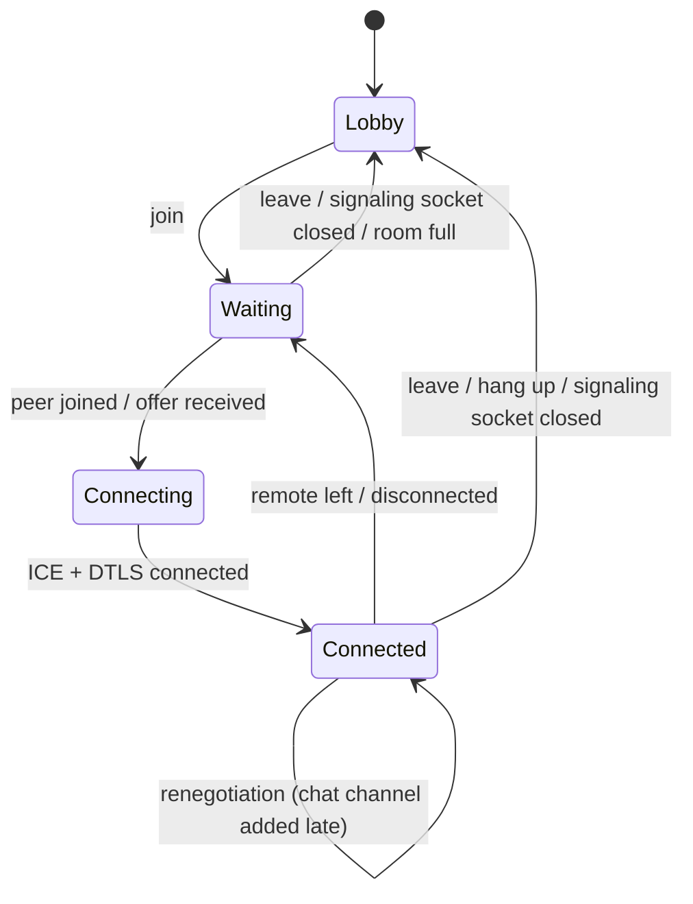

### Losing the signaling socket

There is no reconnect. Each client opens the signaling socket when it joins a room and closes it when it leaves. If the socket closes during a call (server stopped, Wi-Fi to 4G switch, network gone for longer than the server's ping timeout), the client **ends the call** and says so ("Lost the connection to the signaling server"), even if the media between the two peers is still flowing. The server has already freed the seat, so the user simply joins the room again. This keeps the clients simple; it is a demo, and a production app would reconnect and resume the session.

Callbacks from a replaced or disposed peer connection are ignored on every platform. On Android, calling a disposed native `PeerConnection` crashes the process.

### Media state

A disabled video track still sends (black) frames, so the remote side cannot tell "camera off" from a dark room by looking at the video. Each client therefore reports its own state with `media state`: on every change, and again when the peers connect so a late joiner gets the current state. `screen` is true while a screen or a video file is shared; the native clients then show the remote video letterboxed (fit) instead of cropped.

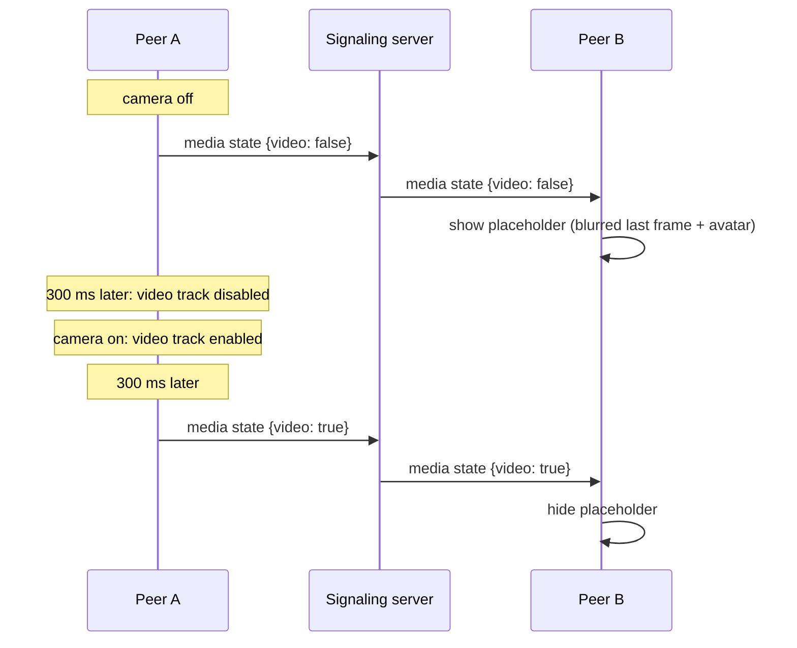

The 300 ms gap makes sure the peer never sees the black frames of a disabled track, nor the last frozen frame before the first new one arrives.

While the remote video is paused (turned off by the peer, or hidden locally), each client shows the **placeholder**: a 36 px wide copy of the last non-black frame (taken every 500 ms), blurred, behind a gradient avatar. iOS takes it in a small video sink on the CPU frame. Android reads it back from the renderer after drawing (`EglRenderer.addFrameListener`). Converting a decoder texture with `toI420()` inside a track sink blocks frame delivery on the decoder's texture thread, and froze the remote video when the decoder was recreated during a renegotiation. The avatar colors come from a hash of the room id, the same on Android and iOS. Its ring follows the remote `audioLevel` from `getStats()` (`inbound-rtp`, kind audio), polled every 250 ms only while the placeholder is visible.

Muting the peer's audio and hiding the peer's video are local only: they disable the remote track on this device and send nothing.

---

## 5. Web client

The call engine is a singleton composable, `useCall()` in `web/src/call/useCall.ts`. It owns the socket, the `RTCPeerConnection`, the local media and the chat, and exposes the state as refs. The components only render that state and call its actions. E2EE transforms run in a dedicated worker so encryption never blocks rendering.


### Local media

Each source has its own track: microphone, camera, screen, video file, and the canvas track of the effects. `outgoingVideoTrack()` picks the one to send (screen or file while sharing, else the effects canvas when an effect is on, else the camera), and `syncVideo()` puts it on the video sender with `replaceTrack()` and updates the local preview. The sender (and its E2EE transform) stays the same, so no renegotiation is needed. The microphone track is never replaced, so muting keeps working while sharing.

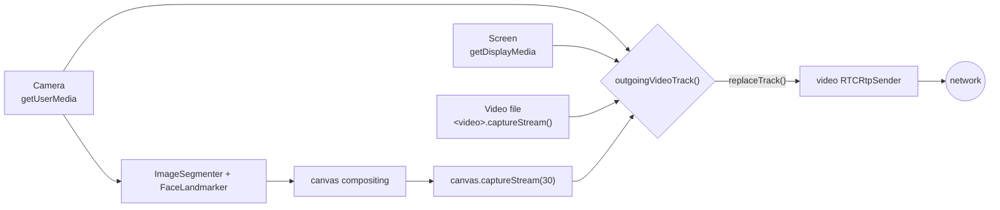

Turning the camera off stops the camera track (the light goes off). Sharing stops it as well, and stopping the share opens the camera again. The remote audio plays from one hidden `<audio>` element; every `<video>` element is muted, so the preview, the stage and the PiP window never play it twice.

MediaPipe is most of the bundle, so `EffectsProcessor.ts` is imported the first time an effect is turned on. When the tab is hidden, the compositing loop switches from `requestAnimationFrame` (paused in background tabs) to timers, so the peer keeps receiving frames while the call is in picture-in-picture.

### UI

- **Lobby.** Two columns on wide screens and on a phone held sideways (a `short:` variant, landscape with a height of 540 px or less), one column otherwise. It follows the system light or dark theme. The call screen is always dark.
- **Stage.** The remote video fills the stage; double tap (or `F`) switches between fill and fit. It starts in fit when the remote side shares a screen or when its orientation differs from the window, like the native apps. When the remote camera is off, a blurred snapshot of its last frame sits behind an avatar with an audio-level ring.
- **Local tile.** The tile is driven by motion values. Dragging projects the release velocity to choose a corner, and the tile snaps there with a spring. Its limits follow the top bar and the toolbar, which hide after 4 s without input.
- **Chat.** A side panel at 1024 px and wider, a bottom drawer below. New messages also show as bubbles above the toolbar for a few seconds.
- **Controls.** The toolbar has tooltips with shortcuts on desktop (`M` mic, `V` camera, `C` chat, `B` backgrounds and effects, `F` fit, `P` picture-in-picture). On phones, `More` opens a drawer with the remaining options. All chrome stays clear of the safe area insets.

### Picture-in-picture

`usePictureInPicture()` in `web/src/composables/usePictureInPicture.ts` uses the Document Picture-in-Picture API where it exists (Chromium desktop) and falls back to video picture-in-picture.

- **Document PiP.** `documentPictureInPicture.requestWindow()` opens an always-on-top window that stays visible over other tabs and apps. The page's stylesheets are copied into it, and `PipView` is rendered there through `<Teleport>`: the remote video, the local tile, status chips, and mic, camera and hang-up buttons on hover. Its animations are CSS only, because the tab that owns the Vue app is hidden and its `requestAnimationFrame` does not run.
- **Opening it automatically.** While a peer is connected, the page registers the `enterpictureinpicture` Media Session action. Chrome 134 and later then opens the window when the user switches to another tab, as Google Meet does. Switching to another app does not open it; the PiP button (or `P`) does.
- **Fallback.** Other browsers put the remote `<video>` itself into picture-in-picture (`requestPictureInPicture()`, or `webkitSetPresentationMode('picture-in-picture')` on iOS Safari). That window only shows the remote video.

### Hang-up detection

Besides the ICE `connectionState` (`disconnected` / `failed`), the web client treats the data channel closing on a live connection as the other side hanging up. The native clients close the channel only when they leave, and the SCTP close arrives at once, while ICE takes several seconds to notice.

### Signaling server address

The default is port 4000 on the host that serves the page. The lobby shows the address with a status dot, from polling `GET /` every 5 s; the socket itself only opens when you join. `web/src/call/serverUrl.ts` normalizes the address to `scheme://host[:port]` (the WebSocket is always on `/ws`) and saves it in `localStorage` when it differs from the default.

---

## 6. Android client

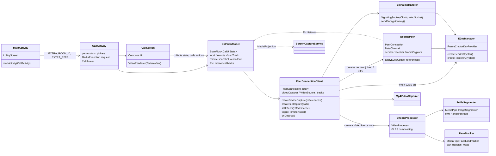

The UI is Jetpack Compose with Material 3 Expressive (`MaterialExpressiveTheme`, `HorizontalFloatingToolbar`, `LoadingIndicator`, shape morphing toggle buttons, `MotionScheme.expressive()`). `CallViewModel` survives rotation and owns the WebRTC client and the shared `EglBase`, so the call keeps running while the activity is recreated. `CallContent` is stateless and takes the two video surfaces as slots, which lets `CallPreviews.kt` render the whole screen with fake video.

Video is drawn by `TextureViewRenderer`, a `TextureView` fed by an `EglRenderer`. Unlike `SurfaceViewRenderer`, a `TextureView` can be clipped, rounded and animated with the rest of the Compose tree, which the picture-in-picture needs. The renderer always fills its view (center crop). `VideoSurface` therefore lays the renderer out at the frame's aspect ratio, just large enough to cover the screen, and "fit" scales it down with a `graphicsLayer`. Toggling fit and fill is then a GPU-only animation that never resizes the `TextureView`. iOS does the same in `StageVideoView`.

Threads that matter:

| Thread | Owner | Work |
|---|---|---|
| Main | Android | UI, `PeerConnectionClient` public calls, `SignalingHandler` callbacks (`SignalingSocket` posts them here), `createOffer` |
| WebRTC signaling thread | webrtc-sdk | `PeerConnection.Observer` callbacks (`onAddTrack`, ICE) |
| `CaptureThread` | `SurfaceTextureHelper` | camera frames, `EffectsProcessor` GL work |
| `SegmenterInference` | `SelfieSegmenter` | MediaPipe person mask |
| `FaceTracker` | `FaceTracker` | MediaPipe face landmarks |

### Picture-in-picture

`CallActivity` declares `supportsPictureInPicture` and handles size changes itself (`configChanges`), so entering and leaving the floating window never recreates it.

- **Entering PiP.** Once a peer is connected, the PiP params set `setAutoEnterEnabled(true)` on Android 12+, and the home gesture moves the call into the window. Older versions do the same from `onUserLeaveHint`. The top bar also has a PiP button.
- **Aspect ratio.** It follows the remote frame size reported by the renderer, clamped to the 1:2.39 to 2.39:1 range the system accepts.
- **Content.** In the window `CallContent` shows only the remote video. Controls, sheets, chat bubbles and the local tile are hidden. The local tile is hidden rather than removed, so it keeps its corner.
- **Closing the window.** The activity stops without coming back (`Lifecycle.State.CREATED` when PiP mode ends). Nothing keeps the camera and microphone alive in the background, so the activity finishes and the call ends.

### Rotation

Neither activity locks its orientation. `MainActivity` is recreated on rotation. `CallActivity` handles the change itself (its `configChanges` are there for PiP), so the call, the renderers and the capturer survive it.

- **Lobby.** When the window is wider than tall and at least 560dp wide, `LobbyScreen` shows the title and the form side by side. Each pane scrolls on its own and stays centered while it fits.
- **Call chrome.** The top bar, toolbar, chat bubbles, waiting card and the local tile's corners keep clear of `systemBars ∪ displayCutout` on every side, which in landscape puts the cutout and the navigation bar on the left or right. The IME is left out on purpose: it only opens over the chat sheet, and the controls behind it should not move.
- **Sheets.** The More sheet scrolls, and the chat sheet takes the full height in landscape instead of 70%.
- **Remote fit.** The default switches to fit when the remote frame and the screen have different orientations; see the README.
- **Camera.** `Camera2Session` tags every frame with the device rotation, so the peer sees an upright picture whichever way the phone is held. The local tile follows the rotated frame size.
- **Screen share.** `ScreenCapturerAndroid` keeps the size it started with. `ScreenCaptureService` is still running while the user shares another app, so it receives `onConfigurationChanged` and calls `PeerConnectionClient.onDisplayChanged()`, which resizes the virtual display with `changeCaptureFormat` (`VirtualDisplay.resize` in this SDK, so the MediaProjection is not reused for a second display).

The signaling server address can be changed in the lobby. `settings/SignalingServer.kt` normalizes it and saves it in `SharedPreferences`; the default is `serverAddress` in `android/app/src/main/res/values/strings.xml`. `MainActivity` passes the address to `CallActivity` as an intent extra, which `CallViewModel` reads from its `SavedStateHandle`.

---

## 7. iOS client

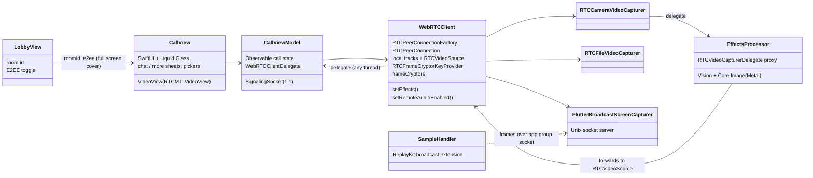

The UI is SwiftUI with Liquid Glass (`glassEffect`, `GlassEffectContainer`, `.glass` / `.glassProminent` button styles), so the deployment target is iOS 26. `CallViewModel` is an `@Observable` class; `WebRTCClient` calls its delegate from WebRTC threads, and the view model hops to the main queue before touching state. `WebRTCClient` no longer owns any view: it exposes the local video track and reports the remote one through the delegate, and `VideoView` attaches an `RTCMTLVideoView` to whichever track it is given (`scaleAspectFill` for fill, `scaleAspectFit` for fit).

Screen sharing uses a ReplayKit broadcast upload extension. The extension cannot run WebRTC itself, so it sends the screen frames to the app through a Unix domain socket in the shared app group, and `FlutterBroadcastScreenCapturer` feeds them into the **same** `RTCVideoSource` the camera uses:

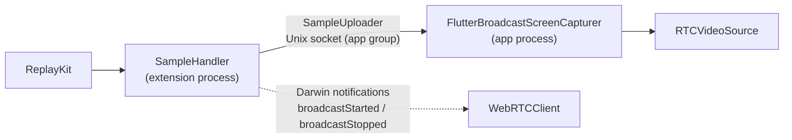

Each frame is sent as an HTTP-style message: `Content-Length`, `Buffer-Width`, `Buffer-Height` and `Buffer-Orientation` headers, then a JPEG body. On the app side, `FlutterSocketConnection` accepts the extension's connection and reads it on its own thread, and `FlutterSocketConnectionFrameReader` asks the stream for exactly the bytes still missing from the current frame, decodes the JPEG into a `CVPixelBuffer` and hands it to `RTCVideoSource`. A frame must be completed before the next read: a read of 0 bytes is reported as end of stream, the app closes the socket and the extension stops with "Screen sharing stopped".

The broadcast keeps going when the user leaves the app, which needs two things:

- **The app process stays alive.** `UIBackgroundModes` has `audio` and `voip`, and the call keeps an active `playAndRecord` audio session, so iOS does not suspend the app (and its socket server) in the background.
- **The video encoder keeps working.** H264 is encoded by the VideoToolbox hardware encoder, which iOS invalidates while the app is in the background; every frame then fails and the remote side sees a frozen picture. So iOS always puts **VP8** (software) first in its codec preferences, with or without E2EE.

The audio session is configured by the app, not left to WebRTC: before every call `CallViewModel.configureCallAudio()` sets `RTCAudioSessionConfiguration.webRTC()` to `playAndRecord` + `voiceChat`. The WebRTC Swift package (`webrtc-sdk/Specs`, the webrtc-sdk fork) otherwise copies the session's launch category (`soloAmbient`), which iOS rejects together with the Bluetooth HFP option, leaving calls without microphone and playout (README > Troubleshooting). `AudioSessionWatcher` turns audio unit failures, interruptions and a rejected configuration into toasts.

The remote peer's audio can be muted locally ("Peer audio" in the More sheet): `setRemoteAudioEnabled()` disables the audio track of every receiver, including receivers added later by a renegotiation. Nothing is sent to the remote peer. Android does the same in `WebRtcPeer` with the tracks from `onAddTrack`, and web does it with `track.enabled` on the remote stream.

### Picture-in-picture

The call uses video-call PiP: an `AVPictureInPictureController` with an `activeVideoCallSourceView` content source (the remote stage) and an `AVPictureInPictureVideoCallViewController`.

- **Rendering.** The system window cannot show the `RTCMTLVideoView`, so `PictureInPictureRenderer` is added to the remote track as a second sink. Between `willStart` and `didStop` it enqueues frames into an `AVSampleBufferDisplayLayer`. Hardware-decoded `RTCCVPixelBuffer`s go in as they are. Software-decoded I420 frames, which is what VP8 produces, are copied into pooled NV12 pixel buffers. The frame rotation is applied as a layer transform.
- **Size.** The window's `preferredContentSize` follows the rotated frame size.
- **Starting.** `canStartPictureInPictureAutomaticallyFromInline` is on while a peer is connected, so leaving the app opens the window. The top bar also shows a PiP button while `isPictureInPicturePossible` is true.
- **Camera in the background.** The camera capture session turns on `isMultitaskingCameraAccessEnabled` where `isMultitaskingCameraAccessSupported`, so the peer keeps seeing you while the call is in PiP. Elsewhere iOS pauses the camera in the background.

### Rotation

The target allows portrait and both landscape orientations on iPhone, and every orientation on iPad.

- **Lobby.** With a compact vertical size class (an iPhone on its side), `LobbyView` puts the title and the form in two columns.
- **Call.** The call screen lays out inside the `GeometryReader`'s safe area, so the chrome and the local tile's corners already keep clear of the Dynamic Island and the home indicator in landscape. The sheets scroll.
- **Remote fit.** `StageVideoView` reports the rotated frame size, and `CallView` defaults to fit when it does not match the screen's orientation.
- **Camera.** `RTCCameraVideoCapturer` tags frames with the device orientation.

The signaling server address can be changed in the lobby. `SignalingServer.swift` normalizes it and saves it in `UserDefaults`; `CallViewModel` reads it when a call starts. `Info.plist` allows plain HTTP (`NSAllowsArbitraryLoads`) so any LAN server works, as `usesCleartextTraffic` does on Android.

---

## 7b. macOS client

The Mac app (`ios/WebRTCDemoMac`) is a native SwiftUI app, with AppKit where SwiftUI has no API, built from the same Xcode project as the iOS app. It compiles the iOS client's model, both call engines and the shared views (`CallViewModel`, `LocalMedia`, `WebRTCClient`, `GroupCallClient`, `SignalingSocket`, `FrameEncryption`, `SignalingServer`, `SFUServer`, `LobbyView`, `ChatView`, `CallOverlays`, `PeerPlaceholderView`, `VideoView`, `EffectsCatalog`, `EffectsProcessor`) and keeps platform code apart with `#if os(macOS)` / `#if os(iOS)`. Signaling (the plain WebSocket of [section 3](#3-signaling-server)), the data channel, media state, E2EE (same key provider options), VP8-first codec preferences and group calls ([section 12.10](#1210-macos-client--group-mode)) are therefore identical to iOS.

- **Window.** One `Window` scene with a hidden, transparent title bar; the call screen draws under it and is always dark, the lobby follows the system appearance. The minimum size is 680×500. Settings (⌘,) holds the signaling server and SFU server addresses.
- **Video.** The macOS slice of webrtc-sdk `150.7871.01` has `RTCMTLVideoView` (an `NSView` without a content mode); `RTCMTLNSVideoView` and `RTCFileVideoCapturer` are declared in its headers but are not in the binary. `VideoHostView` lays the Metal view out at the frame's aspect ratio, just large enough to cover its bounds, and fit/mirror are a layer transform around the center, so fit ↔ fill animates without resizing the drawable (the same idea as `StageVideoView` on iOS).
- **Camera and devices.** All of it lives in `LocalMedia`'s macOS extension. `RTCCameraVideoCapturer` captures the selected camera at the format closest to 1280×720 (30 fps). Turning the camera off stops capture after the usual 300 ms track disable, so the camera light goes out. Microphones and speakers come from the factory's `RTCAudioDeviceModule`. Choices are remembered.
- **Media sources.** Camera, screen and file all feed the same `RTCVideoSource`, as on iOS, so switching never renegotiates and the sender's cryptor stays attached. Screen and window sharing use ScreenCaptureKit (`SCShareableContent`, `SCScreenshotManager` thumbnails, `SCStream` in NV12, at most 1920 px on the long side, 30 fps). The last frame is repeated every 500 ms while the screen is static, so the encoder keeps producing frames. webrtc-sdk's `RTCDesktopCapturer` is not used because it captures with `CGDisplayStream` / `CGWindowListCreateImage`, which macOS 15 and later no longer support. A video file is read with `AVAssetReader`, paced by presentation time and looped.
- **Floating window.** The Mac counterpart of system PiP is an `NSPanel` at floating level that joins all Spaces. It shows the remote video with a mini self view and hover controls, and opens by itself when the call window is minimized. In a group call it shows the active speaker, as the web's picture-in-picture does.
- **Shortcuts.** The Call menu exposes the same single-letter shortcuts as the web client (`M V C B F P`). As on the web, `F` is off in group calls, where each tile switches on its own; ⇧⌘P opens the people list there. The menu items are disabled while the chat field has focus, so the letters reach the text field.
- **Sandbox.** App Sandbox with camera, microphone, outgoing and incoming network (ICE connectivity checks arrive unsolicited), and read access to user-selected files; Hardened Runtime is on. `NSAllowsArbitraryLoads` allows the plain-HTTP signaling server, as on iOS.

---

## 8. Switching media sources

Each platform switches between camera, screen and video file in a different way. This matters for E2EE, because a cryptor/transform is bound to one `RtpSender` / `RtpReceiver`.

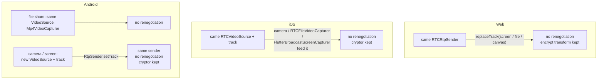

| Platform | Camera ↔ screen | Camera ↔ file | Renegotiation |
|---|---|---|---|
| Web | `replaceTrack` | `replaceTrack` | no |
| iOS | same `RTCVideoSource` | same `RTCVideoSource` | no |
| Android | new video track, `RtpSender.setTrack` | same `VideoSource`, new capturer (back to camera with `setTrack`) | no |

Android gives the screen its own `VideoSource` because only a screencast source adapts by frame rate instead of resolution. The audio track is never replaced. A renegotiation would recreate the receive streams, and so the video decoders, on both sides; on Android the remote video then froze after a few frames.

---

## 9. End-to-end encryption

### 9.1 Where encryption happens

WebRTC already encrypts media hop by hop with DTLS-SRTP. E2EE adds a second layer **on the encoded frame**, before packetization, so that anything relaying RTP (a TURN server, a future SFU) only sees ciphertext.

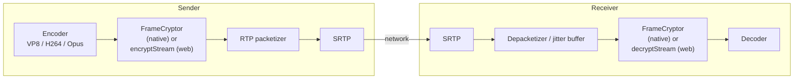

| Platform | Mechanism | Code |
|---|---|---|
| Web | Insertable Streams: `createEncodedStreams()` (Chrome) or `RTCRtpScriptTransform` (Safari, Firefox), running in a worker | `web/src/e2ee.ts`, `web/src/encryptionWorker.ts`, `attachFrameTransform()` in `call/useCall.ts` |
| Android | `FrameCryptor` + `FrameCryptorKeyProvider` from webrtc-sdk | `webrtc/E2eeManager.kt`, `webrtc/WebRtcPeer.kt` |
| iOS | `RTCFrameCryptor` + `RTCFrameCryptorKeyProvider` from webrtc-sdk | `PeerConnectionClient.swift` (E2EE extension) |

The native `FrameCryptor` uses the LiveKit frame format. The web client implements the same format byte for byte, which is what makes Web ↔ Android ↔ iOS work.

### 9.2 Frame format

```text
 ┌──────────────────────┬───────────────────────────────────┬────────────┬──────┬──────────┐
 │ unencrypted header   │ AES-128-GCM ciphertext + 16B tag  │ IV (12 B)  │ 0x0C │ keyIndex │
 └──────────────────────┴───────────────────────────────────┴────────────┴──────┴──────────┘
   additional data (AAD)                                       random/frame  IV len  1 byte
```

| Codec | Unencrypted header | Why |
|---|---|---|
| VP8 | 10 bytes on key frames, 3 bytes on delta frames | The payload header stays readable, so the packetizer and decoder can still parse frame type and size |
| H264 | up to and including the first slice NAL header + 1 byte (`...00 00 01 \| NAL type 1 or 5`) | NAL structure and SPS/PPS stay readable; the encrypted part is RBSP-escaped so it never contains a start code |
| Opus | 1 byte (TOC) | Frame configuration stays readable |

Frames that are empty, or that cannot be encrypted/decrypted (no key yet, wrong key, broken frame), are **dropped**, never forwarded in plain form.

### 9.3 Key derivation and key exchange

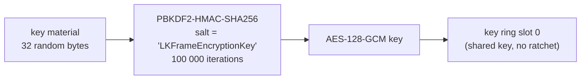

Key provider options are identical on all three platforms. If any of them differ, the peers derive different keys or produce a different trailer, and the remote side cannot decrypt:

| Option | Value |
|---|---|
| shared key mode | `true` |
| ratchet salt | `"LKFrameEncryptionKey"` |
| ratchet window size | `0` |
| uncrypted magic bytes | none |
| failure tolerance | `-1` |
| key ring size | `16` |
| discard frame when cryptor not ready | `false` |
| key derivation | PBKDF2 |
| key index | `0` |

Only the raw key material travels through signaling, base64 encoded in the JSON message. Each side derives the AES key locally.

### 9.4 Codec negotiation

When E2EE is on, every platform puts **VP8 first** in the video codec preferences (`setCodecPreferences`) before creating the offer or the answer, so both sides use the codec whose header layout is most robust across implementations. iOS does this on every call, see [section 7](#7-ios-client). The web client also parses the negotiated SDP (`parseCodecMap`) to map RTP payload types to codecs, because `getMetadata().mimeType` is not available in every browser.

### 9.5 Cryptor lifecycle

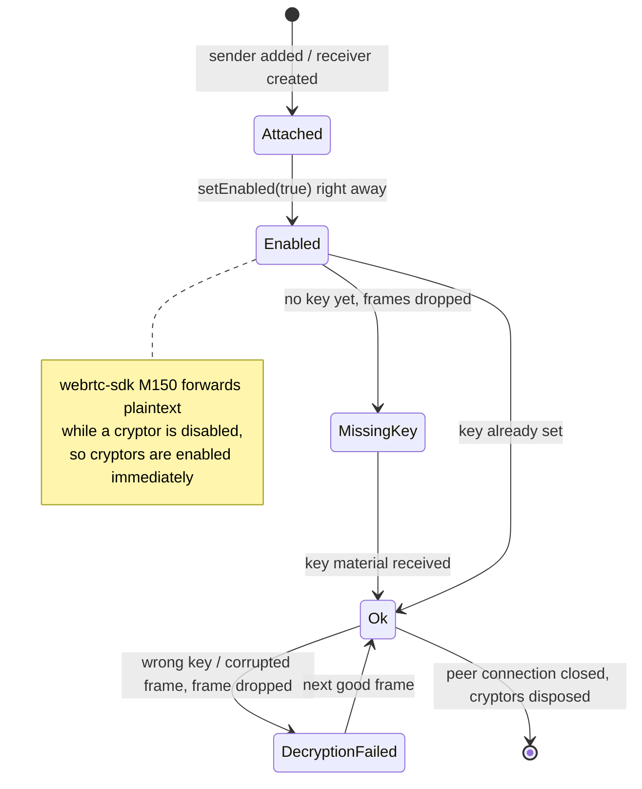

Both peers must enable E2EE. If only one does, the other side gets frames it cannot decode or decrypt, and remote video/audio stays black/silent.

---

## 10. Backgrounds and effects

Effects only process **camera** frames; screen share and file share are sent untouched. A background (none, blur, a picture or a looping video) and a face sticker can be combined.

### Shared assets

The `effects/` folder at the repository root is the single source for every app: Vite imports it with `import.meta.glob`, Android copies it into the APK's `assets/effects` with a generated asset source (`copyEffects` in `app/build.gradle.kts`), and iOS and macOS bundle it as a folder reference.

- `backgrounds.json` lists pictures and videos (`id`, `name`, `type`, `file`, `thumbnail`). It is written by `tools/prepare_effects.py` from `effects-source/`. Blur and none are built into each app.
- `stickers.json` lists stickers. Sizes and offsets are in units of the distance between the eyes, measured from the `anchor` (`eyes`, `nose` or `mouth`), with positive `offsetY` up the face. `height` is optional and stretches the artwork.
- An entry whose file is missing is skipped, and a saved choice that no longer exists falls back to none.

### Sticker placement

Every platform turns its face landmarks into four points (both eye centers, nose tip, mouth center) and runs the same placement code (`placement.ts`, `StickerPlacement.kt`, `StickerPlacement` in `EffectsCatalog.swift`):

- "Right" runs from one eye to the other and "up" from the mouth to the eyes, so the sticker follows a tilted head. The eye order comes from that up direction, so it does not matter which eye a detector calls left.
- The unit is the larger of the eye distance and eyes-to-mouth / 1.2, so stickers do not shrink when the head turns sideways.
- A smoother blends each placement with the previous one (40 % old) and keeps the last one through 6 missed detections.

### Starting with an effect on

The selection is saved (`localStorage`, `SharedPreferences`, `UserDefaults`). When a call starts with a saved effect, the camera frames are held (web: the first `replaceTrack` waits; Android, iOS and macOS: the processor drops camera frames) until the effect is loaded and the first mask is ready, so the peer never sees the real background first. If an effect cannot be loaded, the previous choice comes back with a toast.

| | Web | Android | iOS |
|---|---|---|---|
| Person mask | MediaPipe `ImageSegmenter` (`selfie_segmenter`), `categoryMask` | MediaPipe `tasks-vision` 1.0.0 (`selfie_segmenter`), confidence mask, 256 px input | Vision `VNGeneratePersonSegmentationRequest` (`.balanced`), every 2nd frame |
| Face points | MediaPipe `FaceLandmarker` | MediaPipe `FaceLandmarker` (`face_landmarker.task`), 384 px input | Vision `VNDetectFaceLandmarksRequest`, every 2nd frame |
| Blur | `ctx.filter = blur()` (downscaled draw on Safari) | downscale + separable Gaussian in two FBOs | `CIGaussianBlur` |
| Video background | hidden muted `<video>` | `MediaPlayer` into an OES `SurfaceTexture` | `AVPlayer` + `AVPlayerItemVideoOutput` |
| Compositing | 2D canvas | GLES fragment shader on the camera texture, sticker quad with premultiplied alpha | `CIBlendWithMask`, sticker `composited(over:)`, Metal `CIContext` |
| Output | `canvas.captureStream(30)` + `replaceTrack` | `TextureBuffer` frame (rotation 0) | `RTCCVPixelBuffer` (BGRA), original rotation |
| Hook point | separate `MediaStream` | `VideoSource.setVideoProcessor()` | proxy `RTCVideoCapturerDelegate` |

macOS runs the iOS pipeline unchanged, apart from the cadence and mirroring described under macOS pipeline.

### Android pipeline

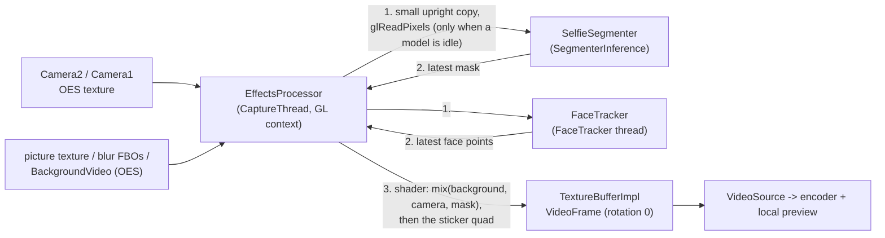

Full-resolution pixels never leave the GPU; only a small copy is read back for the models, and each model copies it before its own thread uses it. If a model is still busy, the frame uses its previous result instead of waiting.

### iOS pipeline

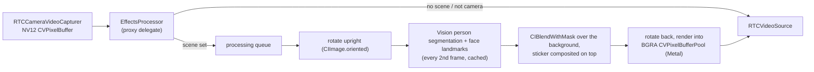

While a frame is being processed, new camera frames are dropped, so the capture queue never blocks and an unprocessed frame (with the real background) never slips through.

### macOS pipeline

The Mac app compiles the iOS `EffectsCatalog`, `EffectsProcessor` and `EffectsSheet`, so the pipeline above is the same: `RTCCameraVideoCapturer` feeds `EffectsProcessor`, while the ScreenCaptureKit and file capturers feed the `RTCVideoSource` directly and are never processed. Mac cameras deliver landscape frames with rotation 0. The capture connection is pinned to unmirrored, so the peer always gets unmirrored frames (stickers the right way round); only the local views mirror. Vision runs on every 2nd frame as on iOS, and the Mac backs off to every 3rd or 4th frame when a pass averages over 20 or 30 ms (Intel Macs have no Neural Engine); the first run of each request, which loads its model, is not timed.

### Web pipeline

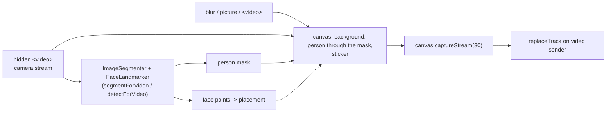

---

## 11. Data channel (chat)

The offerer (the peer already in the room) creates `"MyApp Channel"` before its first offer, so the SCTP m-line is negotiated together with audio and video. The answerer receives the channel through `ondatachannel` / `onDataChannel`. Opening the chat sheet is a UI action only.

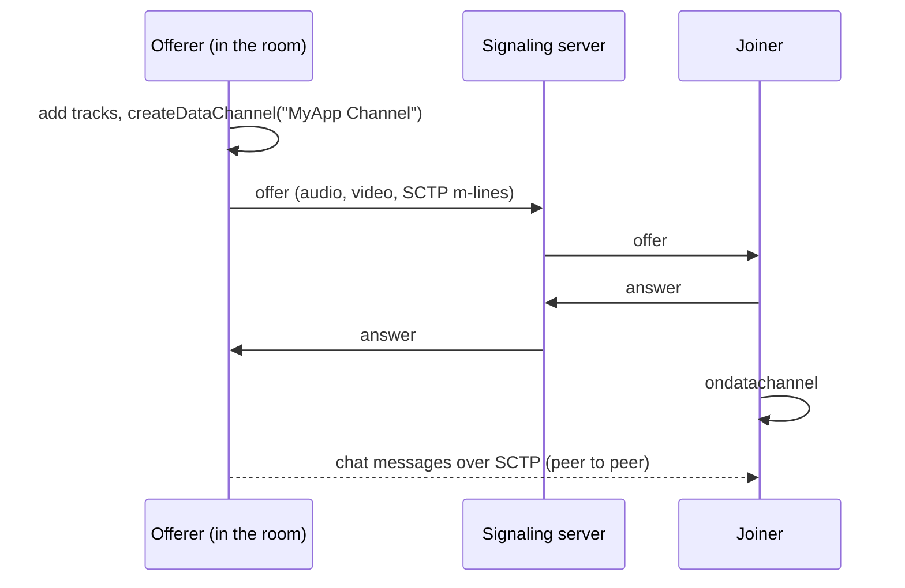

Chat used to create the channel lazily on first open, which renegotiated the call. The renegotiation offer from a peer that had only answered so far (for example iOS joining a room Android created) changed the receive parameters on the other side. Android then recreated its remote video decoder, and the remote video froze after a few frames. Each client still creates the channel on chat open, with one renegotiation, when the call has none. That only happens with an older client that offered without one.

---

## 12. Group call (SFU, optional)

Group calls are an opt-in mode next to the 1:1 call. The 1:1 call, its signaling server and everything in sections 3–11 are unchanged; someone who never starts `sfu-server` never sees a difference.

### 12.1 Why an SFU

| | Mesh (everyone connects to everyone) | SFU (everyone connects to one server) |
|---|---|---|
| Connections per client | N − 1 | 2 (publish + subscribe) |
| Video encodes and uploads per client | N − 1 | 1 |
| Downloads per client | N − 1 | N − 1 |
| Server work | none | forwards RTP packets, never decodes |

With 5 people at about 1.5 Mbps per 720p stream, mesh needs about 6 Mbps of upload and four encoders on every phone. An SFU keeps one encoder and one upload per client whatever the room size. An MCU (decode, mix, re-encode on the server) is not needed for a demo.

### 12.2 The server

`sfu-server/` is one Go process built on [Pion](https://github.com/pion/webrtc). It does both jobs that the 1:1 mode splits between the Node server and the peers:

- **signaling**: a plain WebSocket at `ws://<host>:4001/ws`, JSON messages;
- **media**: a Selective Forwarding Unit. Every participant's RTP packets are copied to the other participants, without decoding.

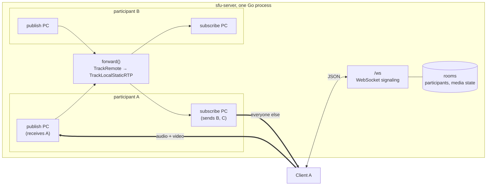

| File | Role |
|---|---|
| `main.go` | Flags (`-port`, `-public-ip`, `-max-participants`, or `PORT`, `PUBLIC_IP`, `MAX_PARTICIPANTS`), `GET /` health check, `/ws` |
| `signaling.go` | Message types; one read loop per socket, one write loop with a queue so a room lock never waits on the network; pings every 20 s |
| `room.go` | Rooms in memory (created by the first `join`, deleted when empty), join / leave, fan-out of published tracks |
| `participant.go` | The two PeerConnections of a participant, RTP forwarding, key frame requests, subscribe renegotiation |
| `webrtc.go` | Pion API shared by every PeerConnection: codecs, interceptors, one UDP port |
| `sfu_test.go` | Real Pion clients over loopback: media between 3 participants, leave + rejoin, media state, chat, full room, E2EE mismatch |

Every PeerConnection shares **one UDP port** (4001, the same number as the TCP port), so a firewall only needs TCP 4001 and UDP 4001. The server does not trickle ICE: it waits for its own (host) candidates before sending an SDP, so every offer and answer it sends already contains them. Behind a 1:1 NAT (a cloud VM), `-public-ip` advertises the public address instead of the private one.

### 12.3 Two PeerConnections per client

Each client opens two PeerConnections to the server, whatever the room size (10 people: 2 per client, 20 on the server):

| | publish PC | subscribe PC |
|---|---|---|
| Direction (client side) | `sendonly`: one audio + one video transceiver | `recvonly`: one transceiver per remote track |
| Who offers | always the client | always the server |
| Renegotiated | never | each time a participant's tracks appear or go away |

Fixing who offers on each connection means the two sides never offer at the same time (glare), and a peer never switches from answering to offering. That switch is what changed the receive parameters and froze the remote video on Android in the 1:1 call ([section 11](#11-data-channel-chat)). Joins and leaves only renegotiate the subscribe PC, so the outgoing camera is never touched. Switching camera, screen and file still uses `replaceTrack` / `setTrack` / the same video source, as in [section 8](#8-switching-media-sources). It also leaves room for simulcast later, where the publisher offers its `sendEncodings`.

### 12.4 Signaling protocol

Every message is a JSON object with a `type`. Unknown types are ignored.

| Client → server | Fields | |
|---|---|---|
| `join` | `roomId`, `name`, `e2ee`, `e2eeKey` (base64, when `e2ee`) | First message. `name` is a label such as `Web`, `Android`, `iOS` |
| `offer` | `pc: "publish"`, `sdp` | Once, after `joined` |
| `answer` | `pc: "subscribe"`, `sdp` | Answer to every subscribe offer |
| `candidate` | `pc`, `candidate: {candidate, sdpMid, sdpMLineIndex}` | Trickle ICE for either connection |
| `media state` | `state: {audio, video, screen}` | Same meaning and same 300 ms rule as [section 4](#4-call-lifecycle) |
| `chat` | `text` | |
| `leave` | – | Then the client closes the socket |

| Server → client | Fields | |
|---|---|---|
| `joined` | `participantId`, `participants: [{id, name, state}]`, `e2ee`, `e2eeKey` | `participants` lists the others already in the room |
| `answer` | `pc: "publish"`, `sdp` | |
| `offer` | `pc: "subscribe"`, `sdp` | Initial and every renegotiation |
| `participant joined` | `participant: {id, name, state}` | |
| `participant left` | `participantId` | Clients remove the tile at once |
| `media state` | `participantId`, `state` | |
| `chat` | `participantId`, `name`, `text` | |
| `error` | `message`, `fatal` | Fatal errors (`Room is full`, `E2EE setting does not match the room`) close the socket |

A closed WebSocket removes the participant, like a disconnect on the Node server. There is no session resume: the client leaves the call.

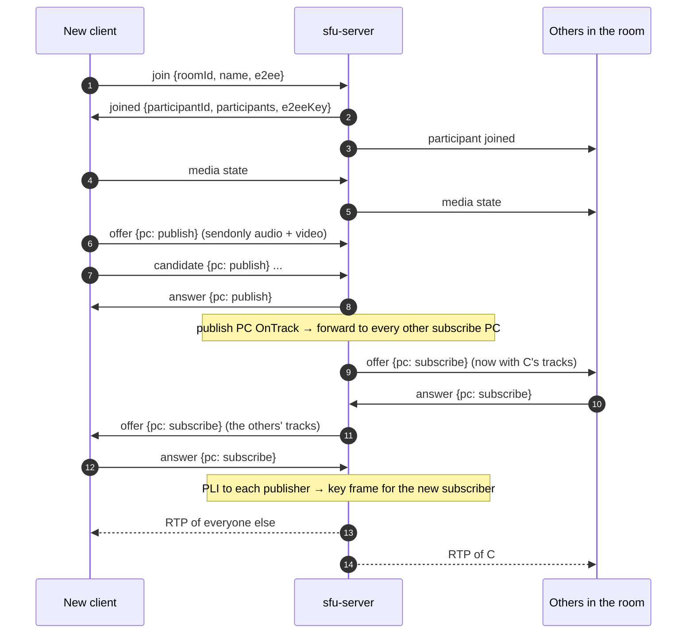

### 12.5 Forwarding

- **Track → participant.** Each published track becomes a `TrackLocalStaticRTP` whose stream id (`msid`) is the publisher's `participantId` and whose track id is `<participantId>-audio` or `<participantId>-video`. Track ids must be unique in the room, because libwebrtc (Android, iOS, Chrome) names a new remote receiver after the track id, and clients key receivers by that id. Clients read `streams[0].id` in `ontrack` / `onAddTrack` to know whose tile a track belongs to. Tracks can arrive before or after `participant joined`.
- **Codecs.** The server only accepts **VP8** and **Opus**. Every client encodes and decodes them, the E2EE frame format keeps the VP8 payload header readable, and the server never translates between codecs. The clients put VP8 first anyway.
- **Header extensions** are stripped from forwarded packets: their ids were negotiated on the publisher's connection and mean nothing on a subscriber's. Pion adds its own transport-wide sequence numbers.
- **Key frames.** A subscriber can only start decoding at a key frame. The server sends a PLI to the publisher when a subscribe PC connects and after each subscribe answer, and relays every PLI / FIR from a subscriber, at most once per 500 ms per track (one key frame serves every subscriber).
- **Loss and congestion.** Pion's default interceptors answer NACKs from subscribers with retransmissions, send NACKs and receiver reports to publishers, and send transport-wide congestion control feedback so the publishers' bandwidth estimation keeps working.
- **Leaving.** Closing a participant's publish PC ends its forward loops; each removes the track from every other subscribe PC and triggers a renegotiation. The freed transceivers are reused by the next tracks.

### 12.6 E2EE in a group

E2EE stays a frame-level transform, so the server only ever sees ciphertext in the RTP payloads; it does not need to know. The 1:1 key exchange (the offerer sends the material to the one other peer) does not fit a room, so:

1. Every client that joins with E2EE on generates 32 random bytes and sends them in `join`.
2. The room keeps the **creator's** material as the room key and returns it in every `joined`.
3. Each client sets it as the shared key (key index 0, same PBKDF2 and options as [section 9.3](#93-key-derivation-and-key-exchange)), attaches encryptors to its publish senders and a decryptor to every subscribe receiver, including receivers added by later renegotiations.

E2EE is a room property: a client whose E2EE switch differs from the room's gets a fatal `E2EE setting does not match the room`. The key still goes through the server in plain form; the key rotation that a real app needs when someone leaves is out of scope.

### 12.7 Web client — group mode

The lobby has a secondary **1:1 call | Group call (SFU)** switch; 1:1 stays the default and is not remembered across visits. Group mode has its own engine, `useGroupCall()` in `web/src/call/useGroupCall.ts`, which talks to `sfu-server` over a plain browser `WebSocket` (`ws://<host>:4001/ws`). The Node signaling server is not used in this mode. The SFU address is edited like the signaling address, saved in `localStorage` under `sfu-server` (default: port 4001 on the page host). The lobby shows its status by polling `GET /`.

Both engines share the local media and E2EE code:

- `web/src/call/media.ts`: `createLocalMedia(hooks)` owns the microphone, camera, screen and file tracks, backgrounds and effects, `outgoingVideoTrack()` / `syncVideo()`, the 300 ms camera rule and `mediaState()`. An engine gives it a `videoSender()` (the sender that `replaceTrack()` targets) and a `sendMediaState()` callback.
- `web/src/call/frameCrypto.ts`: `createFrameCrypto()` holds the frame key (worker or main thread) and attaches the encrypt/decrypt transforms to senders and receivers.
- `useCall.ts` (1:1) and `useGroupCall.ts` (group) only contain signaling and peer connection logic.

```mermaid
flowchart LR
    subgraph Browser
        UI["GroupCallView<br/>GroupTile grid, LocalTile, toolbar, chat"]
        G["useGroupCall()"]
        M["createLocalMedia()<br/>mic / camera / screen / file / background"]
        C["createFrameCrypto()<br/>encryptionWorker.ts"]
        PUB["publish PC<br/>sendonly audio + video<br/>(offer once, replaceTrack)"]
        SUB["subscribe PC<br/>recvonly, answers SFU offers<br/>msid = participantId"]
    end
    SFU["sfu-server :4001<br/>/ws signaling + UDP media"]
    UI --> G
    G --> M
    G --> C
    M -- "replaceTrack()" --> PUB
    C -- "encrypt" --> PUB
    C -- "decrypt" --> SUB
    G <-- "JSON over WebSocket" --> SFU
    PUB -- "RTP" --> SFU
    SFU -- "RTP" --> SUB
```

- **Publish PC.** It is created after `joined` once local media is ready. It has one audio and one video transceiver, both `sendonly` (added even when the mic or camera is missing), with VP8 put first. Encryptors are attached when E2EE is on, then the client makes a single offer. Screen sharing, file sharing, camera switching and effects all go through `replaceTrack()`; the publish PC is never renegotiated.
- **Subscribe PC.** It is created on the first server `offer` and answered on every renegotiation, one offer at a time. The SFU re-offers per track, so a newcomer's audio and video can arrive in separate offers. `ontrack` takes the participantId from `streams[0].id` and attaches a decryptor once per receiver. Because the SFU recycles inactive m-lines, the client moves a reused track away from its previous participant. `removetrack` on the msid stream drops tracks that are no longer forwarded.
- **Participants.** The participant list comes from `joined` and `participant joined/left`. Tracks are kept separately, because they can arrive before or after `participant joined`. A tile is removed as soon as `participant left` arrives.
- **E2EE.** The client sends 32 random bytes (base64) in `join`, then uses the room key from `joined` with the same PBKDF2 derivation, frame format and worker as 1:1 calls.
- **Active speaker.** Every 300 ms the client calls `getStats()` on each audio receiver and reads `inbound-rtp` `audioLevel`. It has to query per receiver because every forwarded track has the id `"audio"`. The loudest participant above 0.03 gets a green ring, which is held for 1.2 s so it does not flicker between words.
- **UI.**
  - Remote tiles are laid out between the top bar and the toolbar, with a column count chosen to give the largest roughly 4:3 tiles. Tiles fill (crop) by default; screen-sharing participants are shown fit, and double click toggles fit and fill.
  - Each tile shows `name · short id` and a mic-off badge. When there is no video, or the participant's camera is off, it shows the gradient avatar with an audio-level ring.
  - The local video stays the draggable `LocalTile`, labelled `You · name · short id` so you can find your own tile on the other screens. When alone, the waiting card is shown.
  - The "N in call" chip in the top bar opens `PeopleDialog`: everyone in the room with their label and mic/camera/presenting icons, you first and highlighted.
  - Each participant's audio plays from its own hidden `<audio>` element.
  - Chat goes over the WebSocket (`chat`) and shows sender names.
  - "Mute everyone" and "Hide all video" in More are local only.
  - Picture-in-picture shows the active speaker (else the first camera) through the existing `PipView`.
- **Ending.** A fatal `error`, a closed WebSocket, or a peer connection in `failed` state leaves the call and returns to the lobby with a toast. There is no session resume.

### 12.8 Android client — group mode

Group mode is opt-in: the lobby's **Group call (SFU)** switch sits under the E2EE switch. While it is on, the server pill edits the SFU address instead of the signaling address. `settings/SfuServer.kt` normalizes the address to `ws[s]://host[:port]`: a bare host gets port 4001, `http(s)` maps to `ws(s)`, and any path is dropped. It saves the address in `SharedPreferences` under its own key. The default is port 4001 on the host of the default signaling address. `MainActivity` passes `EXTRA_GROUP` and `EXTRA_SFU_ADDRESS`, and `CallActivity` then creates a `GroupCallViewModel` and shows `GroupCallScreen` instead of the 1:1 pair.

```mermaid
classDiagram
    direction LR
    class LocalMedia {
        PeerConnectionFactory, E2eeManager
        capturers / sources / tracks
        createDeviceCapture / createFileCapture
        replaceVideoTrack hook, onStateChange hook
        holdEffects / setEffects
    }
    class FrameCryptors {
        attach(sender / receiver)
        attachAllReceivers(pc)
    }
    class PeerConnectionClient {
        1:1 engine
        SignalingHandler + WebRtcPeer
    }
    class SignalingHandler {
        1:1 messages
    }
    class GroupCallClient {
        group engine
        publish PC + subscribe PC
        receiver id -> participant id
        getAudioLevels()
    }
    class SignalingSocket {
        OkHttp WebSocket, JSON
        callbacks on main
    }
    class BaseCallViewModel {
        CallUiState, local controls, chat list
    }
    BaseCallViewModel <|-- CallViewModel
    BaseCallViewModel <|-- GroupCallViewModel
    CallViewModel --> PeerConnectionClient
    GroupCallViewModel --> GroupCallClient
    PeerConnectionClient --> LocalMedia
    PeerConnectionClient --> SignalingHandler
    GroupCallClient --> LocalMedia
    GroupCallClient --> SignalingSocket
    SignalingHandler --> SignalingSocket
    GroupCallClient --> FrameCryptors
    WebRtcPeer --> FrameCryptors
```

The media code is shared. `LocalMedia` owns the factory, the capturers, sources and tracks, the effects processor and the E2EE key provider. Each engine connects it to its senders through two hooks. `replaceVideoTrack` puts a new camera or screen track on the existing video sender with `RtpSender.setTrack`. `onStateChange` sends `media state` (the 300 ms camera rule lives in `LocalMedia`). `FrameCryptors` keeps the cryptors of one peer connection. `preferVp8()` puts VP8 first. On the UI side, `CallLayout` is the shared chrome: local tile, top bar, waiting card, toolbar, sheets and chat bubbles. `CallContent` (1:1) and `GroupCallContent` pass it their remote stage.

`GroupCallClient` makes every PeerConnection call on the main thread. WebSocket, observer, SDP and stats callbacks hop there first, and they are dropped once the call has ended, because calling a disposed native `PeerConnection` crashes the process.

```mermaid
sequenceDiagram
    participant A as Android
    participant S as sfu-server
    A->>A: LocalMedia.start() (camera + mic)
    A->>S: join {roomId, name, e2ee, e2eeKey?}
    S->>A: joined {participantId, participants, e2eeKey?}
    A->>A: setSharedKey(room key)
    A->>S: media state
    A->>A: publish PC: addTransceiver(audio, SEND_ONLY), addTransceiver(video, SEND_ONLY),<br/>sender cryptors, VP8 first
    A->>S: offer {pc: publish}
    S->>A: answer {pc: publish}
    loop every renegotiation
        S->>A: offer {pc: subscribe}
        A->>A: setRemoteDescription, attach receiver cryptors to all transceivers
        A->>S: answer {pc: subscribe}
        A->>A: onAddTrack: streams[0].id = participant id
    end
```

- **Publish PC.** Offered once with empty constraints; the 1:1 `OfferToReceive*` constraints would add receive m-lines. Switching to the screen or back to the camera uses `setTrack` on its video sender, and file sharing reuses the camera `VideoSource`. Neither renegotiates, and the sender cryptors stay attached.
- **Subscribe PC.** Server offers are answered one at a time. Receiver cryptors are attached after `setRemoteDescription` and before the answer, so tracks added or recycled by a renegotiation decrypt from their first frame. Tracks are keyed by receiver id, because the SFU reuses m-lines for new participants. `participant left` removes the tile at once.
- **Tiles.** `GroupCallScreen` draws one `TextureViewRenderer` per remote participant in a single `Layout`: as square a grid as fits, with the last row centered. When the controls hide, the grid's top and bottom margins shrink with a spring and the tiles grow into the space, as on iOS. Tiles crop by default; tiles of participants who share a screen fit, and double tap switches. A participant without video shows the usual blurred-snapshot placeholder and avatar. The label is `name · short id` (`Participant.label`), with mic-off and presenting icons. Once others are in the room, a people chip next to the room pill opens `PeopleSheet`: everyone with their label, you first and highlighted, with the same avatar gradient as their camera-off placeholder. Every 300 ms, `getStats(receiver)` on each remote audio receiver gives a per-participant `audioLevel`. The loudest participant above 0.04 gets a highlighted border, held for 1 s through pauses. The same levels drive the avatar rings.
- **Chat and controls.** Chat goes over the WebSocket, and messages show the sender's name. The local tile, toolbar, sheets and PiP are the 1:1 ones. "Mute everyone" and "Hide everyone's video" in More are local-only and also apply to participants who join later. The fit/fill tile is hidden.
- **Ending.** A fatal server `error`, a closed socket, or a peer connection in `FAILED` ends the call. The activity shows the reason in a Toast and returns to the lobby; there is no reconnection.
- **Dependencies.** The WebSocket is `SignalingSocket` (OkHttp), the same class the 1:1 call uses for the signaling server.

### 12.9 iOS client — group mode

Group calls are opt-in: the lobby has a secondary **Group call (SFU)** switch (off by default) and, while it is on, an SFU server address under the signaling address. `SFUServer.swift` normalizes it like `SignalingServer.swift` (it also accepts `ws://`/`wss://`, and adds port 4001 when none is given) and saves it in `UserDefaults` under its own key; the default is port 4001 on the default signaling host. The engine connects to `ws://<host>:<port>/ws`.

The media layer is shared by both modes:

| Type | File | Role |
|---|---|---|
| `LocalMedia` | `LocalMedia.swift` | Factory, local audio/video tracks, the single `RTCVideoSource` (camera through `EffectsProcessor`, `RTCFileVideoCapturer`, `FlutterBroadcastScreenCapturer`), camera switch, screen/file share, audio session, VP8-first codec preferences |
| `FrameEncryption` | `FrameEncryption.swift` | `RTCFrameCryptorKeyProvider` (same options as section 9) and the sender/receiver `RTCFrameCryptor`s |
| `WebRTCClient` | `PeerConnectionClient.swift` | 1:1 engine: one peer connection + data channel |
| `GroupCallClient` | `GroupCallClient.swift` | Group engine: `URLSessionWebSocketTask` + publish and subscribe peer connections |

`CallViewModel` owns `LocalMedia` and one of the two engines, so mic, camera (with the 300 ms rule), sharing and backgrounds and effects work the same way in both modes.

```mermaid
sequenceDiagram
    participant C as iOS (GroupCallClient)
    participant S as sfu-server
    C->>S: join {roomId, name: "iOS", e2ee, e2eeKey?}
    S->>C: joined {participantId, participants, e2eeKey?}
    Note over C: install room key, send media state
    C->>S: offer {pc: publish} (sendonly audio + sendonly video, msid = participantId)
    S->>C: answer {pc: publish}
    S->>C: offer {pc: subscribe}
    Note over C: create subscribe PC, attach receiver cryptors,<br/>map receivers by stream id
    C->>S: answer {pc: subscribe}
    C-->>S: candidate {pc} (trickle, buffered until our SDP is sent)
```

- **Publish PC.** Created once after `joined`, never renegotiated. Camera, file and screen share keep feeding the same `RTCVideoSource`, so the senders and their cryptors never change.
- **Subscribe PC.** Created on the first server offer. Offers are answered one at a time. Receiver cryptors are attached on the signaling thread right after `setRemoteDescription` and in `didAdd rtpReceiver`, which covers receivers reused by renegotiation.
- **Track mapping.** `streams[0].streamId` of `didAdd rtpReceiver` is the participantId. Every subscribe offer is also parsed (`a=mid`, `a=msid`, direction) and transceivers are re-mapped by `mid`, because libwebrtc does not fire `didAdd` again when an m-line is reused for another stream without going inactive. Tiles come from `joined` / `participant joined` / `participant left`, so tracks may arrive in either order.
- **Threading.** The WebSocket delegate queue is the main queue and peer connection callbacks hop to it, so engine state is main-confined.
- **UI.** `GroupCallView` shows a grid of `RTCMTLVideoView` tiles (1 to 4 columns depending on count and orientation). A tile fills (crop) by default and fits while the participant presents (`state.screen`); double tap switches, animated through `StageVideoView` like the 1:1 stage, until they start or stop presenting. It shows the gradient avatar when there is no video, the video is off or hidden locally, a name + short id label with a mic-off icon, and a green ring on the active speaker. The people chip next to the room pill opens `PeopleSheet`: everyone's label, you (`selfParticipant`) first and highlighted. The active speaker is the loudest `inbound-rtp` audio `audioLevel` above 0.05 (`statistics(for: receiver)` every 250 ms, held for 1 s). The local tile, toolbar, chat sheet and More sheet are the 1:1 ones. "Mute/hide peer" applies to everyone. Chat goes over the WebSocket and bubbles show the sender name. The waiting card is shown while alone.
- **Ending.** A fatal `error` or a closed socket shows "Call ended" with the reason and returns to the lobby. Hanging up sends `leave` and closes the socket.
- **Not in group mode:** system picture-in-picture (1:1 only), the blurred last-frame snapshot behind the avatar.

### 12.10 macOS client — group mode

The Mac app compiles the iOS engine unchanged (`GroupCallClient`, `LocalMedia`, `FrameEncryption`, `SignalingSocket`, `SFUServer`) and joins as `Mac`, so the protocol, track mapping, threading and ending rules are the ones of [12.9](#129-ios-client--group-mode). Only the UI is its own, in `ios/WebRTCDemoMac/MacGroupStage.swift` and `MacCallView.swift`:

- **Lobby and settings.** The shared lobby has the **Group call (SFU)** switch; on the Mac both server addresses open Settings (⌘,), which edits the signaling and SFU addresses with the same normalization as iOS. The SFU default is `http://localhost:4001`, next to the signaling default `http://localhost:4000`.
- **Grid.** `MacGroupGrid` lays the remote tiles out between the top bar and the toolbar, with the column count that gives the largest roughly 4:3 tiles (the web's rule) and a short last row centred. The controls stay visible in group mode, as on the web.
- **Tiles.** `MacGroupTile` fills by default and fits while that participant presents. Double-clicking (or the tile's context menu) switches fit and fill, animated by `StageVideoView`, until they start or stop presenting. Labels `name · short id` start with one animated status mark (red mic-off, presenting, or a green dot while live, as on the web); a green ring marks the active speaker, and the gradient avatar (seed `peer-<id>`) when there is no video, the camera is off or video is hidden locally.
- **People and own label.** A people chip next to the room pill opens `MacPeopleList` in a popover: you first and highlighted, then everyone with mic, camera and presenting icons. The local tile shows `You · Mac · <short id>`.
- **Controls.** More › *Only on this Mac* has Mute Everyone and Hide Everyone's Video, which also apply to people who join later. Chat (side panel, sender names), E2EE, device pickers, ScreenCaptureKit and file sharing, and backgrounds and effects work as in a 1:1 call, since they all feed `LocalMedia`.
- **Floating window.** `P` or minimizing opens the floating panel with the featured participant: the active speaker, else the first camera, else the first person.
- **Ending.** A fatal `error` or a closed socket shows "Call ended" with the reason and returns to the lobby, as in 1:1 calls.

---

## 13. Versions and build

| Component | Version | Notes |
|---|---|---|
| webrtc-sdk Android | `io.github.webrtc-sdk:android:150.7871.01` | `android/app/build.gradle.kts` |
| webrtc-sdk iOS / macOS | `webrtc-sdk/Specs` `150.7871.01` binary (`WebRTC.xcframework.zip`, checksum pinned), product `WebRTC`, through a local package because the Specs manifest for that release doesn't resolve | `ios/Packages/WebRTC/Package.swift` |
| MediaPipe Android | `com.google.mediapipe:tasks-vision:1.0.0` | models in `android/app/src/main/assets/` (`selfie_segmenter.tflite`, `face_landmarker.task`, stored uncompressed) |
| MediaPipe Web | `@mediapipe/tasks-vision` | models loaded from `storage.googleapis.com` |
| Jetpack Compose | BOM `2026.06.01`, `material3` `1.5.0-alpha18` | Material 3 Expressive is only in the 1.5 alphas. Newer Compose BOMs need AGP 9.1 and compileSdk 37 |
| Android Gradle Plugin | `8.13.2`, Gradle `9.5.1`, Kotlin `2.3.0` | compileSdk 36, minSdk 24 |
| iOS / macOS deployment target | 26.0 | Liquid Glass needs the 26 releases; build with Xcode 26 |
| sfu-server | Go 1.24, `github.com/pion/webrtc/v4` `v4.2.22`, `github.com/gorilla/websocket` `v1.5.3` | `sfu-server/go.mod`; an older Go downloads 1.24 by itself (`GOTOOLCHAIN=auto`) |

```text
signaling-server:  npm install && npm run dev                 (port 4000)
sfu-server:        go run .   (optional, group calls)          (TCP + UDP 4001)
                   go test -race ./...
web:               npm install && npm run dev                 (http://localhost:5173)
android:           ./gradlew :app:assembleDebug
ios / macOS:       open ios/WebRTCDemo.xcodeproj; scheme WebRTCDemo (iPhone) or WebRTCDemoMac (My Mac)
```

---

## 14. Limitations

- **1:1 by default.** The default rooms hold two participants. Group calls need the optional `sfu-server` ([section 12](#12-group-call-sfu-optional)), with 8 participants per room by default (`-max-participants`).
- **Group calls: no simulcast and no downlink adaptation.** Every subscriber gets each publisher's single stream at whatever bitrate the publisher sends; a slow subscriber cannot ask for a lower layer. Simulcast (`sendEncodings` with `rid`) plus layer selection on the server is the next step.
- **Group calls: one server, IPv4 UDP only, no TURN.** Clients must reach UDP 4001 of the server directly. Rooms live in one process's memory.
- **Group calls: chat goes through the server** over the signaling WebSocket, in plain text, unlike the 1:1 data channel.
- **No TURN server.** Calls can fail behind symmetric NATs or strict firewalls.
- **Signaling is not secured.** Plain HTTP/WebSocket, no authentication; anyone with the room id can join.
- **E2EE key goes through the signaling server in plain form.** Fine for a demo; a real app should use a key agreement (e.g. ECDH) or a passphrase shared out of band.
- **E2EE is chosen in the lobby** and cannot be toggled during a call; both peers must choose the same setting.
- **macOS screen sharing needs Screen Recording permission**, granted once in System Settings › Privacy & Security; the app has to be relaunched after granting it.
- **iOS always sends VP8.** It is encoded in software, so it uses more CPU and battery than hardware H264; this is what keeps screen sharing alive in the background.