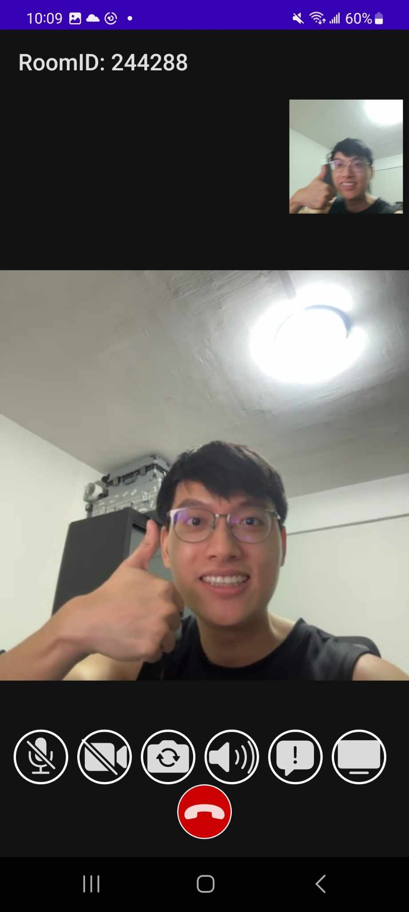
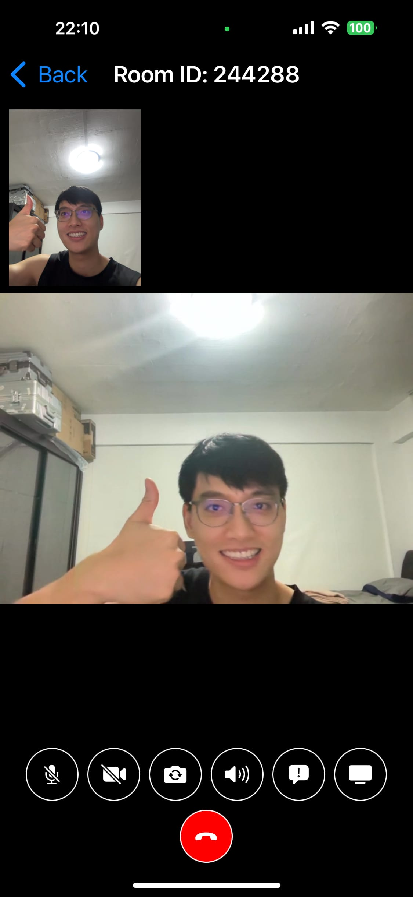
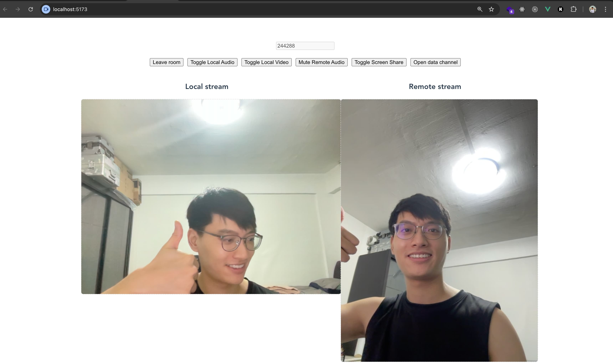
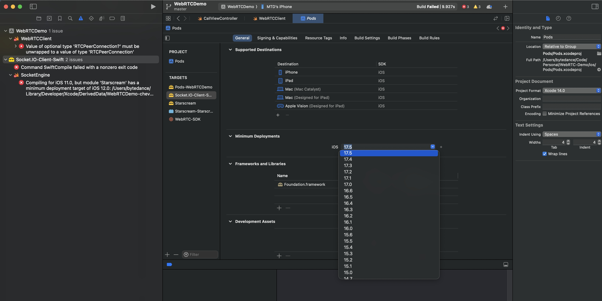
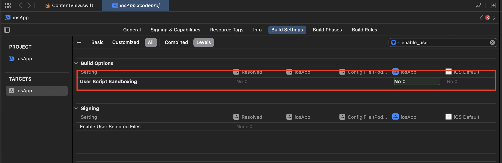

# WebRTC-Demo
<div align="center">
<h2>A comprehensive WebRTC demo on Web, Android and iOS</h2>




</div>
 
# Features
- Up-to-date with latest WebRTC API. Currently using M125
- ✅ Audio control
- ✅ Video control
- ✅ Switch front/back camera
- ✅ Switch between microphone vs Speaker
- ✅ Send message using data channel
- ✅ Screen sharing. All except iOS
- Stream video file. In progress...
- End to end encryption. In progress...

# Disclaimer
This is intended to show common use cases of WebRTC cross platforms and to give you some ideas, it may have bugs, use with caution!

# Setup
## Start signaling server
First you need to start the signaling server, Open terminal at `signaling-server` and run:
```
npm install # or yarn install (to install dependencies)
npm run dev # or yarn dev
```
Once started the address of signling server will be printed in your terminal

## Start clients
The usage of all clients are same, you just need to join clients in same room by input same roomID.

### Web
To start web client, open terminal at `web` and run:
```
npm install

npm run dev
```
Then open 2 browsers at `localhost:5173` to test

### Android 

Change the value of `serverAddress` in `android/app/src/main/res/values/strings.xml` to server IP which is printed when you start the signaling server

### iOS

First run the following command in `ios` folder:
```
pod install
```

Then change `SERVER_URL` in `CallViewController` to signaling server address

# Troubleshooting

## iOS - Compiling for iOS 11.0, but module...

Change Minimum Deployments of the pod that has issue to latest



## iOS - Sandbox: rsync.samba(13105)...


Solution: Update your Xcode project build option ENABLE_USER_SCRIPT_SANDBOXING to 'No'.


