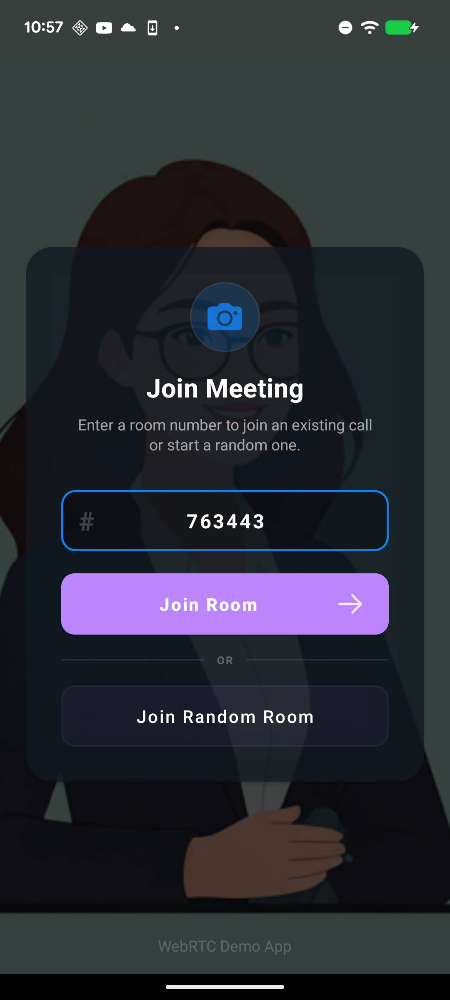
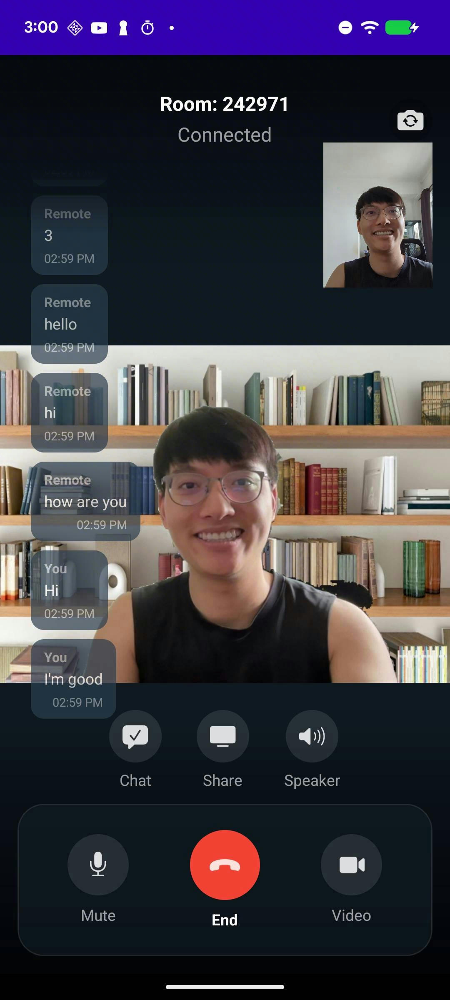
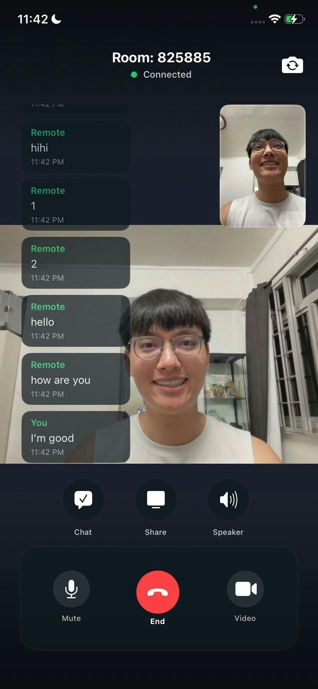
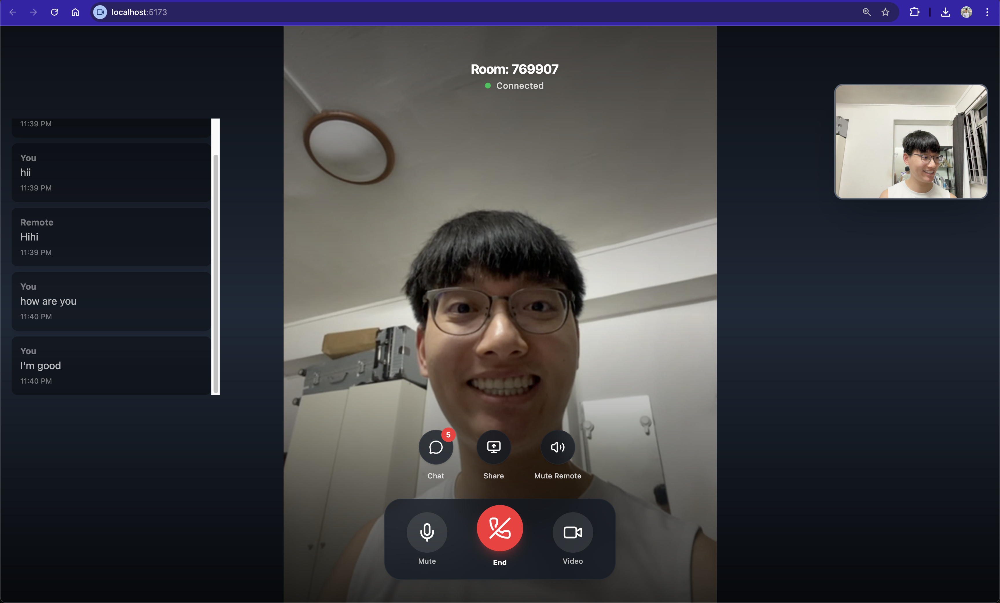

# WebRTC-Demo
<div align="center">
<h2>A comprehensive WebRTC demo on Web, Android and iOS</h2>





</div>
 
# Features

| Feature                       | Desktop | iOS | Android |
|-------------------------------|---------|-----|---------|
| Video call                    | ✅       | ✅   | ✅       |
| Front/back camera             | ❌       | ✅   | ✅       |
| Mute local video              | ✅       | ✅   | ✅       |
| Mute local audio              | ✅       | ✅   | ✅       |
| Mute remote video             | ✅       | ❌   | ❌       |
| Device speaker                | ❌       | ✅   | ✅       |
| Data channel                  | ✅       | ✅   | ✅       |
| Share screen                  | ✅       | ❌   | ✅       |
| Share video from Photos/Files | ✅       | ✅   | ✅       |
| Virtual background            | ✅       | ❌   | ❌       |
| End to end encryption         | ✅       | ❌   | ❌       |


# Disclaimer
This is intended to show common use cases of WebRTC cross platforms and to give you some ideas, it may have bugs, use with caution!

# Setup
## Start signaling server
First you need to start the signaling server, Open terminal at `signaling-server` and run:
```
npm install # or yarn install (to install dependencies)
npm run dev # or yarn dev
```
Once started the address of signling server will be printed in your terminal. Something like `192.168.1.1:4000`

## Start clients
The usage of all clients are same, you just need to join clients in same room by input same roomID.

### Web
To start web client, open terminal at `web` and run:
```
npm install

npm run dev
```
Then open 2 browsers at `localhost:5173` to test

> If sinaling server is not in the same machine with web, then you need to update `BASE_URL` in web/src/App.vue

### Android 

Change the value of `serverAddress` in `android/app/src/main/res/values/strings.xml` to server IP which is printed when you start the signaling server

### iOS

First run the following command in `ios` folder:
```
pod install
```

Then change `SERVER_URL` in `CallViewController` to signaling server address

# Troubleshooting

## iOS - Compiling for iOS 11.0, but module...

Change Minimum Deployments of the pod that has issue to latest


## iOS - Sandbox: rsync.samba(13105)...


Solution: Update your Xcode project build option ENABLE_USER_SCRIPT_SANDBOXING to 'No'.


# Discussion

## End to end encryption on WebRTC

Only support Web for now. Eventhough the owner of webrtc sdk has implemented E2EE for Android/iOS ([See here](https://github.com/webrtc-sdk/webrtc/commit/3a2c008529a15fecde5f979a6ebb75c05463d45e)), but it's pretty different from Web implementation, so need more work to implement cross platform E2EE.

## Screen sharing on iOS

Learn from [Flutter WebRTC Demo](https://github.com/flutter-webrtc/flutter-webrtc/wiki/iOS-Screen-Sharing), we can share screen on iOS using Broadcast Extension, but currently can only share screen from within our app, if we back to home screen, screen sharing will stop.

There's no solution for now, if you have better idea, file an issue or PR is welcome!

## More than 2 peers in a room

For demo purpose, we only support 1:1 call now, but you can extend it to support more peers by implementing a mesh network or using SFU like [mediasoup](https://mediasoup.org/) or [Janus](https://janus.conf.meetecho.com/).

## Virtual background on mobile

Currently we only support virtual background on Web using MediaPipe. Though MediaPipe also supports Android/iOS, but integrating it with WebRTC native sdk is not straight forward. We are working on it, if you have good idea or solution, please file an issue or PR!