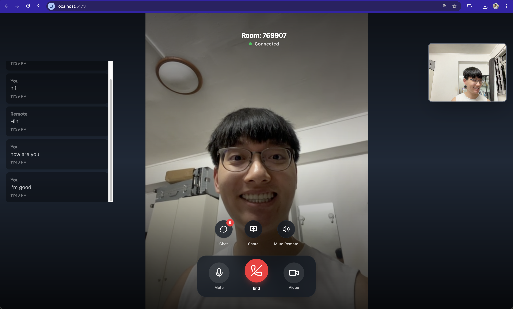
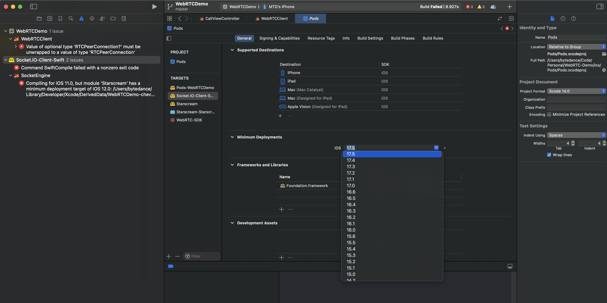
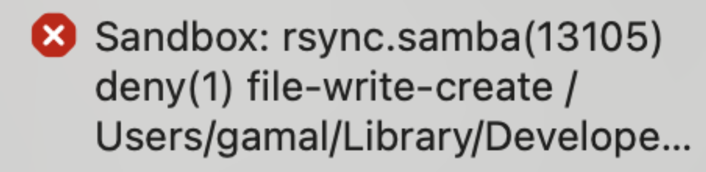
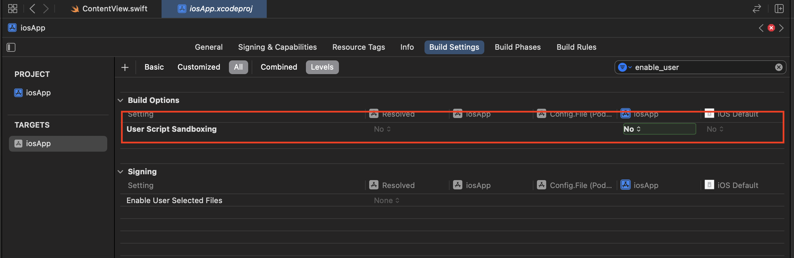

# WebRTC-Demo

<div align="center">
<h3>A comprehensive 1:1 WebRTC demo on Web, Android and iOS</h3>
<p>Video calls, chat, screen and file sharing, virtual background and end-to-end encryption, with native UIs built in Jetpack Compose (Material 3 Expressive) and SwiftUI (Liquid Glass).</p>
</div>

# Screenshots

<!--
  Screenshot placeholders: drop the images into images/ with the file names below,
  then replace each placeholder line with the  tag next to it.
-->

### Android · Jetpack Compose + Material 3 Expressive

| Lobby | In call | Peer camera off | Call options |
|:-----:|:-------:|:---------------:|:------------:|
| _Screenshot: `images/android-lobby.png`_ <!--  --> | _Screenshot: `images/android-call.png`_ <!--  --> | _Screenshot: `images/android-camera-off.png`_ <!--  --> | _Screenshot: `images/android-options.png`_ <!--  --> |

### iOS · SwiftUI + Liquid Glass

| Lobby | In call | Peer camera off | Call options |
|:-----:|:-------:|:---------------:|:------------:|
| _Screenshot: `images/ios-lobby.png`_ <!--  --> | _Screenshot: `images/ios-call.png`_ <!--  --> | _Screenshot: `images/ios-camera-off.png`_ <!--  --> | _Screenshot: `images/ios-options.png`_ <!--  --> |

### Web · Vue 3



_Screenshot: `images/web-camera-off.png`, the web client showing a peer with the camera off_ <!--  -->

_Screenshot: `images/web-mobile.png`, the web client in a phone browser_ <!--  -->

_Screenshot: `images/web-pip.png`, the call in a floating picture-in-picture window over another tab_ <!--  -->

### Demo

_Recording: `images/demo-ui.gif`, joining a room, dragging the picture-in-picture, turning the camera off and chatting_ <!--  -->

# Features

| Feature                                   | Web | iOS | Android |
|-------------------------------------------|-----|-----|---------|
| Video call                                | ✅   | ✅   | ✅       |
| Front/back camera                         | ✅   | ✅   | ✅       |
| Mute local video / audio                  | ✅   | ✅   | ✅       |
| Peer sees when your camera or mic is off  | ✅   | ✅   | ✅       |
| Mute remote audio (this device only)      | ✅   | ✅   | ✅       |
| Hide remote video (this device only)      | ✅   | ✅   | ✅       |
| Device speaker                            | ❌   | ✅   | ✅       |
| Data channel chat                         | ✅   | ✅   | ✅       |
| Share screen                              | ✅   | ✅   | ✅       |
| Share video from Photos/Files             | ✅   | ✅   | ✅       |
| Virtual background                        | ✅   | ✅   | ✅       |
| End to end encryption                     | ✅   | ✅   | ✅       |
| Draggable picture-in-picture self view    | ✅   | ✅   | ✅       |
| System picture-in-picture (call in a floating window) | ✅   | ✅   | ✅       |
| Fit / fill remote video                   | ✅   | ✅   | ✅       |
| Phone rotation (landscape lobby and call) | ✅   | ✅   | ✅       |

Native clients use [webrtc-sdk](https://github.com/webrtc-sdk) `150.7871.01` (Android `io.github.webrtc-sdk:android`, iOS pod `WebRTC-SDK`).

See [ARCHITECTURE.md](ARCHITECTURE.md) for how the signaling server and the three clients work, with diagrams.

## Tech stack

| Part             | Stack |
|------------------|-------|
| Signaling server | Node.js, Express, Socket.IO |
| Web              | Vue 3, Vite, Tailwind CSS, shadcn-vue, Lucide, Motion, MediaPipe |
| Android          | Kotlin, Jetpack Compose, Material 3 Expressive, MediaPipe |
| iOS              | Swift, SwiftUI, Liquid Glass, Vision, Core Image |

# Disclaimer
This is intended to show common use cases of WebRTC cross platforms and to give you some ideas, it may have bugs, use with caution!

# Setup

## Requirements

- Node.js 20.19+ for the signaling server and the web client (Vite 7 needs it)
- Android: Android Studio with JDK 17+, a device on Android 7.0 (API 24) or newer
- iOS: Xcode 26 and CocoaPods, a device on **iOS 26** or newer (Liquid Glass needs iOS 26)

## Start signaling server
First you need to start the signaling server, Open terminal at `signaling-server` and run:
```
npm install # or yarn install (to install dependencies)
npm run dev # or yarn dev
```
Once started the address of the signaling server will be printed in your terminal. Something like `192.168.1.1:4000`

## Start clients
The usage of all clients are same, you just need to join clients in same room by input same roomID.

### Web
To start web client, open terminal at `web` and run:
```
npm install

npm run dev
```
Then open 2 browsers at `localhost:5173` to test

> The web client connects to port 4000 on the host that serves the page. If the signaling server runs elsewhere, click the server address under **Join room** and enter the address printed by the server. It is saved in the browser.

### Android

Run the `app` configuration from Android Studio. In the lobby, tap the signaling server address at the bottom and enter the address printed when you start the signaling server. The app remembers it. The default is `serverAddress` in `android/app/src/main/res/values/strings.xml`.

### iOS

First run the following command in the `ios` folder:
```
pod install
```

Then open `WebRTCDemo.xcworkspace` and run on a device (the camera and screen sharing need real hardware). In the lobby, tap the signaling server address at the bottom and enter the address printed when you start the signaling server. The app remembers it. The default is `SignalingServer.defaultURL` in `WebRTCDemo/SignalingServer.swift`.

# Using the call screen

The Android and iOS call screens work the same way:

- While you are alone, your camera fills the screen and a card shows the room ID with a copy button. When the other peer joins, your video shrinks into a picture-in-picture.
- Tap the video to show or hide the controls. They hide by themselves after a few seconds.
- Double-tap the remote video to switch between fit (whole frame, letterboxed) and fill (cropped to the screen). Screen shares start in fit mode, and so does camera video held the other way round from your screen (a portrait peer on a landscape screen, for example). Rotating starts over from that default.
- Both screens can be used in landscape. The lobby puts the form next to the title, and the call controls stay clear of the camera cutout and the navigation bar.
- Drag the picture-in-picture to any corner. To switch between the front and back cameras, double-tap it or use the button at the top right; the preview flips over to the new camera.
- The toolbar has the microphone, camera, share, chat and more buttons, and hang up. "More" holds the speaker, virtual background, peer audio, peer video, fit/fill and camera switch options.
- Muting the peer's audio or hiding their video only affects your device. The peer is not told.
- When the peer turns their camera off, or you hide their video, you see a blurred copy of their last frame with their avatar. The ring around the avatar pulses while they speak.

The web call screen follows the same layout in desktop and phone browsers, with a few differences:

- Move the mouse to show the controls. Toolbar buttons have tooltips with keyboard shortcuts: `M` microphone, `V` camera, `C` chat, `B` virtual background, `F` fit/fill, `P` picture-in-picture.
- On screens 1024 px and wider, chat opens as a side panel; on smaller screens it opens as a bottom sheet. On phones, "More" opens a sheet with the remaining options.
- The picture-in-picture button opens the call in a floating window that stays on top of other tabs and apps. In Chrome and Edge it is a full mini call window (remote video, your video, mic, camera and hang-up buttons), and since Chrome 134 it opens by itself when you switch to another tab during a call. Other browsers float the remote video only.

# Troubleshooting

## iOS - Compiling for iOS 11.0, but module...

Change Minimum Deployments of the pod that has issue to latest



## iOS - Sandbox: rsync.samba(13105)...




Solution: Update your Xcode project build option ENABLE_USER_SCRIPT_SANDBOXING to 'No'.



## Android - Compose or Material 3 dependency needs a newer compileSdk or AGP

The Android app uses Material 3 Expressive, which is only published in the `material3` 1.5 alphas. It is pinned to `1.5.0-alpha18` with the Compose BOM `2026.06.01`, the newest versions that build with AGP 8.13 and compileSdk 36. Newer versions require AGP 9.1 and compileSdk 37, so upgrade those first if you bump the Compose dependencies.

# Discussion

## Camera and microphone state

When a peer turns its camera or microphone off, it sends a `media state` event (`{ audio, video, screen }`) through the signaling server, which relays it to the other peer. Each client sends it again when the peers connect, so a late joiner gets the current state.

- Turning the camera off sends the state first and disables the track 300 ms later. Turning it on enables the track first and sends the state 300 ms later. Either way the peer switches to the placeholder (or back to video) without showing a black or frozen frame.
- The blurred placeholder comes from a tiny copy (36 px wide) of the last real frame, taken every 500 ms. Near-black frames, like the ones a disabled track produces, are skipped.
- The pulsing ring follows the remote `audioLevel` from `getStats()` (`inbound-rtp`, audio), polled only while the placeholder is visible.

## End to end encryption on WebRTC

Web, Android and iOS can talk to each other with E2EE on. Android/iOS use the `FrameCryptor` built into webrtc-sdk, and the web client (`web/src/e2ee.ts`, Insertable Streams in a worker) produces exactly the same frame format:

```
[unencrypted header][AES-128-GCM ciphertext + 16B tag][IV 12B][IV length = 12][key index]
```

- The unencrypted header is the VP8 payload header (10 bytes for key frames, 3 for delta frames), the Opus TOC byte (1 byte), or H264 data up to the first slice NAL header + 1 byte. It is authenticated as AES-GCM additional data. For H264 the rest of the frame is RBSP-escaped.
- The AES key is derived with `PBKDF2-HMAC-SHA256(material, "LKFrameEncryptionKey", 100000)`, 128 bits. Key provider options are the same on every platform: shared key, key index 0, no ratchet, no magic bytes.
- The peer already in the room generates 32 random bytes of key material and sends them with `send encryption key` before the offer. When E2EE is on, every platform prefers VP8.
- Both peers must enable E2EE. The key goes through the signaling server in plain form, which is fine for a demo; a real app should use a key agreement (e.g. ECDH) or a passphrase shared out of band.

## Screen sharing on iOS

Learn from [Flutter WebRTC Demo](https://github.com/flutter-webrtc/flutter-webrtc/wiki/iOS-Screen-Sharing), we share screen on iOS using a Broadcast Extension. It works both inside the app and after going back to the home screen or another app.

- H264 is encoded by the VideoToolbox hardware encoder, which iOS invalidates while the app is in the background, so the remote side would see a frozen picture. iOS therefore always negotiates **VP8** (software encoded), with or without E2EE. The cost is more CPU and battery than hardware H264.
- The `audio` and `voip` background modes keep the app (and the socket that receives frames from the extension) alive while it is in the background.
- To stop sharing, tap the share button again in the app or stop the broadcast from Control Center.
- The app and the extension must share the same App Group (`group.com.ducmai.webrtc.broadcast` in both `.entitlements` files, `RTCAppGroupIdentifier` in `Info.plist` and `SampleHandler.swift`). If you change the team or bundle id, update all of them, and `RTCScreenSharingExtension` / `preferredExtension` with the new extension bundle id.
- The app side of the socket (`FlutterSocketConnection*`) is copied from the [flutter-webrtc plugin](https://github.com/flutter-webrtc/flutter-webrtc/tree/main/ios/flutter_webrtc/Sources/flutter_webrtc/Broadcast); the LiveKit example only contains the extension side. Keep its frame reading logic as is: if the reader ever asks the stream for 0 bytes, iOS reports end of stream and the broadcast stops right after the first frame.

## More than 2 peers in a room

For demo purpose, we only support 1:1 call now, but you can extend it to support more peers by implementing a mesh network or using SFU like [mediasoup](https://mediasoup.org/) or [Janus](https://janus.conf.meetecho.com/).

## Virtual background on mobile

- Web: MediaPipe `ImageSegmenter` (`selfie_segmenter`) on a canvas.
- Android: MediaPipe `tasks-vision` (`selfie_segmenter`, confidence mask) on its own thread, fed with a small upright copy of the camera frame. The person and the background image are composited on the GPU with a GLES shader over the camera texture, so no full-resolution frame is copied to the CPU.
- iOS: Apple Vision `VNGeneratePersonSegmentationRequest` and Core Image `CIBlendWithMask` on a Metal `CIContext`, inserted as a proxy between `RTCCameraVideoCapturer` and `RTCVideoSource`.

Virtual background only applies to the camera, not to screen share or file share.
