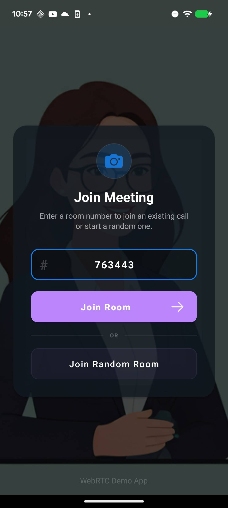
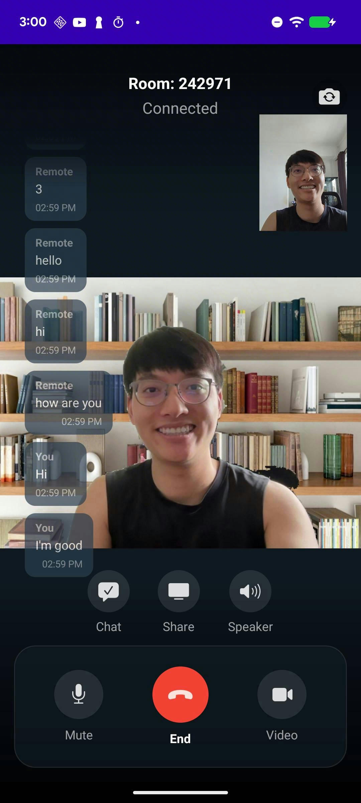
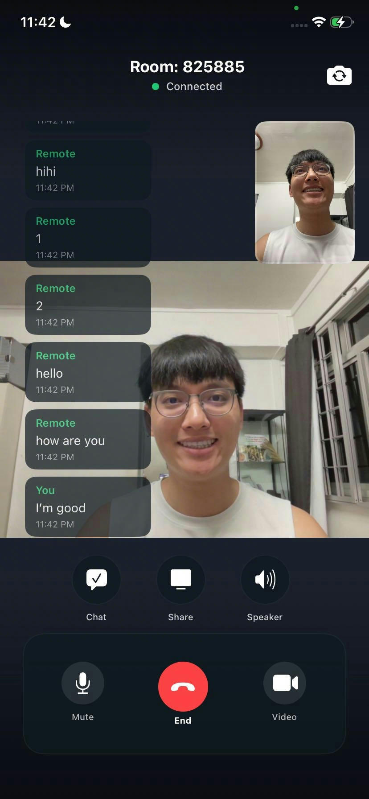

# WebRTC-Demo
<div align="center">
<h2>A comprehensive WebRTC demo on Web, Android and iOS</h2>





</div>
 
# Features

| Feature                       | Desktop | iOS | Android |
|-------------------------------|---------|-----|---------|
| Video call                    | ✅       | ✅   | ✅       |
| Front/back camera             | ❌       | ✅   | ✅       |
| Mute local video              | ✅       | ✅   | ✅       |
| Mute local audio              | ✅       | ✅   | ✅       |
| Mute remote video             | ✅       | ❌   | ❌       |
| Device speaker                | ❌       | ✅   | ✅       |
| Data channel                  | ✅       | ✅   | ✅       |
| Share screen                  | ✅       | ❌   | ✅       |
| Share video from Photos/Files | ✅       | ✅   | ✅       |
| Virtual background            | ✅       | ✅   | ✅       |
| End to end encryption         | ✅       | ✅   | ✅       |

Native clients use [webrtc-sdk](https://github.com/webrtc-sdk) `150.7871.01` (Android `io.github.webrtc-sdk:android`, iOS pod `WebRTC-SDK`).

See [ARCHITECTURE.md](ARCHITECTURE.md) for how the signaling server and the three clients work, with diagrams.


# Disclaimer
This is intended to show common use cases of WebRTC cross platforms and to give you some ideas, it may have bugs, use with caution!

# Setup
## Start signaling server
First you need to start the signaling server, Open terminal at `signaling-server` and run:
```
npm install # or yarn install (to install dependencies)
npm run dev # or yarn dev
```
Once started the address of signling server will be printed in your terminal. Something like `192.168.1.1:4000`

## Start clients
The usage of all clients are same, you just need to join clients in same room by input same roomID.

### Web
To start web client, open terminal at `web` and run:
```
npm install

npm run dev
```
Then open 2 browsers at `localhost:5173` to test

> If sinaling server is not in the same machine with web, then you need to update `BASE_URL` in web/src/App.vue

### Android 

Change the value of `serverAddress` in `android/app/src/main/res/values/strings.xml` to server IP which is printed when you start the signaling server

### iOS

First run the following command in `ios` folder:
```
pod install
```

Then change `SERVER_URL` in `CallViewController` to signaling server address

# Troubleshooting

## iOS - Compiling for iOS 11.0, but module...

Change Minimum Deployments of the pod that has issue to latest


## iOS - Sandbox: rsync.samba(13105)...


Solution: Update your Xcode project build option ENABLE_USER_SCRIPT_SANDBOXING to 'No'.


# Discussion

## End to end encryption on WebRTC

Web, Android and iOS can talk to each other with E2EE on. Android/iOS use the `FrameCryptor` built into webrtc-sdk, and the web client (`web/src/e2ee.ts`, Insertable Streams in a worker) produces exactly the same frame format:

```
[unencrypted header][AES-128-GCM ciphertext + 16B tag][IV 12B][IV length = 12][key index]
```

- The unencrypted header is the VP8 payload header (10 bytes for key frames, 3 for delta frames), the Opus TOC byte (1 byte), or H264 data up to the first slice NAL header + 1 byte. It is authenticated as AES-GCM additional data. For H264 the rest of the frame is RBSP-escaped.
- The AES key is derived with `PBKDF2-HMAC-SHA256(material, "LKFrameEncryptionKey", 100000)`, 128 bits. Key provider options are the same on every platform: shared key, key index 0, no ratchet, no magic bytes.
- The peer already in the room generates 32 random bytes of key material and sends them with `send encryption key` before the offer. When E2EE is on, every platform prefers VP8.
- Both peers must enable E2EE. The key goes through the signaling server in plain form, which is fine for a demo; a real app should use a key agreement (e.g. ECDH) or a passphrase shared out of band.

## Screen sharing on iOS

Learn from [Flutter WebRTC Demo](https://github.com/flutter-webrtc/flutter-webrtc/wiki/iOS-Screen-Sharing), we can share screen on iOS using Broadcast Extension, but currently can only share screen from within our app, if we back to home screen, screen sharing will stop.

There's no solution for now, if you have better idea, file an issue or PR is welcome!

## More than 2 peers in a room

For demo purpose, we only support 1:1 call now, but you can extend it to support more peers by implementing a mesh network or using SFU like [mediasoup](https://mediasoup.org/) or [Janus](https://janus.conf.meetecho.com/).

## Virtual background on mobile

- Web: MediaPipe `ImageSegmenter` (`selfie_segmenter`) on a canvas.
- Android: MediaPipe `tasks-vision` (`selfie_segmenter`, confidence mask) on its own thread, fed with a small upright copy of the camera frame. The person and the background image are composited on the GPU with a GLES shader over the camera texture, so no full-resolution frame is copied to the CPU.
- iOS: Apple Vision `VNGeneratePersonSegmentationRequest` and Core Image `CIBlendWithMask` on a Metal `CIContext`, inserted as a proxy between `RTCCameraVideoCapturer` and `RTCVideoSource`.

Virtual background only applies to the camera, not to screen share or file share.