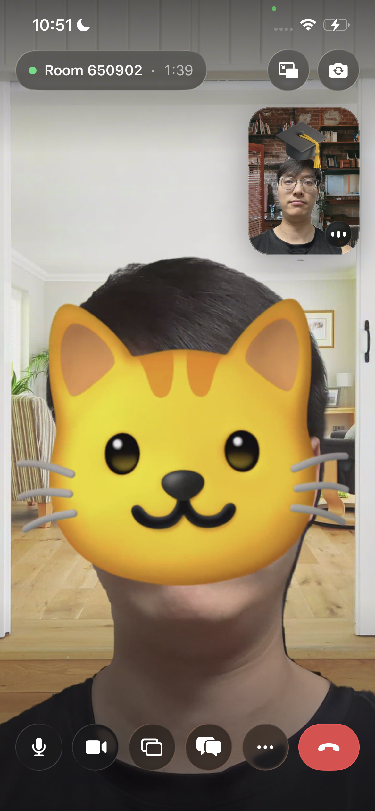
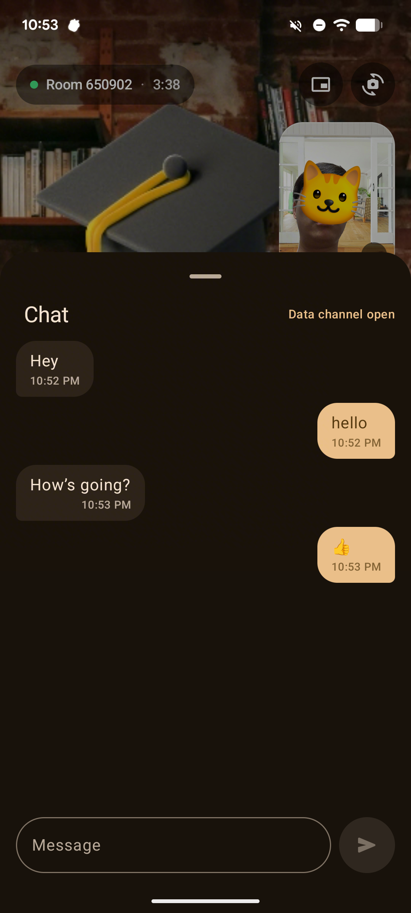
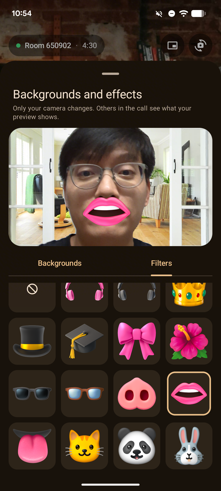
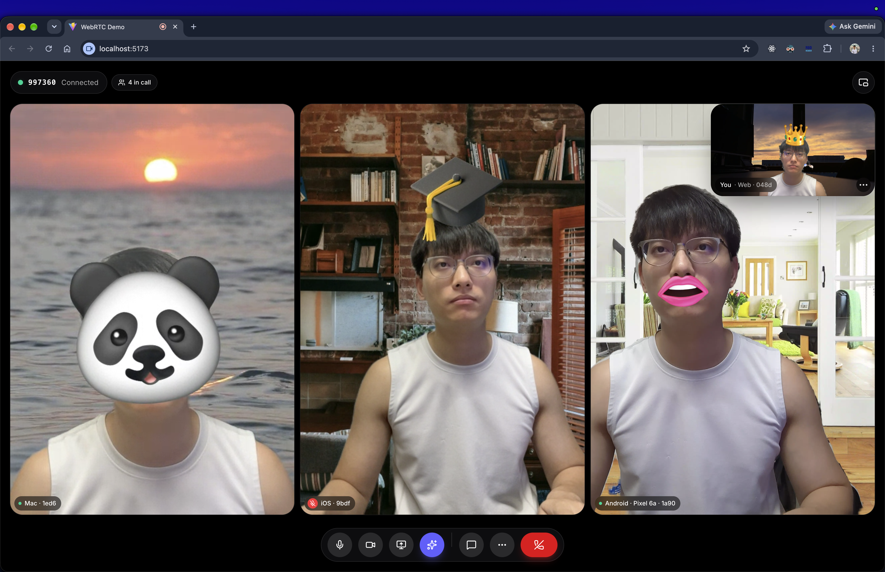
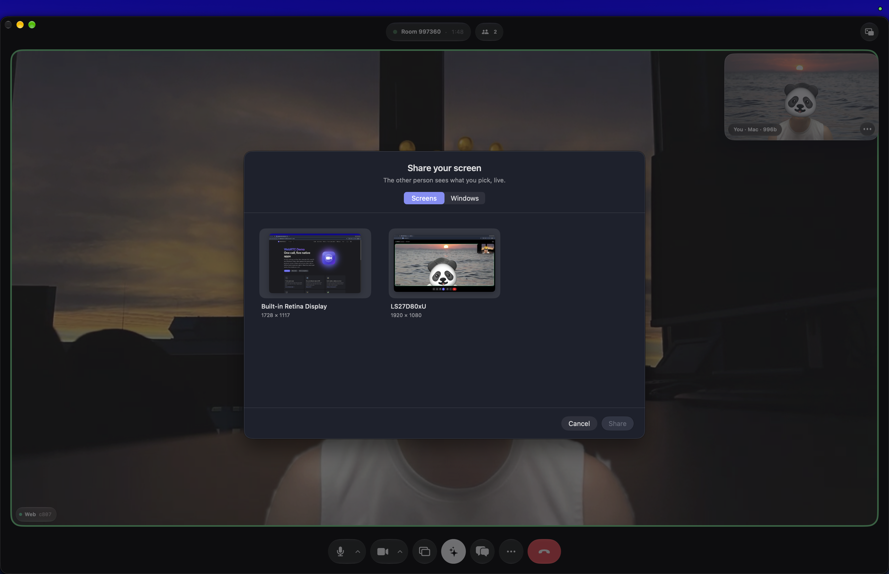
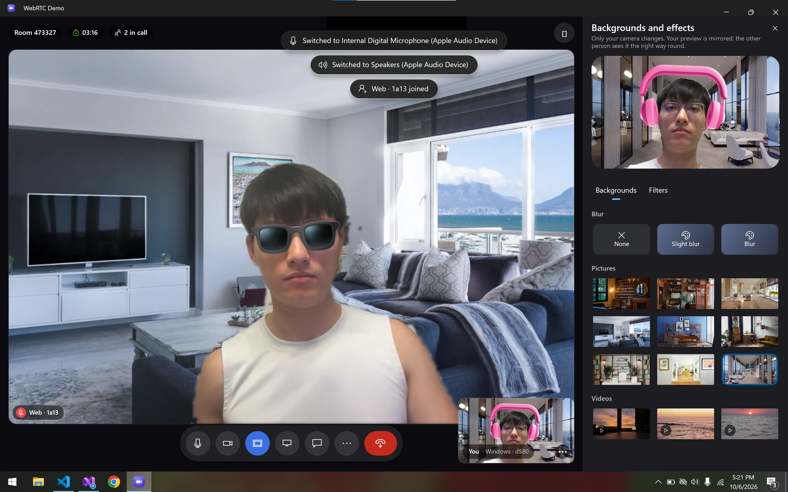
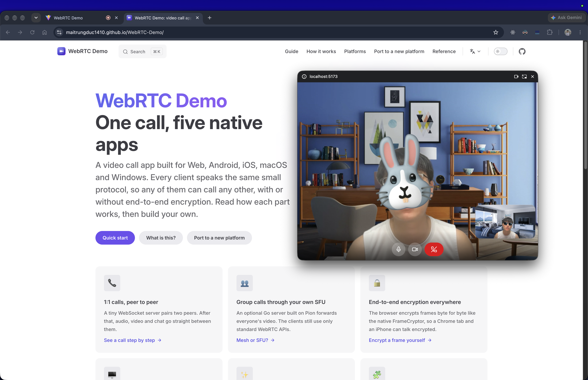

<div align="center">

<h1>WebRTC-Demo</h1>
<p>A WebRTC video call demo with native apps for Web, Android, iOS, macOS and Windows.<br>Every app can call every other one, 1:1 or in a group.</p>
<p><a href="https://maitrungduc1410.github.io/WebRTC-Demo/"><b>Documentation</b></a> · <a href="https://maitrungduc1410.github.io/WebRTC-Demo/vi/">Tiếng Việt</a> · <a href="https://maitrungduc1410.github.io/WebRTC-Demo/zh/">简体中文</a></p>
</div>

<!--
  Media placeholders. Every file goes in docs/public/media/ (the docs site uses the same files).
  When a file is there, replace the italic line with the  tag in the comment next to it.
-->

<!--
  Demo: GitHub does not play an .mp4 from the repository inside a README. Either drag docs/public/media/demo.mp4
  into the GitHub editor and paste the user-attachments link it gives you on its own line, or add a short GIF
  (under 10 MB) as docs/public/media/demo.gif.
  What to record: 20 to 30 s, two different platforms join the same room, the call connects, one side turns on
  a background, sends a chat message, then shrinks the call into picture-in-picture.
-->
<p align="center"><i>Demo recording to add: <code>docs/public/media/demo.gif</code></i></p>
<!-- <p align="center"></p> -->

## Screenshots

Each feature works on every platform. One screenshot per feature is enough to show it.

| 1:1 call · iOS | Chat · Android | Face stickers · Android |
|:---:|:---:|:---:|
| _To add: `call-ios.png`_ <!-- iPhone in a 1:1 call, portrait: the other person fills the screen, your tile in a corner, toolbar visible.  --> | _To add: `chat-android.png`_ <!-- Android in a 1:1 call with the chat sheet open and a few messages from both sides.  --> | _To add: `sticker-android.png`_ <!-- Android front camera with the crown or headphones sticker, head tilted a little.  --> |

| Group call · Web | Screen sharing · macOS |
|:---:|:---:|
| _To add: `group-web.png`_ <!-- Web group call with 4 or 5 people on different platforms: labelled tiles, one speaking ring, one mic-off icon.  --> | _To add: `share-macos.png`_ <!-- Mac app with the share picker open, live thumbnails of screens and windows.  --> |
| **Virtual backgrounds · Windows** | **Picture-in-picture · Web** |
| _To add: `background-windows.png`_ <!-- Windows app with the Backgrounds and effects panel open, you in front of a picture background.  --> | _To add: `pip-web.png`_ <!-- Chrome with another tab in front and the call's floating window on top.  --> |

## Features

| Feature                                                    | Web | iOS | Android | macOS | Windows |
|------------------------------------------------------------|-----|-----|---------|-------|---------|
| 1:1 video call, peer to peer                               | ✅   | ✅   | ✅       | ✅     | ✅       |
| Group call through your own SFU (optional)                 | ✅   | ✅   | ✅       | ✅     | ✅       |
| Chat over a data channel                                   | ✅   | ✅   | ✅       | ✅     | ✅       |
| Share your screen or a video file                          | ✅   | ✅   | ✅       | ✅     | ✅       |
| Virtual backgrounds: blur, pictures and videos             | ✅   | ✅   | ✅       | ✅     | ✅       |
| Face-tracked stickers                                      | ✅   | ✅   | ✅       | ✅     | ✅       |
| End-to-end encryption, 1:1 and group                       | ✅   | ✅   | ✅       | ✅     | ✅       |
| Your own microphone level on your video                    | ✅   | ✅   | ✅       | ✅     | ✅       |
| Picture-in-picture                                         | ✅   | ✅¹  | ✅       | ✅²    | ✅²      |

¹ On iOS, picture-in-picture is available in 1:1 calls only.
² An always-on-top floating window on the Mac and the compact overlay window on Windows.

The native apps use [webrtc-sdk](https://github.com/webrtc-sdk) M150, the web client uses the browser's WebRTC, and the optional group call server is written in Go with [Pion](https://github.com/pion/webrtc).

## Quick start

You need Node.js 20.19 or newer. Start the signaling server:

```
cd signaling-server
npm install
npm run dev
```

It prints its address, something like `192.168.1.1:4000`. Then start the web client:

```
cd web
npm install
npm run dev
```

Open `localhost:5173` in two browser windows and join the same room. To call from a phone or a desktop app, run it, enter the signaling server address in the lobby and join the same room.

Running each app, group calls and the full requirements are in the [Quick start guide](https://maitrungduc1410.github.io/WebRTC-Demo/guide/quick-start).

## Learn more

- [How it works](https://maitrungduc1410.github.io/WebRTC-Demo/how-it-works/): signaling, camera and mic state, sharing, chat, E2EE, group calls and effects, with interactive demos.
- [Platforms](https://maitrungduc1410.github.io/WebRTC-Demo/platforms/): how each app is built and where to look in its code.
- [Port to a new platform](https://maitrungduc1410.github.io/WebRTC-Demo/porting): a checklist for writing a client that works with the others.
- [Troubleshooting](https://maitrungduc1410.github.io/WebRTC-Demo/guide/troubleshooting)
- [ARCHITECTURE.md](ARCHITECTURE.md): the complete technical reference, with diagrams. The docs sources are in [`docs/`](docs) too.

## Disclaimer

This demo shows common WebRTC use cases across platforms and gives you ideas for your own app. It is not a product and may have bugs, so use it with caution.

## Credits

- Stickers are based on [Noto Emoji](https://github.com/googlefonts/noto-emoji) (Apache License 2.0, see [`effects/stickers/LICENSE`](effects/stickers/LICENSE)).
- Background pictures and videos come from [Pexels](https://www.pexels.com) and [Pixabay](https://pixabay.com/), under the [Pexels license](https://www.pexels.com/license/) and the [Pixabay Content License](https://pixabay.com/service/license-summary/).
- The MediaPipe models (`selfie_segmenter`, `face_landmarker`) are used under Apache License 2.0; the Windows app ships them converted to ONNX (see [`windows/models/NOTICE.txt`](windows/models/NOTICE.txt)).

## License

[MIT](LICENSE)
