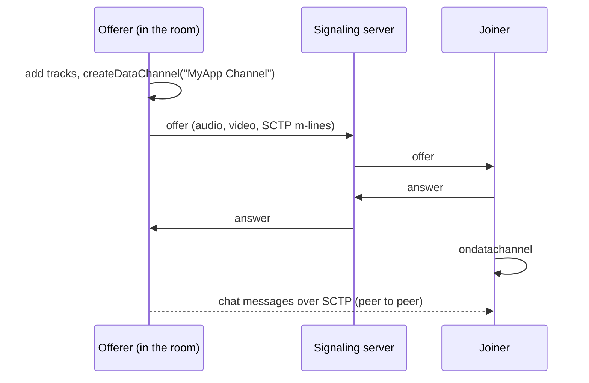

# Chat

In a 1:1 call, chat messages go over a WebRTC data channel, peer to peer, encrypted by DTLS like the media. The server never sees them.

## The channel exists from the first offer {#the-channel-exists-from-the-first-offer}

The offerer (the peer already in the room) creates a channel named `"MyApp Channel"` before its first offer. The SCTP m-line is then negotiated together with audio and video, and opening the chat is only a UI action.

The answerer gets the channel from `ondatachannel` (`onDataChannel` on Android, `didOpen dataChannel` on iOS).

## Why not create it when the chat opens? {#why-not-create-it-when-the-chat-opens}

That is how it used to work, and it caused a bug worth knowing about. Creating the channel later needs a renegotiation, and the renegotiation offer could come from the peer that had only answered so far, for example iOS joining a room Android created. That offer changed the receive parameters on the other side. Android then recreated its remote video decoder, and the remote video froze after a few frames.

Each client can still add the channel on chat open, with one renegotiation, when the call has none. That only happens with an older client that offered without one.

## The channel as a hang-up signal {#the-channel-as-a-hang-up-signal}

The native clients close the channel only when they leave, and the SCTP close arrives at once, while ICE takes several seconds to notice a peer is gone. So the web client treats the channel closing on a live connection as the other side hanging up.

## Group calls {#group-calls}

In a group call there is no peer-to-peer connection between participants, so chat goes through the SFU over the signaling WebSocket as a `chat` message, and the server adds the sender's ID and name. It is plain text on that socket, unlike the 1:1 data channel. See [Messages](/reference/messages#group-calls).

<DemoMedia src="/media/chat-android.png" :width="320">
Android in a 1:1 call with the chat sheet open and a few messages from both sides, one of them a reply in progress in the text field.
</DemoMedia>
