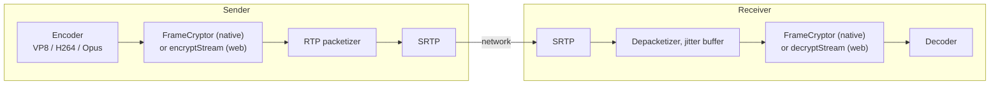
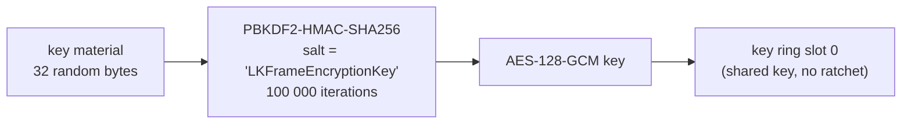
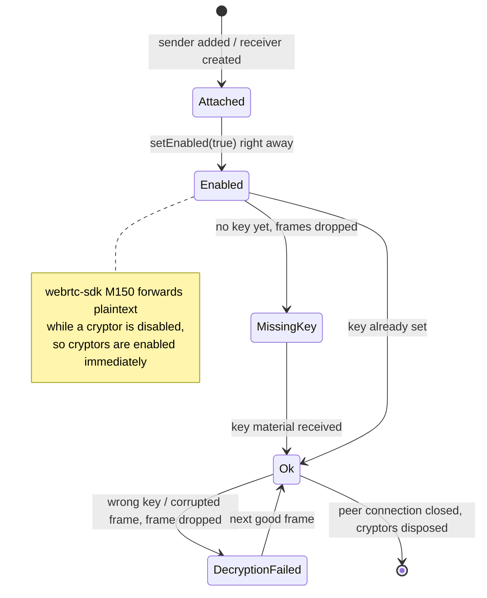

# End-to-end encryption

WebRTC media is always encrypted hop by hop with DTLS-SRTP. That protects it on the wire, but a media server in the middle, like an SFU, ends that encryption and can read every frame. (A TURN server is fine: it only passes the encrypted packets along.) E2EE adds a second layer **on the encoded frame**, before it is split into packets, so a relay only ever sees ciphertext.



The hard part is not the encryption. It is making a browser and three native SDKs produce **exactly the same bytes**, so that any client can decrypt any other.

| Platform | Mechanism | Code |
| --- | --- | --- |
| Web | Insertable Streams: `createEncodedStreams()` (Chrome) or `RTCRtpScriptTransform` (Safari, Firefox), in a worker | [`e2ee.ts`](gh:web/src/e2ee.ts), [`encryptionWorker.ts`](gh:web/src/encryptionWorker.ts), [`frameCrypto.ts`](gh:web/src/call/frameCrypto.ts) |
| Android | `FrameCryptor` + `FrameCryptorKeyProvider` from webrtc-sdk | [`E2eeManager.kt`](gh:android/app/src/main/java/com/example/myapplication/webrtc/E2eeManager.kt), [`FrameCryptors.kt`](gh:android/app/src/main/java/com/example/myapplication/webrtc/FrameCryptors.kt) |
| iOS, macOS | `RTCFrameCryptor` + `RTCFrameCryptorKeyProvider` from webrtc-sdk | [`FrameEncryption.swift`](gh:ios/WebRTCDemo/FrameEncryption.swift) |
| Windows | libwebrtc's frame cryptor, through the C shim | [`shim_peer.cpp`](gh:windows/native/RtcShim/src/shim_peer.cpp) |

The native `FrameCryptor` uses the LiveKit frame format. The web client implements the same format byte for byte, and that is what makes Web, Android, iOS, macOS and Windows interoperate.

## The frame format {#the-frame-format}

```text
┌──────────────────────┬───────────────────────────────────┬────────────┬──────┬──────────┐
│ unencrypted header   │ AES-128-GCM ciphertext + 16B tag  │ IV (12 B)  │ 0x0C │ keyIndex │
└──────────────────────┴───────────────────────────────────┴────────────┴──────┴──────────┘
  additional data (AAD)                                       per frame    IV len  1 byte
```

The first bytes of each frame stay readable, because the packetizer and the decoder need them:

| Codec | Unencrypted header | Why |
| --- | --- | --- |
| VP8 | 10 bytes on key frames, 3 on delta frames | The payload header, so frame type and size can still be parsed |
| H264 | Up to and including the first slice NAL header + 1 byte | NAL structure and SPS/PPS stay readable. The rest is RBSP-escaped so it never contains a start code. |
| Opus | 1 byte, the TOC | The frame configuration |

The header isn't encrypted, but it is authenticated as AES-GCM additional data, so changing it makes decryption fail.

Try it. This box runs the web client's real code on a sample frame:

<E2eeFrame />

A frame that can't be encrypted or decrypted (no key yet, wrong key, broken frame) is **dropped**. It is never sent or decoded in plain form. Empty frames, like Opus silence, pass through untouched, as the native cryptor does.

## The key {#the-key}



Only the 32 bytes of key material travel, base64 in the `encryption key` message. Each side derives the AES key locally. In a 1:1 call the offerer generates the material and sends it before the offer.

The key provider options must be identical everywhere. If any of them differ, the peers derive different keys or write a different trailer, and the other side can't decrypt:

| Option | Value |
| --- | --- |
| Shared key mode | `true` |
| Ratchet salt | `"LKFrameEncryptionKey"` |
| Ratchet window size | `0` |
| Uncrypted magic bytes | none |
| Failure tolerance | `-1` |
| Key ring size | `16` |
| Discard frame when cryptor not ready | `false` |
| Key derivation | PBKDF2 |
| Key index | `0` |

## Codec choice {#codec-choice}

When E2EE is on, every platform puts **VP8 first** in the video codec preferences (`setCodecPreferences`) before the offer or the answer. Its header layout is the simplest and the most consistent across implementations. iOS puts VP8 first on every call anyway, see [iOS screen sharing](/platforms/ios#screen-sharing).

The web client also reads the negotiated SDP to map payload types to codecs (`parseCodecMap`), because `getMetadata().mimeType` isn't available in every browser.

## Cryptor lifecycle {#cryptor-lifecycle}



Both peers must turn E2EE on. If only one does, the other side gets frames it can't decode or decrypt, and the call stays black and silent. E2EE is chosen in the lobby and can't be toggled during a call.

In group calls the SFU forwards ciphertext without knowing it, and the room creator's key material becomes the room key. See [Group calls (SFU)](/how-it-works/group-calls#e2ee-in-a-group).

::: warning Good enough for a demo
The key material goes through the signaling server in plain form. A real app should use a key agreement (for example ECDH) or a passphrase shared out of band, and rotate the key when someone leaves a group call.
:::
