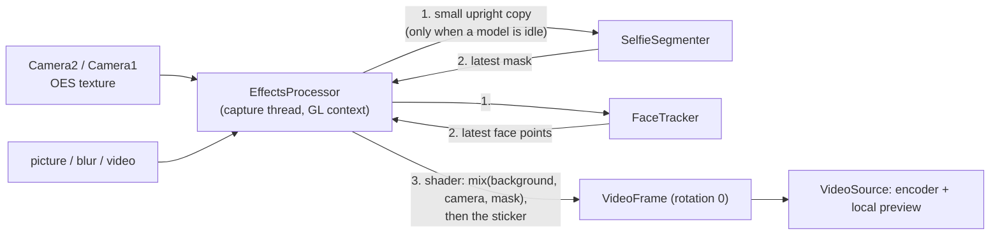
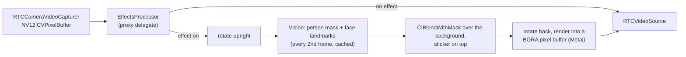
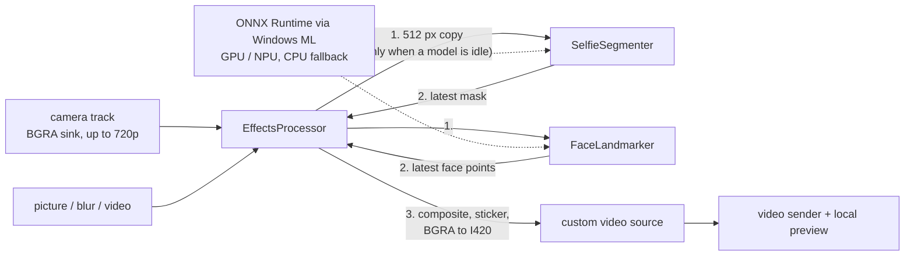
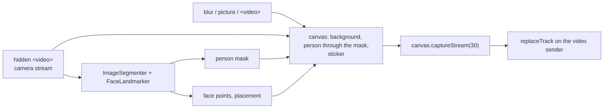

# Backgrounds and effects

**Backgrounds and effects** (under More, or `B` on desktop) shows a live preview and two tabs: **Backgrounds** (none, slight blur, blur, pictures and looping videos) and **Filters** (stickers that follow your face, like headphones, a crown or glasses). A background and a sticker can be combined.

<DemoMedia src="/media/background-windows.png" :width="720">
The Windows app with the Backgrounds and effects panel open on the side: the live preview shows you in front of a picture background, with the grid of background thumbnails below.
</DemoMedia>

Effects only touch **camera** frames. Screen and file sharing are sent as they are.

## One folder for every app {#one-folder-for-every-app}

The [`effects`](gh:effects) folder at the repository root is the single source for every app:

- Vite imports it with `import.meta.glob`.
- Android copies it into the APK's `assets/effects` at build time (`copyEffects` in [`build.gradle.kts`](gh:android/app/build.gradle.kts)).
- iOS and macOS bundle it as a folder reference.
- Windows links it into the app output.

`backgrounds.json` lists pictures and videos, `stickers.json` lists stickers. An entry whose file is missing is skipped, and a saved choice that no longer exists falls back to none. [Customize](/customize) shows how to add your own.

## Sticker placement {#sticker-placement}

<DemoMedia src="/media/sticker-android.png" :width="320">
Android front camera with a face sticker on (the crown or the headphones), the head tilted a little so it shows that the sticker follows the face.
</DemoMedia>

Every platform turns its face landmarks into four points (both eye centers, the nose tip, the mouth center) and runs the same placement code: [`placement.ts`](gh:web/src/effects/placement.ts), [`StickerPlacement.kt`](gh:android/app/src/main/java/com/example/myapplication/webrtc/effects/StickerPlacement.kt), `StickerPlacement` in [`EffectsCatalog.swift`](gh:ios/WebRTCDemo/EffectsCatalog.swift), [`StickerPlacement.cs`](gh:windows/src/WebRtcDemo.Effects/StickerPlacement.cs).

- "Right" runs from one eye to the other and "up" from the mouth to the eyes, so the sticker follows a tilted head. The eye order comes from that up direction, so it doesn't matter which eye a detector calls left.
- The unit is the larger of the eye distance and eyes-to-mouth divided by 1.2, so stickers don't shrink when the head turns sideways.
- Each placement is blended with the previous one (40% old), and the last one stays on screen for up to 6 missed detections in a row.

## Starting with an effect on {#starting-with-an-effect-on}

The choice is saved. When a call starts with a saved effect, camera frames are held until the effect is loaded and the first mask is ready, so the other person never sees your real room first. If an effect can't be loaded, the previous choice comes back with a toast.

## Five pipelines {#five-pipelines}

| | Web | Android | iOS, macOS | Windows |
| --- | --- | --- | --- | --- |
| Person mask | MediaPipe `ImageSegmenter` | MediaPipe `tasks-vision`, 256 px input | Vision `VNGeneratePersonSegmentationRequest`, every 2nd frame | `selfie_segmenter` as ONNX, 256 px input |
| Face points | MediaPipe `FaceLandmarker` | MediaPipe `FaceLandmarker`, 384 px input | Vision `VNDetectFaceLandmarksRequest`, every 2nd frame | BlazeFace then face landmarks, as ONNX |
| Blur | `ctx.filter = blur()` | Downscale + separable Gaussian in two FBOs | `CIGaussianBlur` | Downscale + separable Gaussian in C# |
| Video background | Hidden muted `<video>` | `MediaPlayer` into an OES texture | `AVPlayer` + `AVPlayerItemVideoOutput` | Media Foundation file source |
| Compositing | Canvas 2D | GLES fragment shader | Core Image on Metal | C# on the CPU |
| Hook point | Separate `MediaStream`, `replaceTrack` | `VideoSource.setVideoProcessor()` | Proxy `RTCVideoCapturerDelegate` | Second sink on the camera track, effects track swapped onto the sender |

### Android {#android}

Full-resolution pixels never leave the GPU. Only a small copy is read back for the models. If a model is still busy, the frame uses its previous result instead of waiting.

### iOS and macOS {#ios-and-macos}

While a frame is being processed, new camera frames are dropped, so the capture queue never blocks and an unprocessed frame never slips through. The Mac runs the same code, and backs off to every 3rd or 4th frame when Vision is slow (Intel Macs have no Neural Engine).

### Windows {#windows}

The models are MediaPipe's, converted to ONNX by [`convert.sh`](gh:windows/models/convert.sh). Windows ML picks the GPU or NPU provider certified for the PC and falls back to the CPU. Because a GPU provider can run without an error and still return nonsense, an accelerated model's first frames also run on the CPU and are compared.

### Web {#web}

MediaPipe is most of the bundle, so [`EffectsProcessor.ts`](gh:web/src/effects/EffectsProcessor.ts) is only loaded the first time an effect is turned on. When the tab is hidden, the compositing loop switches from `requestAnimationFrame` to timers, so the other side keeps getting frames while the call is in picture-in-picture.
