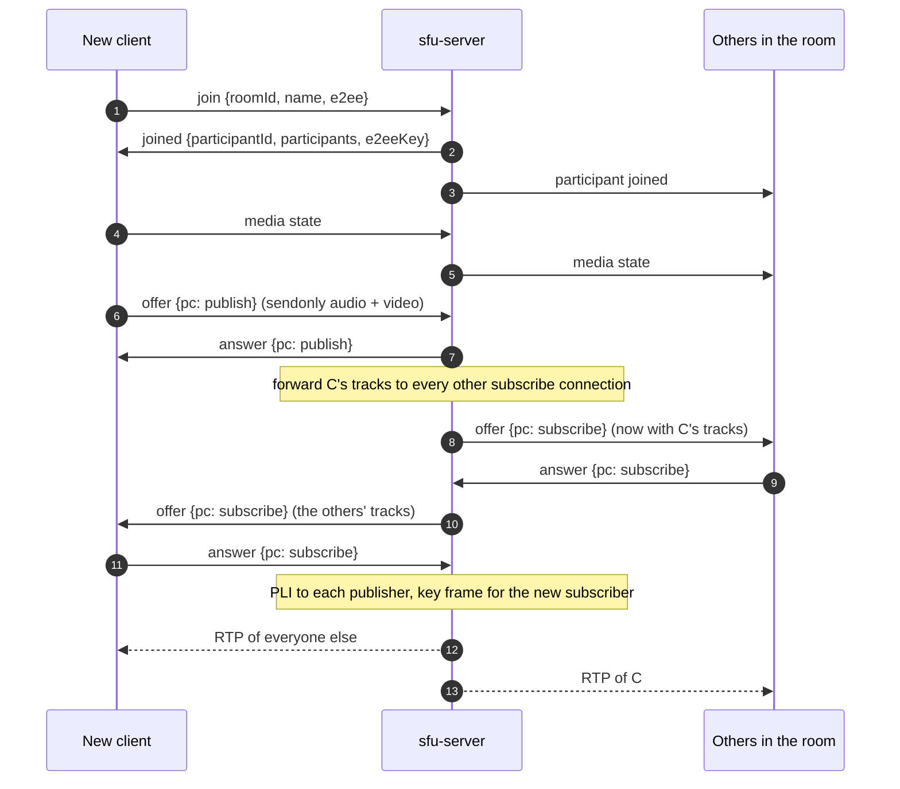

# Group calls (SFU)

The default call is 1:1 and peer to peer. Group calls go through [`sfu-server`](gh:sfu-server), a small Selective Forwarding Unit written for this demo with [Pion](https://github.com/pion/webrtc), instead of a ready-made media server. Every client still uses only standard WebRTC APIs, with no SFU SDK, so you can read how a group call works from end to end.

Group calls are opt in. The 1:1 call and its signaling server don't change at all.

<DemoMedia src="/media/group-web.png" :width="720">
The web client in a group call with four or five people on different platforms: the grid of tiles with their labels (for example "Android · 3f2a1c"), one tile with the green speaking ring, one with the mic-off icon, one showing the avatar because the camera is off.
</DemoMedia>

## Why an SFU {#why-an-sfu}

With mesh, everyone connects to everyone, so every phone encodes and uploads its video once per other person. Through an SFU each client uploads one stream and the server copies its packets to the others, without decoding them. Drag the slider:

<SfuCompare />

An MCU, which decodes, mixes and re-encodes on the server, isn't needed for a demo.

## The server {#the-server}

`sfu-server` is one Go process that does both jobs the 1:1 mode splits between the Node server and the peers:

- **signaling**: a plain WebSocket at `ws://<host>:4001/ws`, JSON messages;
- **media**: every participant's RTP packets are copied to the other participants.

| File | Role |
| --- | --- |
| [`main.go`](gh:sfu-server/main.go) | Flags, `GET /` health check, `/ws` |
| [`signaling.go`](gh:sfu-server/signaling.go) | Message types. One read loop and one queued write loop per socket, so a room lock never waits on the network. Pings every 20 s. |
| [`room.go`](gh:sfu-server/room.go) | Rooms in memory, join and leave, forwarding a new track to everyone else |
| [`participant.go`](gh:sfu-server/participant.go) | The two peer connections of a participant, RTP forwarding, key frame requests, renegotiation |
| [`webrtc.go`](gh:sfu-server/webrtc.go) | Pion setup shared by every peer connection: codecs, interceptors, one UDP port |
| [`sfu_test.go`](gh:sfu-server/sfu_test.go) | Real Pion clients over loopback |

Every peer connection shares **one UDP port** (4001, the same number as the TCP port), so a firewall only needs TCP 4001 and UDP 4001. The server doesn't trickle ICE: it waits for its own candidates before sending an SDP, so its offers and answers already contain them.

## Two peer connections per client {#two-peer-connections-per-client}

Each client opens two peer connections to the server, whatever the room size:

| | Publish connection | Subscribe connection |
| --- | --- | --- |
| Direction (client side) | `sendonly`: one audio, one video transceiver | `recvonly`: one transceiver per remote track |
| Who offers | Always the client | Always the server |
| Renegotiated | Never | Each time someone's tracks appear or go away |

Fixing who offers on each connection means the two sides never offer at the same time, and a peer never switches from answering to offering. Joins and leaves only renegotiate the subscribe connection, so the outgoing camera is never touched. Switching camera, screen and file works exactly as in a 1:1 call ([Switching video sources](/how-it-works/media-sources)).

## Joining a room {#joining-a-room}

All messages are listed in [Messages](/reference/messages#group-calls).

## Forwarding {#forwarding}

- **Whose track is this?** Each forwarded track's stream ID (`msid`) is the publisher's `participantId`, and its track ID is `<participantId>-audio` or `<participantId>-video`. Clients read `streams[0].id` in `ontrack` to know which tile a track belongs to. Tracks can arrive before or after `participant joined`.
- **Reused m-lines.** When someone leaves, the server reuses their transceivers for the next tracks. libwebrtc doesn't always fire a new track event for a reused m-line, so iOS, macOS and Windows also read `a=mid` and `a=msid` from every subscribe offer and map receivers by `mid`. Android keys tracks by receiver ID, and the web moves a reused track away from its previous owner.
- **Codecs.** The server only accepts **VP8** and **Opus**. Every client can encode and decode them, and the server never translates between codecs.
- **Header extensions** are stripped from forwarded packets: their IDs were negotiated on the publisher's connection and mean nothing on a subscriber's.
- **Key frames.** A subscriber can only start decoding at a key frame. The server sends a PLI to the publisher when a subscribe connection connects and after each subscribe answer, and relays PLI and FIR from subscribers, at most once per 500 ms per track.
- **Loss and congestion.** Pion's default interceptors handle NACK retransmissions, receiver reports and transport-wide congestion control feedback.

## Active speaker {#active-speaker}

Every 250 to 300 ms each client reads `audioLevel` from `inbound-rtp` stats for every remote audio receiver. The loudest participant above a small threshold gets a green ring, held for about a second so it doesn't flicker between words. The level has to be read per receiver, because every forwarded audio track looks the same from the outside.

## E2EE in a group {#e2ee-in-a-group}

E2EE is a frame-level transform, so the server only sees ciphertext in the RTP payloads. It doesn't need to know. The 1:1 key exchange (the offerer sends the material to the one other peer) doesn't fit a room, so:

1. Every client that joins with E2EE on generates 32 random bytes and sends them in `join`.
2. The room keeps the **creator's** material as the room key and returns it in every `joined`.
3. Each client sets it as the shared key (key index 0, the [same derivation and options](/how-it-works/e2ee#the-key)), attaches encryptors to its publish senders and decryptors to every subscribe receiver, including ones added by later renegotiations.

E2EE is a property of the room. A client whose switch differs from the room's gets a fatal `E2EE setting does not match the room`.

## What a production SFU adds {#what-a-production-sfu-adds}

Simulcast with per-subscriber layer selection, TURN, several servers, authentication and key rotation. If you need those, look at [LiveKit](https://github.com/livekit/livekit), [mediasoup](https://mediasoup.org/) or [Janus](https://janus.conf.meetecho.com/).
