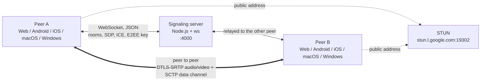

# How it works

Two peers join the same room through a small WebSocket signaling server. The server only relays control messages: the SDP offer and answer, ICE candidates and the E2EE key. Audio, video and chat go **directly between the peers** over WebRTC. Google's public STUN server helps each peer find its public address.

That is the default mode: a room holds two people. [Group calls](/how-it-works/group-calls) are an optional mode where everyone connects to a small SFU server instead.

## The pieces {#the-pieces}

| Piece | Tech | Start reading at |
| --- | --- | --- |
| Signaling server | Node.js, `ws` | [`server.js`](gh:signaling-server/server.js) |
| SFU server (optional) | Go, Pion | [`sfu-server/`](gh:sfu-server) |
| Web | Vue 3, TypeScript, Vite | [`useCall.ts`](gh:web/src/call/useCall.ts) |
| Android | Kotlin, Jetpack Compose, webrtc-sdk | [`PeerConnectionClient.kt`](gh:android/app/src/main/java/com/example/myapplication/webrtc/PeerConnectionClient.kt) |
| iOS | Swift, SwiftUI, webrtc-sdk | [`PeerConnectionClient.swift`](gh:ios/WebRTCDemo/PeerConnectionClient.swift) |
| macOS | Swift, SwiftUI + AppKit, the iOS engine | [`WebRTCDemoMacApp.swift`](gh:ios/WebRTCDemoMac/WebRTCDemoMacApp.swift) |
| Windows | C#, WinUI 3, libwebrtc through a C shim | [`CallViewModel.cs`](gh:windows/src/WebRtcDemo.Core/Call/CallViewModel.cs) |

<PlatformPicker />

## Rules every client follows {#rules-every-client-follows}

These few decisions are what let five independent apps call each other. Each one has its own page.

- **The peer already in the room makes the offer.** The one who joins second answers. Nobody ever offers at the same time. [Signaling](/how-it-works/signaling)
- **The chat channel is created before the first offer**, so opening the chat never renegotiates. [Chat](/how-it-works/chat)
- **Switching between camera, screen and file never renegotiates.** The video sender stays, only what feeds it changes. [Switching video sources](/how-it-works/media-sources)
- **Camera state travels as a message.** A disabled track still sends black frames, so each side tells the other with `media state`, 300 ms before or after the track changes. [Camera and mic state](/how-it-works/media-state)
- **E2EE uses one frame format and one set of key options**, and VP8 goes first when it is on. [End-to-end encryption](/how-it-works/e2ee)
- **No reconnect.** If the signaling socket closes, the call ends. [Signaling](/how-it-works/signaling#losing-the-signaling-socket)

The full repository layout, with every file and what it does, is in [`ARCHITECTURE.md`](gh:ARCHITECTURE.md#2-repository-layout).
