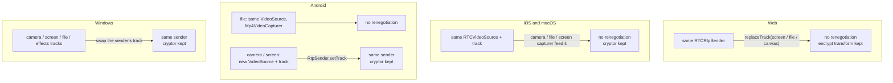
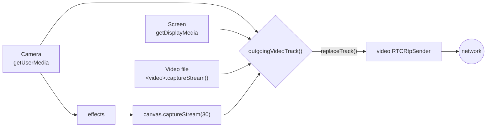

# Switching video sources

A call can send the camera, a screen or window, or a video file, and the effects output when a background is on. Switching between them never renegotiates. The video sender stays the same and only what feeds it changes.

That matters for two reasons:

- **E2EE.** A frame cryptor is bound to one sender and one receiver. Keep the sender and the encryption keeps working.
- **Stability.** A renegotiation recreates the receive streams, and so the video decoders, on both sides. On Android the remote video froze after a few frames when that happened.

## How each platform does it {#how-each-platform-does-it}

| Platform | Camera ↔ screen | Camera ↔ file |
| --- | --- | --- |
| Web | `replaceTrack()` | `replaceTrack()` |
| iOS, macOS | Same `RTCVideoSource`, another capturer | Same `RTCVideoSource`, another capturer |
| Android | New video track, `RtpSender.setTrack()` | Same `VideoSource`, new capturer |
| Windows | New track on the same sender | New track on the same sender |

Android gives the screen its own `VideoSource` because only a screencast source adapts by frame rate instead of resolution. The microphone track is never replaced anywhere, so muting keeps working while you share.

## The web client, as an example {#the-web-client-as-an-example}

Each source has its own track. `outgoingVideoTrack()` in [`media.ts`](gh:web/src/call/media.ts) picks the one to send: the screen or file while sharing, else the effects canvas when an effect is on, else the camera. `syncVideo()` puts it on the sender with `replaceTrack()`.

Sharing stops the camera, and stopping the share opens it again.

## Starting without a camera {#starting-without-a-camera}

A call can start with no camera: another app has it (Windows gives a camera to one app at a time), none is plugged in, or access is blocked. The video sender exists anyway:

- The 1:1 offerer adds a `sendrecv` video transceiver without a track.
- The answerer turns the offer's `recvonly` video transceiver into `sendrecv` before answering.
- The group publish connection always has its `sendonly` video transceiver.
- Windows puts a placeholder track on the sender.

Turning the camera on later only needs to put a track on that sender. If it can't open, a toast says why: in use by another app, blocked, or none.

## Screen sharing per platform {#screen-sharing-per-platform}

| Platform | How |
| --- | --- |
| Web | `getDisplayMedia()` |
| Android | `MediaProjection` with a foreground service ([`ScreenCaptureService.kt`](gh:android/app/src/main/java/com/example/myapplication/ScreenCaptureService.kt)). Rotating the phone resizes the virtual display. |
| iOS | A ReplayKit broadcast extension sends JPEG frames to the app over a Unix socket. See [iOS](/platforms/ios#screen-sharing). |
| macOS | ScreenCaptureKit (`SCStream`), with live thumbnails in the picker. |
| Windows | libwebrtc's desktop capturer, with live thumbnails in the picker. |

Video files are read with `<video>.captureStream()` on the web, `Mp4VideoCapturer` on Android, `RTCFileVideoCapturer` on iOS, `AVAssetReader` on the Mac and Media Foundation on Windows. All of them loop.
