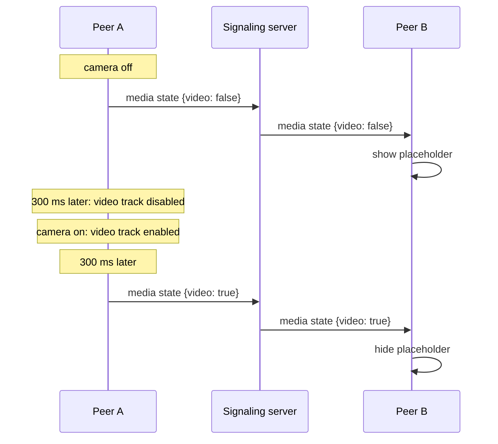

# Camera and mic state

A disabled video track doesn't stop sending. It sends black frames. So the other side can't tell "camera off" from "dark room" by looking at the video. Each client reports its own state with a `media state` message instead:

```json
{ "type": "media state", "state": { "audio": true, "video": false, "screen": false } }
```

It is sent on every change, and once more when the peers connect, so someone who joins late gets the current state. `screen` is true while a screen or a video file is shared. The receiving app then shows that video fit (the whole frame) instead of cropped.

## The 300 ms rule {#the-300-ms-rule}



- **Turning the camera off** sends the state first and disables the track 300 ms later. The peer switches to the placeholder before any black frame arrives.
- **Turning it on** enables the track first and sends the state 300 ms later. The peer only switches back once real frames are flowing, so it never shows the last frozen frame.

Turning the camera off also releases the camera, so its light goes out.

## The placeholder {#the-placeholder}

<DemoMedia src="/media/camera-off.png" :width="320">
A phone (Android or iOS) in a 1:1 call where the other person has turned their camera off: their blurred last frame fills the screen behind a round gradient avatar, ideally caught while they speak so the ring around the avatar is visible.
</DemoMedia>

While the other person's video is off (turned off by them, or hidden by you), each app shows a blurred copy of their last frame behind a gradient avatar:

- The copy is tiny, 36 px wide, taken every 500 ms. Near-black frames, like the ones a disabled track sends, are skipped.
- The avatar colors come from a hash of the room ID, so every platform draws the same avatar for the same room.
- The ring around the avatar follows the remote `audioLevel` from `getStats()` (`inbound-rtp`, audio), polled only while the placeholder is visible.

How each platform takes the snapshot matters more than it looks. iOS copies it from the CPU frame in a small video sink. Android reads it back from the renderer after drawing (`EglRenderer.addFrameListener`), because converting a decoder texture with `toI420()` inside a track sink blocks the decoder's thread and freezes the remote video.

| Platform | Where |
| --- | --- |
| Web | [`PeerPlaceholder.vue`](gh:web/src/components/call/PeerPlaceholder.vue) |
| Android | [`FrameSnapshotter.kt`](gh:android/app/src/main/java/com/example/myapplication/ui/video/FrameSnapshotter.kt), [`PeerPlaceholder.kt`](gh:android/app/src/main/java/com/example/myapplication/ui/call/PeerPlaceholder.kt) |
| iOS, macOS | [`VideoView.swift`](gh:ios/WebRTCDemo/VideoView.swift), [`PeerPlaceholderView.swift`](gh:ios/WebRTCDemo/PeerPlaceholderView.swift) |
| Windows | [`RemoteSnapshotter.cs`](gh:windows/src/WebRtcDemo.Core/Media/RemoteSnapshotter.cs), [`RemotePlaceholder.cs`](gh:windows/src/WebRtcDemo.App/Views/RemotePlaceholder.cs) |

## Your own microphone level {#your-own-microphone-level}

Your own tile shows three small bars that move with your voice while the mic is on, so you can see that the microphone works. The web client measures the microphone track with a Web Audio analyser. The native apps measure what WebRTC sends during a call. While you wait alone in a 1:1 room there is no peer connection yet, so they read the microphone directly for the meter and release it before WebRTC starts recording.

## Things that stay local {#things-that-stay-local}

Muting the other person's audio and hiding their video only disable the remote track on your device. Nothing is sent. On iOS, `setRemoteAudioEnabled()` also covers receivers that a later renegotiation adds.

The rule lives in one place per platform, shared by the 1:1 and group engines: [`media.ts`](gh:web/src/call/media.ts) on the web, [`LocalMedia.kt`](gh:android/app/src/main/java/com/example/myapplication/webrtc/LocalMedia.kt) on Android, [`CallViewModel.swift`](gh:ios/WebRTCDemo/CallViewModel.swift) on iOS and macOS, and [`CallViewModel.cs`](gh:windows/src/WebRtcDemo.Core/Call/CallViewModel.cs) on Windows.
