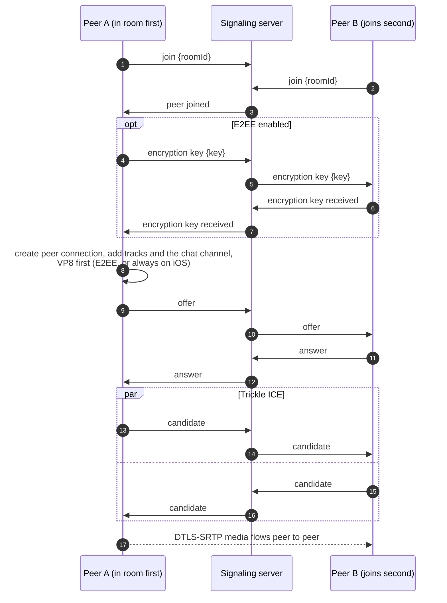
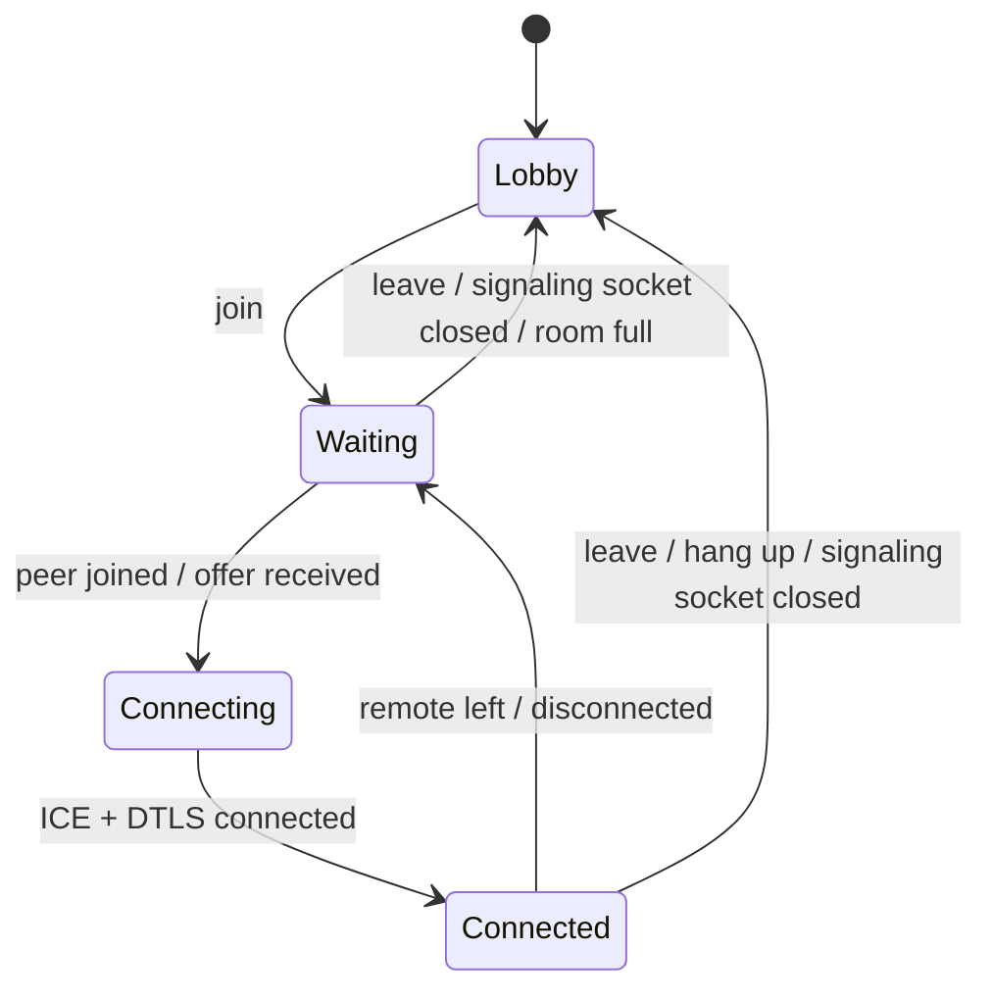

# Signaling and call setup

WebRTC doesn't say how two peers find each other. Before any media can flow, they have to swap an SDP offer, an SDP answer and ICE candidates through some other channel. Here that channel is a WebSocket to a small server.

## The server {#the-server}

[`signaling-server/server.js`](gh:signaling-server/server.js) is a plain Node.js HTTP server with a WebSocket endpoint on `/ws`. Every message is a JSON text frame with a `type`. The server keeps rooms in memory, pairs at most two sockets per room, and relays messages to **the other** socket in the room. It never reads the SDP and never touches media.

- `GET /` answers `{"name":"signaling-server","ok":true}`. The lobbies poll it every 5 seconds for their status dot.
- The server pings every socket every 25 seconds and drops one that doesn't answer, so a phone that lost its network frees its seat.
- A WebSocket keeps message order, so a key sent before an offer always arrives before that offer.

## A call, step by step {#a-call-step-by-step}

Click through the messages of a real call. Turn E2EE off to see the shorter version.

<CallFlow />

The same thing as a sequence diagram:

Every message and its fields are listed in [Messages](/reference/messages#one-to-one-calls).

## Who makes the offer {#who-makes-the-offer}

The peer that is **already in the room** always makes the offer. The second one answers. This one rule removes a whole class of problems: the two sides never offer at the same time (glare), and a peer never switches from answering to offering.

Renegotiation reuses the same `offer` and `answer` messages, but none of the clients needs it in a normal call. Switching sources doesn't renegotiate ([why](/how-it-works/media-sources)), and the chat channel exists from the first offer ([why](/how-it-works/chat)).

## Connection states {#connection-states}

What the UI shows during a call:

## Hanging up {#hanging-up}

`leave` frees the seat, and so does closing the socket. The server doesn't tell the other peer. That peer notices on its own:

- the data channel closes. The SCTP close arrives at once, so the web client treats it as a hang-up on a live connection;
- the ICE connection state turns `disconnected` or `failed`, which takes a few seconds.

## Losing the signaling socket {#losing-the-signaling-socket}

There is no reconnect. Each client opens the socket when it joins and closes it when it leaves. If it closes during a call (server stopped, Wi-Fi to 4G switch, network gone for longer than the ping timeout), the client **ends the call** and says "Lost the connection to the signaling server", even if media is still flowing. The server has already freed the seat, so joining again just works.

This keeps every client simple. A production app would reconnect and resume the session.

One more rule on every platform: callbacks from a peer connection that was replaced or closed are ignored. On Android, calling a disposed native `PeerConnection` crashes the process.

## The server address {#the-server-address}

Each lobby normalizes what you type to `scheme://host[:port]` (the WebSocket is always on `/ws`) and saves it when it differs from the default. On the web that is [`serverUrl.ts`](gh:web/src/call/serverUrl.ts), on Android [`SignalingServer.kt`](gh:android/app/src/main/java/com/example/myapplication/settings/SignalingServer.kt), on iOS and macOS [`SignalingServer.swift`](gh:ios/WebRTCDemo/SignalingServer.swift). iOS and macOS allow plain HTTP (`NSAllowsArbitraryLoads`) and Android sets `usesCleartextTraffic`, so any LAN server works.
