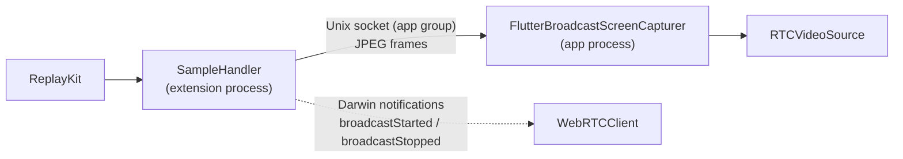

# iOS

A SwiftUI app with Liquid Glass, on the webrtc-sdk `150.7871.01` binary. iOS 26 or newer, built with Xcode 26.

<DemoMedia src="/media/call-ios.png" :width="320">
An iPhone on the home screen (or in another app) with the call in the system picture-in-picture window, showing the other person's video.
</DemoMedia>

Open [`ios/WebRTCDemo.xcodeproj`](gh:ios/WebRTCDemo.xcodeproj), pick the `WebRTCDemo` scheme and run on a device. The camera and screen sharing need real hardware.

## Where things are {#where-things-are}

Files in [`ios/WebRTCDemo`](gh:ios/WebRTCDemo). Most of them are also compiled into the [Mac app](/platforms/macos).

| File | What it does |
| --- | --- |
| [`CallViewModel.swift`](gh:ios/WebRTCDemo/CallViewModel.swift) | `@Observable` call state. Owns `LocalMedia` and the 1:1 or group engine. |
| [`LocalMedia.swift`](gh:ios/WebRTCDemo/LocalMedia.swift) | Factory, local tracks, the single `RTCVideoSource`, sharing, audio session, VP8 first |
| [`PeerConnectionClient.swift`](gh:ios/WebRTCDemo/PeerConnectionClient.swift) | `WebRTCClient`, the 1:1 engine: one peer connection and data channel |
| [`GroupCallClient.swift`](gh:ios/WebRTCDemo/GroupCallClient.swift) | The group engine: SFU WebSocket, publish and subscribe connections |
| [`SignalingSocket.swift`](gh:ios/WebRTCDemo/SignalingSocket.swift) | JSON over `URLSessionWebSocketTask`. Used by both engines. |
| [`FrameEncryption.swift`](gh:ios/WebRTCDemo/FrameEncryption.swift) | E2EE key provider and frame cryptors |
| [`EffectsProcessor.swift`](gh:ios/WebRTCDemo/EffectsProcessor.swift) | Vision + Core Image, as a proxy capturer delegate |
| [`PictureInPicture.swift`](gh:ios/WebRTCDemo/PictureInPicture.swift) | System PiP through an `AVSampleBufferDisplayLayer` |
| [`VideoView.swift`](gh:ios/WebRTCDemo/VideoView.swift) | `RTCMTLVideoView` wrapper and the placeholder snapshotter |
| [`CallView.swift`](gh:ios/WebRTCDemo/CallView.swift), [`GroupCallView.swift`](gh:ios/WebRTCDemo/GroupCallView.swift) | The call screens |
| [`WebRTCDemoScreenBroadcast/`](gh:ios/WebRTCDemoScreenBroadcast) | The ReplayKit broadcast extension |

`WebRTCClient` calls its delegate from WebRTC threads, and the view model hops to the main queue before touching state.

## Screen sharing {#screen-sharing}

iOS only lets an app capture the whole screen, including after you leave it, through a ReplayKit broadcast upload extension. The extension runs in its own process and can't run WebRTC, so it sends the frames to the app over a Unix domain socket in the shared app group. `FlutterBroadcastScreenCapturer` then feeds them into the **same** `RTCVideoSource` the camera uses.

Each frame is an HTTP-style message: `Content-Length`, `Buffer-Width`, `Buffer-Height` and `Buffer-Orientation` headers, then a JPEG body. The app side of the socket is copied from the [flutter-webrtc plugin](https://github.com/flutter-webrtc/flutter-webrtc). Keep its reading logic as it is: if the reader ever asks the stream for 0 bytes, iOS reports end of stream and the broadcast stops right after the first frame.

Sharing keeps going when you leave the app, which needs two things:

- **The app stays alive.** `UIBackgroundModes` has `audio` and `voip`, and the call keeps a `playAndRecord` audio session active, so iOS doesn't suspend the app and its socket.
- **The encoder keeps working.** iOS invalidates the VideoToolbox hardware H264 encoder in the background, so every frame would fail and the other side would see a frozen picture. iOS therefore always puts **VP8** (software) first, with or without E2EE. It costs more CPU and battery.

The app and the extension must share the same App Group (`group.com.ducmai.webrtc.broadcast`). If you change the team or bundle ID, update it in both `.entitlements` files, `RTCAppGroupIdentifier` in `Info.plist`, `SampleHandler.swift`, and the extension bundle ID in `RTCScreenSharingExtension`.

## The audio session {#the-audio-session}

The app configures the audio session itself: before every call, `CallViewModel.configureCallAudio()` sets WebRTC's configuration to `playAndRecord` + `voiceChat`. The webrtc-sdk fork otherwise copies the session's launch category (`soloAmbient`), which iOS rejects together with the Bluetooth HFP option, and calls end up with no microphone and no sound. See [Troubleshooting](/guide/troubleshooting#ios-and-macos).

## How it does each part {#how-it-does-each-part}

- **Switching sources.** Camera, file and screen capturers all feed one `RTCVideoSource`, so the track, the sender and its cryptor never change. [Switching video sources](/how-it-works/media-sources)
- **E2EE.** `RTCFrameCryptor` with the [shared options](/how-it-works/e2ee#the-key).
- **Effects.** A proxy `RTCVideoCapturerDelegate` between the camera and the source runs Vision and Core Image on Metal. [Backgrounds and effects](/how-it-works/effects#ios-and-macos)
- **Picture-in-picture.** Video call PiP, 1:1 only. [Picture-in-picture](/how-it-works/picture-in-picture#ios)
- **Group calls.** Every subscribe offer is parsed for `a=mid` and `a=msid`, because libwebrtc doesn't fire a new receiver event when an m-line is reused for someone else. [Group calls (SFU)](/how-it-works/group-calls#forwarding)

## Notes {#notes}

- WebRTC comes from the local Swift package [`ios/Packages/WebRTC`](gh:ios/Packages/WebRTC), because the Specs manifest for this release doesn't resolve. To upgrade, change the URL and checksum in its `Package.swift`.
- `Info.plist` allows plain HTTP (`NSAllowsArbitraryLoads`) so any LAN server works.
