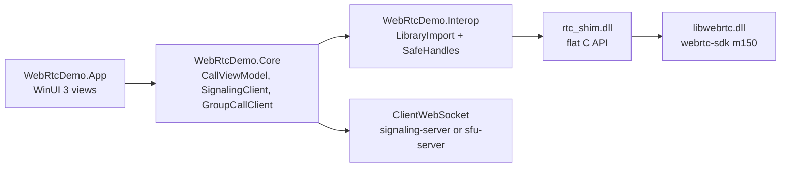

# Windows

A WinUI 3 app on .NET 10, unpackaged and self-contained, for x64 and ARM64. WebRTC is the prebuilt [webrtc-sdk/libwebrtc](https://github.com/webrtc-sdk/libwebrtc) release `m150.7871.03`, the same branch as the Android and Apple SDKs, reached through a small C shim.

<DemoMedia src="/media/windows-call.png" :width="720">
The Windows app in a 1:1 call: the other person's video fills the window, your own tile with rounded corners floats in a corner with the "You" label and the three mic bars, and the toolbar is visible at the bottom.
</DemoMedia>

```powershell
cd windows
./native/RtcShim/scripts/build-shim.ps1   # downloads libwebrtc, builds rtc_shim.dll
dotnet run --project src/WebRtcDemo.App -p:Platform=x64
```

Or open `WebRtcDemo.slnx` in Visual Studio 2026 and run x64 or ARM64. Tests, publishing and troubleshooting are in [`windows/README.md`](gh:windows/README.md).

## Layers {#layers}



| Project | What it does |
| --- | --- |
| [`native/RtcShim`](gh:windows/native/RtcShim) | The C shim. [`rtc_shim.h`](gh:windows/native/RtcShim/include/rtc_shim.h) is the whole API. |
| [`WebRtcDemo.Interop`](gh:windows/src/WebRtcDemo.Interop) | `LibraryImport` bindings, one `SafeHandle` per native object, native callbacks |
| [`WebRtcDemo.Core`](gh:windows/src/WebRtcDemo.Core) | Signaling, the call state machine, media, group engine. No UI, unit tested on any OS. |
| [`WebRtcDemo.Effects`](gh:windows/src/WebRtcDemo.Effects) | Backgrounds and stickers: ONNX models, compositing. No UI. |
| [`WebRtcDemo.App`](gh:windows/src/WebRtcDemo.App) | The WinUI 3 app, with the UI built in C# rather than XAML pages |

## Why a C shim {#why-a-c-shim}

libwebrtc's API is C++ classes: virtual methods, `scoped_refptr`, observer interfaces. C# can't call that directly. The shim, built with MSVC and the static CRT to match `libwebrtc.dll`, exports plain C instead:

- opaque handles with explicit release, UTF-8 strings, and callbacks with a `void* user` argument;
- async calls (create offer, set description, stats) that complete through callbacks;
- a closed peer connection that rejects calls instead of crashing;
- video sinks that hand out BGRA, already rotated and optionally downscaled.

On the C# side, callbacks are `UnmanagedCallersOnly` functions that look their target up by ID, so nothing is pinned and no exception unwinds into native code. If you want to bring libwebrtc to another language, this header is a good map of what a call actually needs.

## How it does each part {#how-it-does-each-part}

- **Signaling.** One `ClientWebSocket` per call, [`SignalingClient.cs`](gh:windows/src/WebRtcDemo.Core/Signaling/SignalingClient.cs). A closed socket ends the call, as on the other clients.
- **Call state.** [`CallViewModel.cs`](gh:windows/src/WebRtcDemo.Core/Call/CallViewModel.cs) follows the same flow as the web and iOS clients: the peer in the room offers, the key goes first, the 300 ms rule.
- **Switching sources.** [`NativeCallMedia.cs`](gh:windows/src/WebRtcDemo.Core/Media/NativeCallMedia.cs) swaps the video sender's track between camera, screen or window, file and effects, which keeps the sender's cryptor. [Switching video sources](/how-it-works/media-sources)
- **Camera.** The shim reads cameras through Media Foundation, like the Windows Camera app, and tries the formats closest to 1280×720 at 30 fps until one sends frames within 4 s. Cameras Media Foundation can't read go through libwebrtc's DirectShow capturer.
- **Effects.** MediaPipe models converted to ONNX, run by ONNX Runtime through Windows ML on the GPU or NPU, with compositing in C#. [Backgrounds and effects](/how-it-works/effects#windows)
- **Picture-in-picture.** The `CompactOverlay` presenter. [Picture-in-picture](/how-it-works/picture-in-picture#windows)

## Two Windows-specific problems worth knowing {#two-windows-specific-problems-worth-knowing}

**The microphone.** libwebrtc's Windows audio device hands echo cancellation to Windows' voice-capture DMO, which only captures while playout runs. A call usually starts sending before any audio arrives, and a group call's publish connection never plays anything, so recording failed and was never retried: the others heard nothing. The shim keeps the DMO out of the audio device, so capture is plain WASAPI, echo-cancelled by libwebrtc's own AEC3.

**Rounded video.** A `SwapChainPanel` is "external content": Windows draws it below WinUI's own rendering, through a hole, so no rounded clip reaches it. Each video view is instead a composition sprite whose brush shows a drawing surface the size of the frame (`ICompositorInterop::CreateGraphicsDevice` on a D3D11 device). The compositor draws that surface itself, so the view can clip it with rounded corners. Frames from WebRTC threads go into a one-slot mailbox that the UI thread draws on the next composition tick.

## Testing without Windows {#testing-without-windows}

[`windows/scripts/verify.sh`](gh:windows/scripts/verify.sh) builds the shim against the Linux libwebrtc release, runs its loopback test (two encrypted peers in one process), runs all the .NET tests against it, and compiles the app for x64 and ARM64. Linux needs an audio server, since libwebrtc aborts without one. PulseAudio with a null sink is enough.
