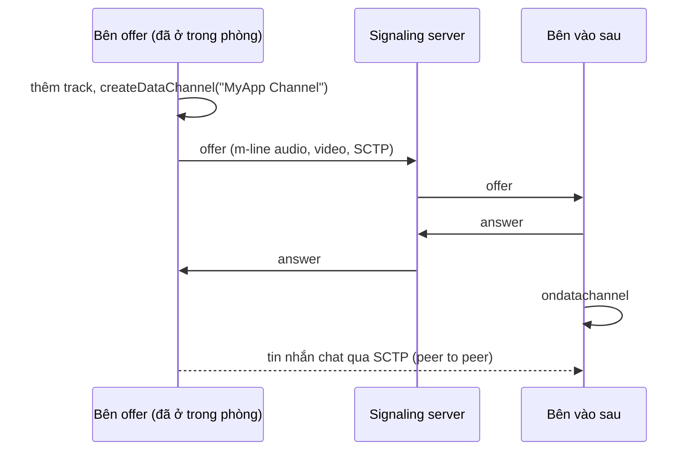

# Chat

Trong cuộc gọi 1:1, tin nhắn chat đi qua một data channel WebRTC, peer to peer, được DTLS mã hóa giống như media. Server không bao giờ thấy chúng.

## Channel có từ offer đầu tiên {#the-channel-exists-from-the-first-offer}

Bên offer (peer đã ở trong phòng) tạo một channel tên `"MyApp Channel"` trước offer đầu tiên. Nhờ vậy m-line SCTP được negotiate cùng lúc với audio và video, và mở chat chỉ còn là thao tác trên UI.

Bên answer lấy channel từ `ondatachannel` (`onDataChannel` trên Android, `didOpen dataChannel` trên iOS).

## Sao không tạo channel lúc mở chat? {#why-not-create-it-when-the-chat-opens}

Trước đây app làm đúng như vậy, và nó gây ra một bug đáng biết. Tạo channel muộn thì phải renegotiate, và offer của lần renegotiate đó có thể đến từ peer mà từ đầu tới giờ chỉ làm bên answer, ví dụ iOS vào một phòng do Android tạo. Offer đó làm thay đổi tham số nhận ở phía bên kia. Android liền tạo lại video decoder cho bên kia, và video bị đứng hình sau vài frame.

Mỗi client vẫn có thể thêm channel khi mở chat, kèm một lần renegotiate, nếu cuộc gọi chưa có channel nào. Chuyện này chỉ xảy ra khi gọi với một client cũ đã offer mà không tạo channel.

## Channel như một tín hiệu cúp máy {#the-channel-as-a-hang-up-signal}

Client native chỉ đóng channel khi rời phòng, và tín hiệu đóng SCTP tới ngay lập tức, trong khi ICE phải mất vài giây mới nhận ra peer đã đi. Vì thế web client coi việc channel bị đóng khi connection vẫn đang sống là bên kia đã cúp máy.

## Cuộc gọi nhóm {#group-calls}

Trong cuộc gọi nhóm, các thành viên không có connection peer to peer với nhau, nên chat đi qua SFU trên WebSocket signaling dưới dạng message `chat`, và server thêm ID và tên của người gửi vào. Trên socket đó, chat là text thuần, khác với data channel của cuộc gọi 1:1. Xem [Messages](/vi/reference/messages#group-calls).

<DemoMedia src="/media/chat-android.png" :width="320">
Android trong cuộc gọi 1:1, sheet chat đang mở, có vài tin nhắn từ cả hai bên, và một câu trả lời đang gõ dở trong ô nhập.
</DemoMedia>
