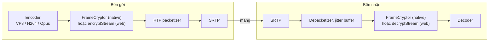
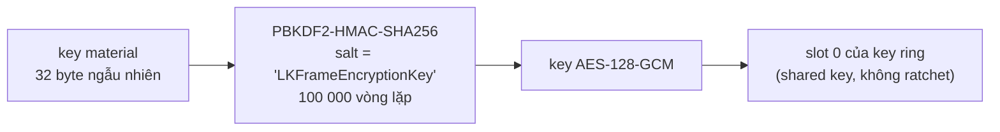
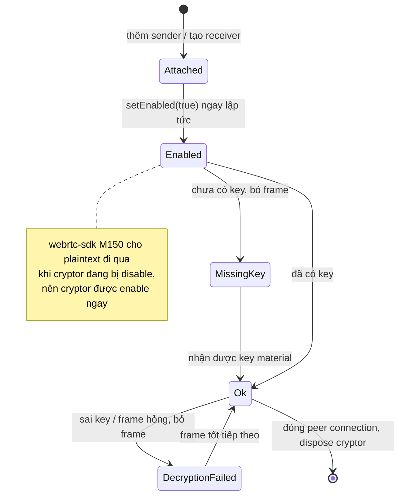

# Mã hóa đầu cuối

Media của WebRTC luôn được mã hóa theo từng chặng (hop by hop) bằng DTLS-SRTP. Lớp này bảo vệ dữ liệu khi đi trên đường truyền, nhưng media server đứng giữa, như SFU, sẽ giải mã lớp này và đọc được mọi frame. (TURN server thì không sao, nó chỉ chuyển tiếp các packet đã mã hóa.) Mã hóa đầu cuối (E2EE) thêm một lớp thứ hai **ngay trên frame đã encode**, trước khi frame bị chia thành packet, nên relay chỉ thấy được ciphertext.



Phần khó không nằm ở việc mã hóa. Khó là làm sao để trình duyệt và ba SDK native tạo ra **đúng y hệt từng byte**, để client nào cũng giải mã được dữ liệu của client khác.

| Nền tảng | Cơ chế | Code |
| --- | --- | --- |
| Web | Insertable Streams: `createEncodedStreams()` (Chrome) hoặc `RTCRtpScriptTransform` (Safari, Firefox), chạy trong worker | [`e2ee.ts`](gh:web/src/e2ee.ts), [`encryptionWorker.ts`](gh:web/src/encryptionWorker.ts), [`frameCrypto.ts`](gh:web/src/call/frameCrypto.ts) |
| Android | `FrameCryptor` + `FrameCryptorKeyProvider` của webrtc-sdk | [`E2eeManager.kt`](gh:android/app/src/main/java/com/example/myapplication/webrtc/E2eeManager.kt), [`FrameCryptors.kt`](gh:android/app/src/main/java/com/example/myapplication/webrtc/FrameCryptors.kt) |
| iOS, macOS | `RTCFrameCryptor` + `RTCFrameCryptorKeyProvider` của webrtc-sdk | [`FrameEncryption.swift`](gh:ios/WebRTCDemo/FrameEncryption.swift) |
| Windows | Frame cryptor của libwebrtc, gọi qua C shim | [`shim_peer.cpp`](gh:windows/native/RtcShim/src/shim_peer.cpp) |

`FrameCryptor` native dùng định dạng frame của LiveKit. Web client cài đặt lại đúng định dạng đó tới từng byte, và chính điều này giúp Web, Android, iOS, macOS và Windows gọi được cho nhau.

## Định dạng frame {#the-frame-format}

```text
┌──────────────────────┬───────────────────────────────────┬────────────┬──────┬──────────┐
│ unencrypted header   │ AES-128-GCM ciphertext + 16B tag  │ IV (12 B)  │ 0x0C │ keyIndex │
└──────────────────────┴───────────────────────────────────┴────────────┴──────┴──────────┘
  additional data (AAD)                                       per frame    IV len  1 byte
```

Vài byte đầu của mỗi frame được để nguyên không mã hóa, vì packetizer và decoder cần đọc chúng:

| Codec | Header không mã hóa | Lý do |
| --- | --- | --- |
| VP8 | 10 byte với key frame, 3 byte với delta frame | Đây là payload header, để vẫn đọc được loại frame và kích thước |
| H264 | Tới hết NAL header của slice đầu tiên, cộng thêm 1 byte | Cấu trúc NAL và SPS/PPS vẫn đọc được. Phần còn lại được escape kiểu RBSP nên không bao giờ chứa start code. |
| Opus | 1 byte, là TOC | Cấu hình của frame |

Header không được mã hóa, nhưng được xác thực như additional data của AES-GCM, nên chỉ cần sửa header là giải mã sẽ thất bại.

Bạn thử luôn ở đây. Ô dưới đây chạy chính code của web client trên một frame mẫu:

<E2eeFrame />

Frame nào không mã hóa hoặc giải mã được (chưa có key, sai key, frame hỏng) sẽ bị **bỏ**. Nó không bao giờ được gửi đi hay decode ở dạng chưa mã hóa. Frame rỗng (ví dụ lúc Opus im lặng) được cho qua nguyên vẹn, giống cryptor native.

## Key {#the-key}



Thứ duy nhất được gửi đi là 32 byte key material, mã hóa base64 trong message `encryption key`. Mỗi bên tự tính ra key AES từ key material đó. Trong cuộc gọi 1:1, bên offer sinh key material và gửi nó đi trước offer.

Các tùy chọn của key provider phải giống hệt nhau ở mọi nơi. Chỉ cần lệch một tùy chọn, hai peer sẽ ra hai key khác nhau hoặc ghi trailer khác nhau, và bên kia không giải mã được:

| Tùy chọn | Giá trị |
| --- | --- |
| Shared key mode | `true` |
| Ratchet salt | `"LKFrameEncryptionKey"` |
| Ratchet window size | `0` |
| Uncrypted magic bytes | không có |
| Failure tolerance | `-1` |
| Key ring size | `16` |
| Discard frame when cryptor not ready | `false` |
| Key derivation | PBKDF2 |
| Key index | `0` |

## Chọn codec {#codec-choice}

Khi bật E2EE, mọi nền tảng đều đưa **VP8 lên đầu** danh sách codec video ưu tiên (`setCodecPreferences`) trước khi tạo offer hoặc answer. Cách bố trí header của VP8 đơn giản nhất và nhất quán nhất giữa các bản cài đặt. Riêng iOS thì cuộc gọi nào cũng đưa VP8 lên đầu, xem [chia sẻ màn hình trên iOS](/vi/platforms/ios#screen-sharing).

Web client còn đọc SDP đã negotiate để biết payload type nào ứng với codec nào (`parseCodecMap`), vì không phải trình duyệt nào cũng có `getMetadata().mimeType`.

## Vòng đời của cryptor {#cryptor-lifecycle}



Cả hai peer đều phải bật E2EE. Nếu chỉ một bên bật, bên kia nhận được những frame không decode hay giải mã được, và cuộc gọi cứ đen hình, im tiếng. E2EE được chọn ở lobby và không bật tắt được trong lúc gọi.

Trong cuộc gọi nhóm, SFU chỉ chuyển tiếp ciphertext mà không cần biết bên trong là gì, và key material của người tạo phòng trở thành key của phòng. Xem [Cuộc gọi nhóm (SFU)](/vi/how-it-works/group-calls#e2ee-in-a-group).

::: warning Đủ dùng cho demo
Key material đi qua signaling server ở dạng chưa mã hóa. Một app thật nên dùng cơ chế thỏa thuận key (ví dụ ECDH) hoặc một passphrase chia sẻ qua kênh khác, và đổi key mỗi khi có người rời cuộc gọi nhóm.
:::
