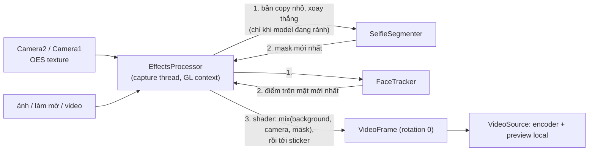
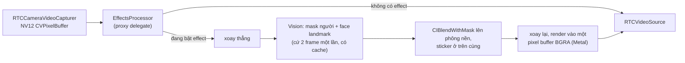
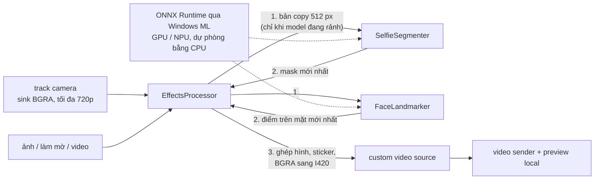
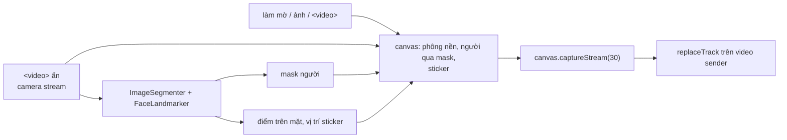

# Phông nền và effect

**Backgrounds and effects** (trong More, hoặc phím `B` trên máy tính) hiện một bản xem trước trực tiếp và hai tab: **Backgrounds** (không có, làm mờ nhẹ, làm mờ, ảnh và video lặp) và **Filters** (sticker bám theo khuôn mặt, như tai nghe, vương miện hay kính). Có thể dùng phông nền và sticker cùng lúc.

<DemoMedia src="/media/background-windows.png" :width="720">
App Windows với panel Backgrounds and effects đang mở ở bên cạnh: bản xem trước trực tiếp cho thấy bạn đứng trước một phông nền là ảnh, bên dưới là lưới thumbnail các phông nền.
</DemoMedia>

Effect chỉ áp dụng cho frame của **camera**. Chia sẻ màn hình và file được gửi nguyên như vậy.

## Một thư mục cho mọi app {#one-folder-for-every-app}

Thư mục [`effects`](gh:effects) ở gốc repository là nguồn duy nhất cho mọi app:

- Vite import nó bằng `import.meta.glob`.
- Android copy nó vào `assets/effects` của APK lúc build (`copyEffects` trong [`build.gradle.kts`](gh:android/app/build.gradle.kts)).
- iOS và macOS đóng gói nó dưới dạng folder reference.
- Windows link nó vào thư mục output của app.

`backgrounds.json` liệt kê ảnh và video, `stickers.json` liệt kê sticker. Mục nào thiếu file thì bị bỏ qua, còn lựa chọn đã lưu mà không còn tồn tại thì quay về "none". Trang [Tùy biến](/vi/customize) hướng dẫn thêm phông nền và sticker của riêng bạn.

## Đặt sticker {#sticker-placement}

<DemoMedia src="/media/sticker-android.png" :width="320">
Camera trước trên Android đang bật một sticker trên mặt (vương miện hoặc tai nghe), đầu hơi nghiêng để thấy sticker bám theo khuôn mặt.
</DemoMedia>

Nền tảng nào cũng chuyển các landmark khuôn mặt của mình thành bốn điểm (tâm hai mắt, chóp mũi, tâm miệng) rồi chạy cùng một đoạn code đặt sticker: [`placement.ts`](gh:web/src/effects/placement.ts), [`StickerPlacement.kt`](gh:android/app/src/main/java/com/example/myapplication/webrtc/effects/StickerPlacement.kt), `StickerPlacement` trong [`EffectsCatalog.swift`](gh:ios/WebRTCDemo/EffectsCatalog.swift), [`StickerPlacement.cs`](gh:windows/src/WebRtcDemo.Effects/StickerPlacement.cs).

- Hướng "phải" đi từ mắt này sang mắt kia, hướng "lên" đi từ miệng lên mắt, nên sticker nghiêng theo đầu. Thứ tự hai mắt được suy ra từ hướng "lên" đó, nên detector gọi mắt nào là mắt trái cũng không quan trọng.
- Đơn vị đo là giá trị lớn hơn giữa khoảng cách hai mắt và khoảng cách từ mắt tới miệng chia cho 1.2, để sticker không bị nhỏ lại khi quay đầu sang bên.
- Mỗi vị trí mới được trộn với vị trí trước (40% vị trí cũ), và vị trí cuối cùng được giữ lại qua tối đa 6 lần không nhận diện được mặt.

## Bắt đầu cuộc gọi khi effect đang bật {#starting-with-an-effect-on}

Lựa chọn effect được lưu lại. Khi cuộc gọi bắt đầu với một effect đã lưu, frame camera được giữ lại cho tới khi effect tải xong và mask đầu tiên sẵn sàng, nên người kia không bao giờ nhìn thấy căn phòng thật của bạn trước. Nếu không tải được effect, app quay về lựa chọn trước đó và hiện một toast.

## Năm pipeline {#five-pipelines}

| | Web | Android | iOS, macOS | Windows |
| --- | --- | --- | --- | --- |
| Mask người | MediaPipe `ImageSegmenter` | MediaPipe `tasks-vision`, input 256 px | Vision `VNGeneratePersonSegmentationRequest`, cứ 2 frame chạy một lần | `selfie_segmenter` dạng ONNX, input 256 px |
| Điểm trên mặt | MediaPipe `FaceLandmarker` | MediaPipe `FaceLandmarker`, input 384 px | Vision `VNDetectFaceLandmarksRequest`, cứ 2 frame chạy một lần | BlazeFace rồi tới face landmark, dạng ONNX |
| Làm mờ | `ctx.filter = blur()` | Thu nhỏ + Gaussian tách hai chiều trong hai FBO | `CIGaussianBlur` | Thu nhỏ + Gaussian tách hai chiều bằng C# |
| Phông nền video | `<video>` ẩn, tắt tiếng | `MediaPlayer` vào một OES texture | `AVPlayer` + `AVPlayerItemVideoOutput` | File source của Media Foundation |
| Ghép hình | Canvas 2D | Fragment shader GLES | Core Image trên Metal | C# trên CPU |
| Điểm móc vào | `MediaStream` riêng, `replaceTrack` | `VideoSource.setVideoProcessor()` | Proxy `RTCVideoCapturerDelegate` | Sink thứ hai trên track camera, track effect được đổi vào sender |

### Android {#android}

Pixel ở độ phân giải đầy đủ không bao giờ rời khỏi GPU. Chỉ có một bản copy nhỏ được đọc ngược ra cho model. Nếu model vẫn đang bận, frame dùng kết quả trước đó của model chứ không chờ.

### iOS và macOS {#ios-and-macos}

Khi một frame đang được xử lý, frame camera mới tới sẽ bị bỏ, nên capture queue không bao giờ bị nghẽn và không có frame chưa xử lý nào lọt ra ngoài. Mac chạy cùng code này, và giảm xuống cứ 3 hoặc 4 frame mới xử lý một lần khi Vision chạy chậm (Mac Intel không có Neural Engine).

### Windows {#windows}

Model là của MediaPipe, được chuyển sang ONNX bằng [`convert.sh`](gh:windows/models/convert.sh). Windows ML chọn provider GPU hoặc NPU đã được chứng nhận cho máy đó, nếu không có thì quay về CPU. Vì provider GPU có thể chạy không báo lỗi mà vẫn trả về kết quả vô nghĩa, nên với model được tăng tốc, vài frame đầu tiên cũng được chạy trên CPU để so sánh.

### Web {#web}

MediaPipe chiếm phần lớn bundle, nên [`EffectsProcessor.ts`](gh:web/src/effects/EffectsProcessor.ts) chỉ được tải ở lần đầu tiên bạn bật effect. Khi tab bị ẩn, vòng lặp ghép hình chuyển từ `requestAnimationFrame` sang timer, để bên kia vẫn nhận được frame khi cuộc gọi đang ở picture-in-picture.
