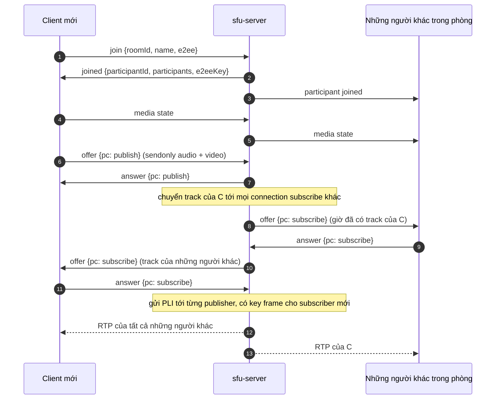

# Cuộc gọi nhóm (SFU)

Cuộc gọi mặc định là 1:1 và peer to peer. Cuộc gọi nhóm đi qua [`sfu-server`](gh:sfu-server), một Selective Forwarding Unit nhỏ viết riêng cho demo này bằng [Pion](https://github.com/pion/webrtc), chứ không dùng một media server làm sẵn. Client vẫn chỉ dùng API WebRTC chuẩn, không có SDK SFU nào, nên bạn có thể đọc hiểu một cuộc gọi nhóm chạy thế nào từ đầu tới cuối.

Cuộc gọi nhóm là tùy chọn. Cuộc gọi 1:1 và signaling server của nó không thay đổi gì.

<DemoMedia src="/media/group-web.png" :width="720">
Web client trong một cuộc gọi nhóm bốn hoặc năm người trên các nền tảng khác nhau: lưới tile kèm nhãn (ví dụ "Android · 3f2a1c"), một tile có vòng xanh báo đang nói, một tile có icon micro tắt, một tile hiện avatar vì camera đang tắt.
</DemoMedia>

## Tại sao dùng SFU {#why-an-sfu}

Với mesh, ai cũng kết nối với tất cả mọi người, nên mỗi điện thoại phải encode và upload video của mình một lần cho mỗi người còn lại. Qua SFU, mỗi client chỉ upload một stream, server copy packet của stream đó sang những người khác mà không cần decode. Bạn thử kéo thanh trượt:

<SfuCompare />

Với một demo thì không cần tới MCU, loại server decode, trộn rồi encode lại.

## Server {#the-server}

`sfu-server` là một process Go làm cả hai việc mà ở chế độ 1:1 được chia cho server Node và các peer:

- **signaling**: một WebSocket bình thường ở `ws://<host>:4001/ws`, message JSON;
- **media**: packet RTP của mỗi người tham gia được copy sang những người còn lại.

| File | Vai trò |
| --- | --- |
| [`main.go`](gh:sfu-server/main.go) | Flag, health check `GET /`, `/ws` |
| [`signaling.go`](gh:sfu-server/signaling.go) | Các loại message. Mỗi socket có một vòng đọc và một vòng ghi có hàng đợi, để lock của phòng không bao giờ phải chờ mạng. Ping mỗi 20 s. |
| [`room.go`](gh:sfu-server/room.go) | Phòng trong bộ nhớ, join và leave, chuyển track mới tới tất cả những người khác |
| [`participant.go`](gh:sfu-server/participant.go) | Hai peer connection của một người tham gia, chuyển tiếp RTP, yêu cầu key frame, renegotiate |
| [`webrtc.go`](gh:sfu-server/webrtc.go) | Phần setup Pion dùng chung cho mọi peer connection: codec, interceptor, một port UDP |
| [`sfu_test.go`](gh:sfu-server/sfu_test.go) | Client Pion thật chạy qua loopback |

Mọi peer connection dùng chung **một port UDP** (4001, trùng số với port TCP), nên firewall chỉ cần mở TCP 4001 và UDP 4001. Server không trickle ICE: nó chờ có đủ candidate của mình rồi mới gửi SDP, nên offer và answer của server đã chứa sẵn candidate.

## Hai peer connection cho mỗi client {#two-peer-connections-per-client}

Phòng lớn hay nhỏ thì mỗi client cũng mở đúng hai peer connection tới server:

| | Connection publish | Connection subscribe |
| --- | --- | --- |
| Chiều (phía client) | `sendonly`: một audio transceiver, một video transceiver | `recvonly`: mỗi remote track một transceiver |
| Ai offer | Luôn là client | Luôn là server |
| Có renegotiate không | Không bao giờ | Mỗi khi track của ai đó xuất hiện hoặc biến mất |

Cố định bên offer trên mỗi connection nghĩa là hai bên không bao giờ offer cùng lúc, và một peer không bao giờ phải đổi từ vai answer sang vai offer. Có người vào hay rời phòng thì chỉ connection subscribe phải renegotiate, nên camera đang gửi đi không bị đụng tới. Chuyển giữa camera, màn hình và file chạy y như trong cuộc gọi 1:1 ([Chuyển nguồn video](/vi/how-it-works/media-sources)).

## Vào phòng {#joining-a-room}

Mọi message có trong [Messages](/vi/reference/messages#group-calls).

## Chuyển tiếp {#forwarding}

- **Track này của ai?** Stream ID (`msid`) của mỗi track được chuyển tiếp chính là `participantId` của người publish, còn track ID là `<participantId>-audio` hoặc `<participantId>-video`. Client đọc `streams[0].id` trong `ontrack` để biết track thuộc về tile nào. Track có thể đến trước hoặc sau `participant joined`.
- **M-line bị dùng lại.** Khi có người rời phòng, server dùng lại transceiver của họ cho các track tiếp theo. libwebrtc không phải lúc nào cũng bắn event track mới cho m-line bị dùng lại, nên iOS, macOS và Windows còn đọc `a=mid` và `a=msid` trong mọi offer subscribe và ghép receiver theo `mid`. Android lấy receiver ID làm khóa cho track, còn web thì gỡ track bị dùng lại khỏi chủ cũ của nó.
- **Codec.** Server chỉ nhận **VP8** và **Opus**. Client nào cũng encode và decode được hai codec này, và server không bao giờ chuyển đổi giữa các codec.
- **Header extension** bị bỏ khỏi packet được chuyển tiếp: ID của chúng được negotiate trên connection của người publish, sang connection của subscriber thì không còn ý nghĩa gì.
- **Key frame.** Subscriber chỉ bắt đầu decode được từ một key frame. Server gửi PLI tới người publish khi một connection subscribe kết nối xong và sau mỗi answer subscribe, đồng thời chuyển tiếp PLI và FIR từ subscriber, tối đa một lần mỗi 500 ms cho mỗi track.
- **Mất gói và nghẽn mạng.** Các interceptor mặc định của Pion lo phần gửi lại NACK, receiver report và feedback cho transport-wide congestion control.

## Người đang nói {#active-speaker}

Cứ 250 đến 300 ms, mỗi client đọc `audioLevel` từ stats `inbound-rtp` của từng audio receiver bên kia. Người to tiếng nhất, vượt một ngưỡng nhỏ, sẽ có vòng xanh, giữ trong khoảng một giây để không nhấp nháy giữa các từ. Phải đọc mức âm lượng theo từng receiver, vì nhìn từ bên ngoài thì track audio được chuyển tiếp nào cũng giống nhau.

## E2EE trong cuộc gọi nhóm {#e2ee-in-a-group}

E2EE là một transform ở mức frame, nên server chỉ thấy ciphertext trong payload RTP. Server không cần biết gì về nó. Cách trao đổi key của cuộc gọi 1:1 (bên offer gửi key material cho đúng một peer còn lại) không hợp với một phòng nhiều người, nên:

1. Mỗi client vào phòng với E2EE bật sẽ sinh 32 byte ngẫu nhiên và gửi kèm trong `join`.
2. Phòng giữ key material của **người tạo phòng** làm key của phòng, và trả nó về trong mọi `joined`.
3. Mỗi client đặt nó làm shared key (key index 0, [cùng cách tạo key và cùng tùy chọn](/vi/how-it-works/e2ee#the-key)), gắn encryptor vào các sender publish và decryptor vào mọi receiver subscribe, kể cả những receiver được thêm ở các lần renegotiate sau.

E2EE là thuộc tính của phòng. Client nào có thiết lập khác với phòng sẽ nhận lỗi fatal `E2EE setting does not match the room`.

## SFU production có thêm gì {#what-a-production-sfu-adds}

Simulcast có chọn layer cho từng subscriber, TURN, nhiều server, xác thực và đổi key. Nếu cần những thứ đó, bạn xem [LiveKit](https://github.com/livekit/livekit), [mediasoup](https://mediasoup.org/) hoặc [Janus](https://janus.conf.meetecho.com/).
