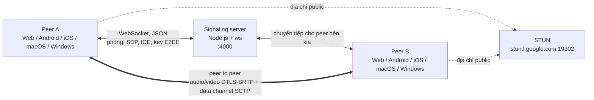

# Cách hoạt động

Hai peer vào cùng một phòng thông qua một signaling server WebSocket nhỏ. Server chỉ chuyển tiếp các message điều khiển: SDP offer và answer, ICE candidate và key E2EE. Audio, video và chat đi **thẳng giữa hai peer** qua WebRTC. STUN server công khai của Google giúp mỗi peer biết địa chỉ public của mình.

Đó là chế độ mặc định: mỗi phòng chứa hai người. [Cuộc gọi nhóm](/vi/how-it-works/group-calls) là một chế độ tùy chọn, trong đó mọi người kết nối tới một SFU server nhỏ.

## Các thành phần {#the-pieces}

| Thành phần | Công nghệ | Bắt đầu đọc từ |
| --- | --- | --- |
| Signaling server | Node.js, `ws` | [`server.js`](gh:signaling-server/server.js) |
| SFU server (không bắt buộc) | Go, Pion | [`sfu-server/`](gh:sfu-server) |
| Web | Vue 3, TypeScript, Vite | [`useCall.ts`](gh:web/src/call/useCall.ts) |
| Android | Kotlin, Jetpack Compose, webrtc-sdk | [`PeerConnectionClient.kt`](gh:android/app/src/main/java/com/example/myapplication/webrtc/PeerConnectionClient.kt) |
| iOS | Swift, SwiftUI, webrtc-sdk | [`PeerConnectionClient.swift`](gh:ios/WebRTCDemo/PeerConnectionClient.swift) |
| macOS | Swift, SwiftUI + AppKit, dùng lại engine của iOS | [`WebRTCDemoMacApp.swift`](gh:ios/WebRTCDemoMac/WebRTCDemoMacApp.swift) |
| Windows | C#, WinUI 3, libwebrtc qua một C shim | [`CallViewModel.cs`](gh:windows/src/WebRtcDemo.Core/Call/CallViewModel.cs) |

<PlatformPicker />

## Quy tắc mọi client đều tuân theo {#rules-every-client-follows}

Chính vài quyết định này giúp năm app độc lập gọi được cho nhau. Mỗi quy tắc có trang riêng.

- **Peer đã ở trong phòng là bên tạo offer.** Peer vào sau sẽ answer. Không bao giờ có chuyện hai bên cùng offer một lúc. [Signaling](/vi/how-it-works/signaling)
- **Channel chat được tạo trước offer đầu tiên**, nên mở chat không bao giờ phải renegotiate. [Chat](/vi/how-it-works/chat)
- **Chuyển giữa camera, màn hình và file không bao giờ renegotiate.** Video sender giữ nguyên, chỉ thay thứ cấp frame cho nó. [Chuyển nguồn video](/vi/how-it-works/media-sources)
- **Trạng thái camera được gửi thành message.** Track bị disable vẫn gửi frame đen, nên mỗi bên báo cho bên kia bằng `media state`, trước hoặc sau khi track thay đổi 300 ms. [Trạng thái camera và micro](/vi/how-it-works/media-state)
- **E2EE dùng một định dạng frame và một bộ tùy chọn key duy nhất**, và VP8 được ưu tiên khi bật E2EE. [Mã hóa đầu cuối](/vi/how-it-works/e2ee)
- **Không tự kết nối lại.** Socket signaling đóng thì cuộc gọi kết thúc. [Signaling](/vi/how-it-works/signaling#losing-the-signaling-socket)

Cấu trúc đầy đủ của repository, kèm từng file và công dụng của nó, có trong [`ARCHITECTURE.md`](gh:ARCHITECTURE.md#2-repository-layout).
