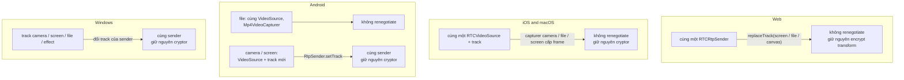
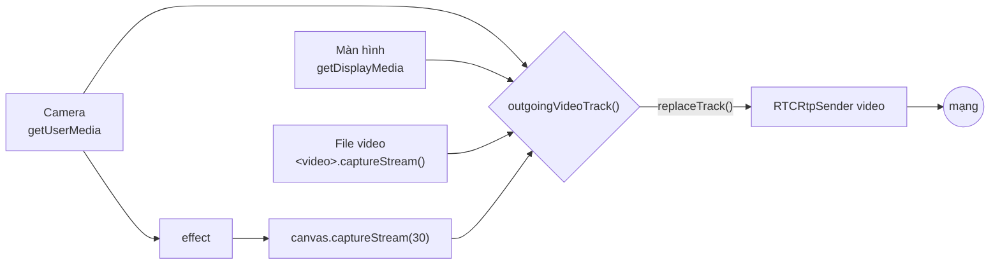

# Chuyển nguồn video

Một cuộc gọi có thể gửi camera, một màn hình hay cửa sổ, một file video, hoặc đầu ra của effect khi đang bật phông nền. Chuyển qua lại giữa các nguồn này không bao giờ renegotiate. Video sender giữ nguyên, chỉ thay thứ cấp frame cho nó.

Điều này quan trọng vì hai lý do:

- **E2EE.** Mỗi frame cryptor gắn với một sender và một receiver. Giữ nguyên sender thì phần mã hóa vẫn chạy.
- **Ổn định.** Renegotiate sẽ tạo lại các receive stream, kéo theo tạo lại video decoder, ở cả hai bên. Trên Android, mỗi lần như vậy video của bên kia bị đứng hình sau vài frame.

## Mỗi nền tảng làm thế nào {#how-each-platform-does-it}

| Nền tảng | Camera ↔ màn hình | Camera ↔ file |
| --- | --- | --- |
| Web | `replaceTrack()` | `replaceTrack()` |
| iOS, macOS | Cùng `RTCVideoSource`, đổi capturer | Cùng `RTCVideoSource`, đổi capturer |
| Android | Video track mới, `RtpSender.setTrack()` | Cùng `VideoSource`, capturer mới |
| Windows | Track mới trên cùng sender | Track mới trên cùng sender |

Android cho màn hình một `VideoSource` riêng, vì chỉ có source kiểu screencast mới điều chỉnh theo frame rate thay vì theo độ phân giải. Track micro thì không nền tảng nào thay, nên nút tắt tiếng vẫn chạy khi bạn đang chia sẻ.

## Ví dụ với web client {#the-web-client-as-an-example}

Mỗi nguồn có track riêng. `outgoingVideoTrack()` trong [`media.ts`](gh:web/src/call/media.ts) chọn track để gửi: màn hình hoặc file nếu đang chia sẻ, nếu không thì canvas của effect khi đang bật effect, còn lại là camera. `syncVideo()` đặt track đó lên sender bằng `replaceTrack()`.

Bắt đầu chia sẻ thì camera tắt, dừng chia sẻ thì camera mở lại.

## Bắt đầu khi không có camera {#starting-without-a-camera}

Cuộc gọi có thể bắt đầu mà không có camera: app khác đang giữ camera (Windows chỉ cho một app dùng camera tại một thời điểm), không cắm camera nào, hoặc bị chặn quyền truy cập. Video sender vẫn được tạo ra:

- Bên offer trong cuộc gọi 1:1 thêm một video transceiver `sendrecv` không có track.
- Bên answer chuyển video transceiver `recvonly` của offer thành `sendrecv` trước khi answer.
- Connection publish của cuộc gọi nhóm luôn có video transceiver `sendonly`.
- Windows đặt một track placeholder lên sender.

Sau này muốn bật camera thì chỉ cần đặt track lên sender đó. Nếu không mở được camera, một toast sẽ báo lý do: app khác đang dùng, bị chặn quyền, hoặc không có camera.

## Chia sẻ màn hình trên từng nền tảng {#screen-sharing-per-platform}

| Nền tảng | Cách làm |
| --- | --- |
| Web | `getDisplayMedia()` |
| Android | `MediaProjection` kèm một foreground service ([`ScreenCaptureService.kt`](gh:android/app/src/main/java/com/example/myapplication/ScreenCaptureService.kt)). Xoay điện thoại thì virtual display đổi kích thước theo. |
| iOS | Một broadcast extension của ReplayKit gửi frame JPEG cho app qua Unix socket. Xem [iOS](/vi/platforms/ios#screen-sharing). |
| macOS | ScreenCaptureKit (`SCStream`), hộp chọn có thumbnail trực tiếp. |
| Windows | Desktop capturer của libwebrtc, hộp chọn có thumbnail trực tiếp. |

File video được đọc bằng `<video>.captureStream()` trên web, `Mp4VideoCapturer` trên Android, `RTCFileVideoCapturer` trên iOS, `AVAssetReader` trên Mac và Media Foundation trên Windows. Tất cả đều phát lặp lại.
