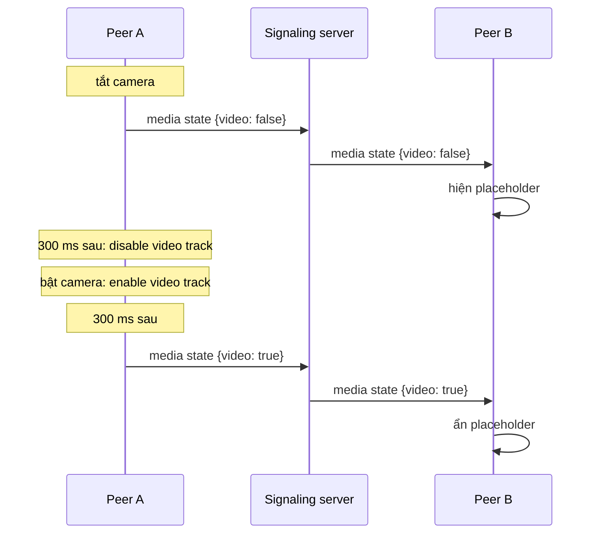

# Trạng thái camera và micro

Video track bị disable không ngừng gửi. Nó gửi frame đen. Vì vậy chỉ nhìn video thì bên kia không phân biệt được "tắt camera" với "phòng tối". Thay vào đó, mỗi client tự báo trạng thái của mình bằng message `media state`:

```json
{ "type": "media state", "state": { "audio": true, "video": false, "screen": false } }
```

Message này được gửi mỗi khi có thay đổi, và gửi thêm một lần khi hai peer kết nối, để người vào sau cũng nhận được trạng thái hiện tại. `screen` là true khi đang chia sẻ màn hình hoặc file video. Lúc đó app nhận sẽ hiện video ở chế độ fit (thấy trọn frame) thay vì crop.

## Quy tắc 300 ms {#the-300-ms-rule}



- **Khi tắt camera**, app gửi state trước, 300 ms sau mới disable track. Nhờ vậy peer bên kia đã chuyển sang placeholder trước khi có frame đen nào tới.
- **Khi bật camera**, app enable track trước, 300 ms sau mới gửi state. Peer bên kia chỉ chuyển lại khi frame thật đã chạy, nên không bao giờ hiện frame cuối bị đứng hình.

Tắt camera cũng giải phóng luôn camera, nên đèn camera tắt.

## Placeholder {#the-placeholder}

<DemoMedia src="/media/camera-off.png" :width="320">
Một điện thoại (Android hoặc iOS) trong cuộc gọi 1:1, người kia đã tắt camera: frame cuối bị làm mờ của họ phủ kín màn hình phía sau một avatar tròn màu gradient. Tốt nhất là chụp lúc họ đang nói để thấy vòng tròn quanh avatar.
</DemoMedia>

Khi video của người kia đang tắt (họ tự tắt, hoặc bạn ẩn đi), app nào cũng hiện một bản làm mờ của frame cuối cùng của họ phía sau một avatar gradient:

- Bản copy này rất nhỏ, rộng 36 px, chụp mỗi 500 ms. Frame gần như đen, như frame mà track bị disable gửi đi, sẽ bị bỏ qua.
- Màu avatar lấy từ hash của room ID, nên với cùng một phòng thì nền tảng nào cũng vẽ ra cùng một avatar.
- Vòng tròn quanh avatar chạy theo `audioLevel` của bên kia lấy từ `getStats()` (`inbound-rtp`, audio), và chỉ đọc khi placeholder đang hiện.

Cách mỗi nền tảng chụp ảnh này quan trọng hơn bạn nghĩ. iOS copy từ frame trên CPU trong một video sink nhỏ. Android đọc ngược lại từ renderer sau khi vẽ (`EglRenderer.addFrameListener`), vì nếu chuyển texture của decoder bằng `toI420()` ngay trong track sink thì thread của decoder bị chặn và video của bên kia đứng hình.

| Nền tảng | Ở đâu |
| --- | --- |
| Web | [`PeerPlaceholder.vue`](gh:web/src/components/call/PeerPlaceholder.vue) |
| Android | [`FrameSnapshotter.kt`](gh:android/app/src/main/java/com/example/myapplication/ui/video/FrameSnapshotter.kt), [`PeerPlaceholder.kt`](gh:android/app/src/main/java/com/example/myapplication/ui/call/PeerPlaceholder.kt) |
| iOS, macOS | [`VideoView.swift`](gh:ios/WebRTCDemo/VideoView.swift), [`PeerPlaceholderView.swift`](gh:ios/WebRTCDemo/PeerPlaceholderView.swift) |
| Windows | [`RemoteSnapshotter.cs`](gh:windows/src/WebRtcDemo.Core/Media/RemoteSnapshotter.cs), [`RemotePlaceholder.cs`](gh:windows/src/WebRtcDemo.App/Views/RemotePlaceholder.cs) |

## Mức âm lượng micro của bạn {#your-own-microphone-level}

Khi micro bật, tile của bạn hiện ba vạch nhỏ nhảy theo giọng nói, để bạn biết micro đang hoạt động. Web client đo track micro bằng một analyser của Web Audio. Các app native đo phần âm thanh WebRTC đang gửi đi trong cuộc gọi. Khi bạn đang chờ một mình trong phòng 1:1 thì chưa có peer connection, nên các app này đọc thẳng từ micro để hiện mức âm lượng, và giải phóng micro trước khi WebRTC bắt đầu thu âm.

## Những thứ chỉ diễn ra ở phía bạn {#things-that-stay-local}

Tắt tiếng người kia hay ẩn video của họ chỉ disable remote track trên thiết bị của bạn. Không có gì được gửi đi. Trên iOS, `setRemoteAudioEnabled()` còn áp dụng cho cả những receiver được thêm vào ở các lần renegotiate sau.

Mỗi nền tảng đặt quy tắc này ở đúng một chỗ, dùng chung cho cả engine 1:1 lẫn engine nhóm: [`media.ts`](gh:web/src/call/media.ts) trên web, [`LocalMedia.kt`](gh:android/app/src/main/java/com/example/myapplication/webrtc/LocalMedia.kt) trên Android, [`CallViewModel.swift`](gh:ios/WebRTCDemo/CallViewModel.swift) trên iOS và macOS, và [`CallViewModel.cs`](gh:windows/src/WebRtcDemo.Core/Call/CallViewModel.cs) trên Windows.
