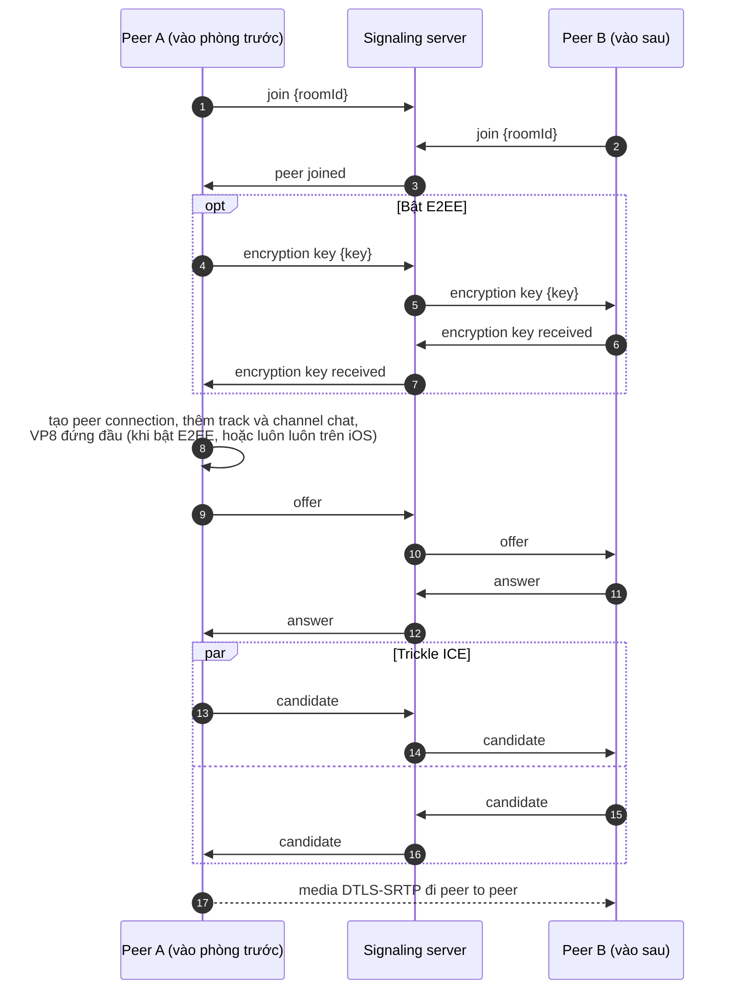
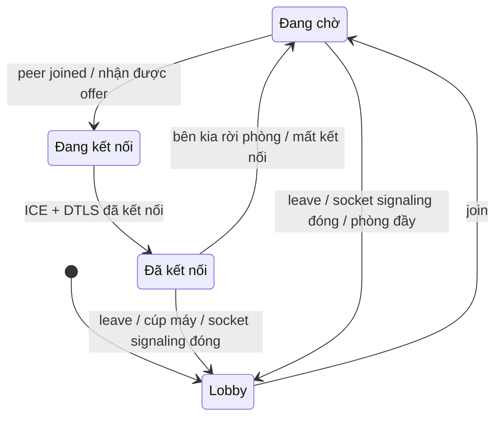

# Signaling và thiết lập cuộc gọi

WebRTC không quy định hai peer tìm thấy nhau bằng cách nào. Trước khi có media, hai bên phải trao đổi SDP offer, SDP answer và ICE candidate qua một kênh khác. Ở đây kênh đó là một WebSocket tới một server nhỏ.

## Server {#the-server}

[`signaling-server/server.js`](gh:signaling-server/server.js) là một HTTP server Node.js bình thường, có endpoint WebSocket ở `/ws`. Mỗi message là một text frame JSON có trường `type`. Server giữ danh sách phòng trong bộ nhớ, ghép tối đa hai socket mỗi phòng, và chuyển message tới **socket còn lại** trong phòng. Server không bao giờ đọc SDP và không đụng tới media.

- `GET /` trả về `{"name":"signaling-server","ok":true}`. Lobby gọi endpoint này mỗi 5 giây để cập nhật chấm trạng thái.
- Cứ 25 giây server ping mọi socket một lần và ngắt socket nào không trả lời, để một chiếc điện thoại mất mạng không chiếm chỗ trong phòng mãi.
- WebSocket giữ đúng thứ tự message, nên key gửi trước offer luôn tới trước offer đó.

## Từng bước của một cuộc gọi {#a-call-step-by-step}

Bấm qua từng message của một cuộc gọi thật. Tắt E2EE để xem bản ngắn hơn.

<CallFlow />

Cũng nội dung đó, vẽ thành sequence diagram:

Mọi message và các trường của nó có trong [Messages](/vi/reference/messages#one-to-one-calls).

## Ai tạo offer {#who-makes-the-offer}

Peer **đã ở trong phòng** luôn là bên tạo offer. Peer thứ hai trả lời bằng answer. Chỉ một quy tắc này đã loại bỏ cả một nhóm vấn đề: hai bên không bao giờ offer cùng lúc (glare), và một peer không bao giờ phải đổi từ vai answer sang vai offer.

Renegotiate dùng lại đúng hai message `offer` và `answer`, nhưng trong một cuộc gọi bình thường không client nào cần tới. Chuyển nguồn video không renegotiate ([tại sao](/vi/how-it-works/media-sources)), còn channel chat đã có từ offer đầu tiên ([tại sao](/vi/how-it-works/chat)).

## Trạng thái kết nối {#connection-states}

UI hiển thị gì trong một cuộc gọi:

## Cúp máy {#hanging-up}

`leave` giải phóng chỗ trong phòng, đóng socket cũng vậy. Server không báo cho peer còn lại. Peer đó tự nhận ra:

- data channel bị đóng. Tín hiệu đóng SCTP tới ngay lập tức, nên web client coi đó là cúp máy khi connection vẫn đang sống;
- trạng thái ICE connection chuyển sang `disconnected` hoặc `failed`, việc này mất vài giây.

## Mất socket signaling {#losing-the-signaling-socket}

Không có cơ chế tự kết nối lại. Mỗi client mở socket khi vào phòng và đóng nó khi rời phòng. Nếu socket bị đóng giữa cuộc gọi (server bị tắt, chuyển từ Wi-Fi sang 4G, mất mạng lâu hơn thời gian chờ ping), client sẽ **kết thúc cuộc gọi** và báo "Lost the connection to the signaling server", kể cả khi media vẫn đang chạy. Lúc đó server đã giải phóng chỗ trong phòng, nên bạn vào lại là được ngay.

Làm vậy giúp client nào cũng đơn giản. Một app production thì sẽ kết nối lại và tiếp tục phiên cũ.

Thêm một quy tắc nữa trên mọi nền tảng: callback từ peer connection đã bị thay thế hoặc đã đóng đều bị bỏ qua. Trên Android, gọi vào một `PeerConnection` native đã bị dispose sẽ làm crash cả process.

## Địa chỉ server {#the-server-address}

Lobby nào cũng chuẩn hóa địa chỉ bạn nhập về dạng `scheme://host[:port]` (WebSocket luôn nằm ở `/ws`) và lưu lại nếu nó khác giá trị mặc định. Trên web việc này nằm ở [`serverUrl.ts`](gh:web/src/call/serverUrl.ts), trên Android ở [`SignalingServer.kt`](gh:android/app/src/main/java/com/example/myapplication/settings/SignalingServer.kt), trên iOS và macOS ở [`SignalingServer.swift`](gh:ios/WebRTCDemo/SignalingServer.swift). iOS và macOS cho phép HTTP thường (`NSAllowsArbitraryLoads`) còn Android đặt `usesCleartextTraffic`, nên server nào trong mạng LAN cũng dùng được.
