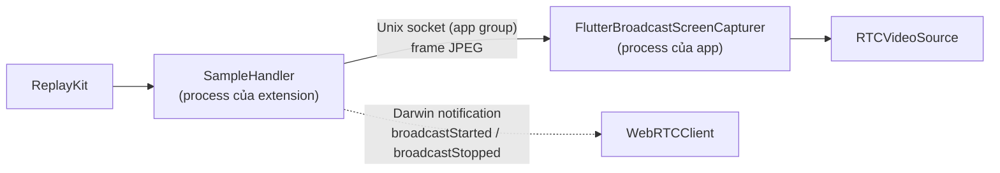

# iOS

App SwiftUI dùng Liquid Glass, chạy trên binary webrtc-sdk `150.7871.01`. Cần iOS 26 trở lên, build bằng Xcode 26.

<DemoMedia src="/media/ios-pip.png" :width="320">
Một iPhone đang ở màn hình chính (hoặc trong app khác), cuộc gọi nằm trong cửa sổ picture-in-picture của hệ thống, hiện video của người kia.
</DemoMedia>

Mở [`ios/WebRTCDemo.xcodeproj`](gh:ios/WebRTCDemo.xcodeproj), chọn scheme `WebRTCDemo` và chạy trên thiết bị thật. Camera và chia sẻ màn hình cần phần cứng thật.

## Code nằm ở đâu {#where-things-are}

Các file nằm trong [`ios/WebRTCDemo`](gh:ios/WebRTCDemo). Phần lớn cũng được compile vào [app Mac](/vi/platforms/macos).

| File | Làm gì |
| --- | --- |
| [`CallViewModel.swift`](gh:ios/WebRTCDemo/CallViewModel.swift) | State cuộc gọi dạng `@Observable`. Nắm `LocalMedia` và engine 1:1 hoặc engine nhóm. |
| [`LocalMedia.swift`](gh:ios/WebRTCDemo/LocalMedia.swift) | Factory, track local, `RTCVideoSource` duy nhất, chia sẻ, audio session, đưa VP8 lên đầu |
| [`PeerConnectionClient.swift`](gh:ios/WebRTCDemo/PeerConnectionClient.swift) | `WebRTCClient`, engine 1:1: một peer connection và một data channel |
| [`GroupCallClient.swift`](gh:ios/WebRTCDemo/GroupCallClient.swift) | Engine nhóm: WebSocket tới SFU, connection publish và subscribe |
| [`SignalingSocket.swift`](gh:ios/WebRTCDemo/SignalingSocket.swift) | JSON qua `URLSessionWebSocketTask`. Cả hai engine đều dùng. |
| [`FrameEncryption.swift`](gh:ios/WebRTCDemo/FrameEncryption.swift) | Key provider E2EE và các frame cryptor |
| [`EffectsProcessor.swift`](gh:ios/WebRTCDemo/EffectsProcessor.swift) | Vision + Core Image, chạy dưới dạng một proxy capturer delegate |
| [`PictureInPicture.swift`](gh:ios/WebRTCDemo/PictureInPicture.swift) | PiP của hệ thống qua một `AVSampleBufferDisplayLayer` |
| [`VideoView.swift`](gh:ios/WebRTCDemo/VideoView.swift) | Wrapper của `RTCMTLVideoView` và phần chụp ảnh cho placeholder |
| [`CallView.swift`](gh:ios/WebRTCDemo/CallView.swift), [`GroupCallView.swift`](gh:ios/WebRTCDemo/GroupCallView.swift) | Các màn hình cuộc gọi |
| [`WebRTCDemoScreenBroadcast/`](gh:ios/WebRTCDemoScreenBroadcast) | Broadcast extension của ReplayKit |

`WebRTCClient` gọi delegate từ các thread của WebRTC, còn view model chuyển sang main queue rồi mới đụng tới state.

## Chia sẻ màn hình {#screen-sharing}

Trên iOS, cách duy nhất để một app quay toàn bộ màn hình, kể cả sau khi bạn đã rời app, là dùng broadcast upload extension của ReplayKit. Extension chạy trong process riêng và không chạy được WebRTC, nên nó gửi frame cho app qua một Unix domain socket nằm trong app group dùng chung. Sau đó `FlutterBroadcastScreenCapturer` đẩy các frame này vào **chính** `RTCVideoSource` mà camera đang dùng.

Mỗi frame là một message kiểu HTTP: các header `Content-Length`, `Buffer-Width`, `Buffer-Height` và `Buffer-Orientation`, rồi tới phần body JPEG. Phía app của socket được chép từ [plugin flutter-webrtc](https://github.com/flutter-webrtc/flutter-webrtc). Hãy giữ nguyên logic đọc của nó: nếu reader đòi stream trả về 0 byte, iOS sẽ báo hết stream và broadcast dừng ngay sau frame đầu tiên.

Chia sẻ vẫn tiếp tục khi bạn rời app, và để làm được điều đó cần hai thứ:

- **App phải còn sống.** `UIBackgroundModes` có `audio` và `voip`, và cuộc gọi giữ một audio session `playAndRecord` luôn active, nên iOS không suspend app và socket của nó.
- **Encoder phải còn chạy.** Khi app chạy nền, iOS vô hiệu hóa encoder H264 phần cứng của VideoToolbox, nên frame nào cũng encode lỗi và bên kia chỉ thấy hình đứng yên. Vì thế iOS luôn đưa **VP8** (encode bằng phần mềm) lên đầu, dù có bật E2EE hay không. Đổi lại thì tốn CPU và pin hơn.

App và extension phải dùng chung một App Group (`group.com.ducmai.webrtc.broadcast`). Nếu bạn đổi team hoặc bundle ID, cập nhật nó trong cả hai file `.entitlements`, `RTCAppGroupIdentifier` trong `Info.plist`, `SampleHandler.swift`, và bundle ID của extension trong `RTCScreenSharingExtension`.

## Audio session {#the-audio-session}

App tự cấu hình audio session: trước mỗi cuộc gọi, `CallViewModel.configureCallAudio()` đặt cấu hình của WebRTC thành `playAndRecord` + `voiceChat`. Nếu không làm vậy, bản fork webrtc-sdk sẽ chép category lúc khởi động của session (`soloAmbient`), mà iOS lại từ chối category này khi đi kèm tùy chọn Bluetooth HFP, và cuộc gọi sẽ không có micro, không có tiếng. Xem [Xử lý sự cố](/vi/guide/troubleshooting#ios-and-macos).

## Cách iOS làm từng phần {#how-it-does-each-part}

- **Chuyển nguồn.** Capturer của camera, file và màn hình đều cấp frame cho một `RTCVideoSource` duy nhất, nên track, sender và cryptor của nó không bao giờ thay đổi. [Chuyển nguồn video](/vi/how-it-works/media-sources)
- **E2EE.** `RTCFrameCryptor` với [các tùy chọn dùng chung](/vi/how-it-works/e2ee#the-key).
- **Effect.** Một proxy `RTCVideoCapturerDelegate` nằm giữa camera và source, chạy Vision và Core Image trên Metal. [Phông nền và effect](/vi/how-it-works/effects#ios-and-macos)
- **Picture-in-picture.** PiP dành cho cuộc gọi video, chỉ 1:1. [Picture-in-picture](/vi/how-it-works/picture-in-picture#ios)
- **Cuộc gọi nhóm.** Mọi offer subscribe đều được parse để lấy `a=mid` và `a=msid`, vì libwebrtc không bắn event receiver mới khi một m-line được dùng lại cho người khác. [Cuộc gọi nhóm (SFU)](/vi/how-it-works/group-calls#forwarding)

## Ghi chú {#notes}

- WebRTC lấy từ local Swift package [`ios/Packages/WebRTC`](gh:ios/Packages/WebRTC), vì manifest Specs của bản release này không resolve được. Muốn nâng cấp, đổi URL và checksum trong `Package.swift` của package đó.
- `Info.plist` cho phép HTTP thường (`NSAllowsArbitraryLoads`) để server nào trong mạng LAN cũng dùng được.
