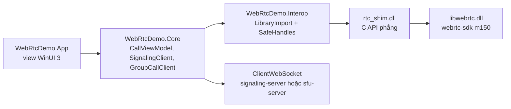

# Windows

App WinUI 3 trên .NET 10, dạng unpackaged và self-contained, cho x64 và ARM64. WebRTC là bản prebuilt [webrtc-sdk/libwebrtc](https://github.com/webrtc-sdk/libwebrtc) release `m150.7871.03`, cùng nhánh với SDK của Android và Apple, gọi qua một C shim nhỏ.

<DemoMedia src="/media/windows-call.png" :width="720">
App Windows trong cuộc gọi 1:1: video của người kia chiếm cả cửa sổ, tile của bạn bo góc nổi ở một góc với nhãn "You" và ba vạch âm lượng micro, toolbar hiện ở phía dưới.
</DemoMedia>

```powershell
cd windows
./native/RtcShim/scripts/build-shim.ps1   # downloads libwebrtc, builds rtc_shim.dll
dotnet run --project src/WebRtcDemo.App -p:Platform=x64
```

Hoặc mở `WebRtcDemo.slnx` bằng Visual Studio 2026 và chạy x64 hoặc ARM64. Phần test, publish và xử lý sự cố có trong [`windows/README.md`](gh:windows/README.md).

## Các lớp {#layers}



| Project | Làm gì |
| --- | --- |
| [`native/RtcShim`](gh:windows/native/RtcShim) | C shim. [`rtc_shim.h`](gh:windows/native/RtcShim/include/rtc_shim.h) là toàn bộ API. |
| [`WebRtcDemo.Interop`](gh:windows/src/WebRtcDemo.Interop) | Binding bằng `LibraryImport`, mỗi object native một `SafeHandle`, các callback native |
| [`WebRtcDemo.Core`](gh:windows/src/WebRtcDemo.Core) | Signaling, state machine của cuộc gọi, media, engine nhóm. Không có UI, unit test chạy được trên mọi OS. |
| [`WebRtcDemo.Effects`](gh:windows/src/WebRtcDemo.Effects) | Phông nền và sticker: model ONNX, ghép hình. Không có UI. |
| [`WebRtcDemo.App`](gh:windows/src/WebRtcDemo.App) | App WinUI 3, UI viết bằng C# chứ không dùng trang XAML |

## Tại sao cần C shim {#why-a-c-shim}

API của libwebrtc là các class C++: virtual method, `scoped_refptr`, observer interface. C# không gọi thẳng được những thứ đó. Shim được build bằng MSVC với static CRT cho khớp với `libwebrtc.dll`, và export ra C thuần:

- handle kiểu opaque có hàm release rõ ràng, chuỗi UTF-8, và callback có tham số `void* user`;
- các lời gọi bất đồng bộ (tạo offer, đặt description, lấy stats) trả kết quả qua callback;
- peer connection đã đóng thì từ chối lời gọi thay vì crash;
- video sink trả ra BGRA, đã xoay đúng chiều và có thể thu nhỏ nếu cần.

Phía C#, callback là các hàm `UnmanagedCallersOnly`, tìm object đích theo ID, nên không phải pin gì cả và không có exception nào lan ngược vào code native. Nếu bạn muốn đưa libwebrtc sang một ngôn ngữ khác, header này là một bản đồ tốt cho thấy một cuộc gọi thực sự cần những gì.

## Cách Windows làm từng phần {#how-it-does-each-part}

- **Signaling.** Mỗi cuộc gọi một `ClientWebSocket`, [`SignalingClient.cs`](gh:windows/src/WebRtcDemo.Core/Signaling/SignalingClient.cs). Socket đóng thì cuộc gọi kết thúc, giống các client khác.
- **State cuộc gọi.** [`CallViewModel.cs`](gh:windows/src/WebRtcDemo.Core/Call/CallViewModel.cs) đi theo cùng luồng với client web và iOS: peer đang ở trong phòng tạo offer, key được gửi trước, quy tắc 300 ms.
- **Chuyển nguồn.** [`NativeCallMedia.cs`](gh:windows/src/WebRtcDemo.Core/Media/NativeCallMedia.cs) đổi track của video sender giữa camera, màn hình hoặc cửa sổ, file và effect, nhờ vậy giữ được cryptor của sender. [Chuyển nguồn video](/vi/how-it-works/media-sources)
- **Camera.** Shim đọc camera qua Media Foundation, giống app Camera của Windows, và thử dần các định dạng gần 1280×720 ở 30 fps nhất cho tới khi có một định dạng gửi được frame trong vòng 4 s. Camera nào Media Foundation không đọc được thì đi qua DirectShow capturer của libwebrtc.
- **Effect.** Model MediaPipe chuyển sang ONNX, chạy bằng ONNX Runtime qua Windows ML trên GPU hoặc NPU, phần ghép hình viết bằng C#. [Phông nền và effect](/vi/how-it-works/effects#windows)
- **Picture-in-picture.** Presenter `CompactOverlay`. [Picture-in-picture](/vi/how-it-works/picture-in-picture#windows)

## Hai vấn đề riêng của Windows nên biết {#two-windows-specific-problems-worth-knowing}

**Micro.** Audio device của libwebrtc trên Windows giao phần khử tiếng vọng cho voice-capture DMO của Windows, mà DMO này chỉ thu âm khi đang phát âm thanh (playout). Một cuộc gọi thường bắt đầu gửi trước khi có âm thanh nào tới, còn connection publish của cuộc gọi nhóm thì không bao giờ phát gì, nên việc thu âm thất bại và không bao giờ được thử lại: người khác không nghe thấy gì. Shim tách DMO ra khỏi audio device, nên việc thu âm chỉ là WASAPI thuần, phần khử tiếng vọng do chính AEC3 của libwebrtc lo.

**Bo góc video.** `SwapChainPanel` là "external content": Windows vẽ nó bên dưới phần render của WinUI, qua một cái lỗ, nên không có clip bo góc nào áp được lên nó. Thay vào đó, mỗi view video là một composition sprite có brush hiện một drawing surface đúng bằng kích thước frame (`ICompositorInterop::CreateGraphicsDevice` trên một D3D11 device). Compositor tự vẽ surface đó, nên view có thể clip nó với góc bo tròn. Frame từ các thread của WebRTC được bỏ vào một mailbox một ô, và UI thread vẽ nó ở tick composition kế tiếp.

## Test khi không có Windows {#testing-without-windows}

[`windows/scripts/verify.sh`](gh:windows/scripts/verify.sh) build shim với bản release libwebrtc cho Linux, chạy loopback test của nó (hai peer mã hóa trong cùng một process), chạy toàn bộ test .NET trên shim đó, và compile app cho x64 và ARM64. Linux cần có audio server, vì libwebrtc sẽ abort nếu không có. Dùng PulseAudio với một null sink là đủ.
