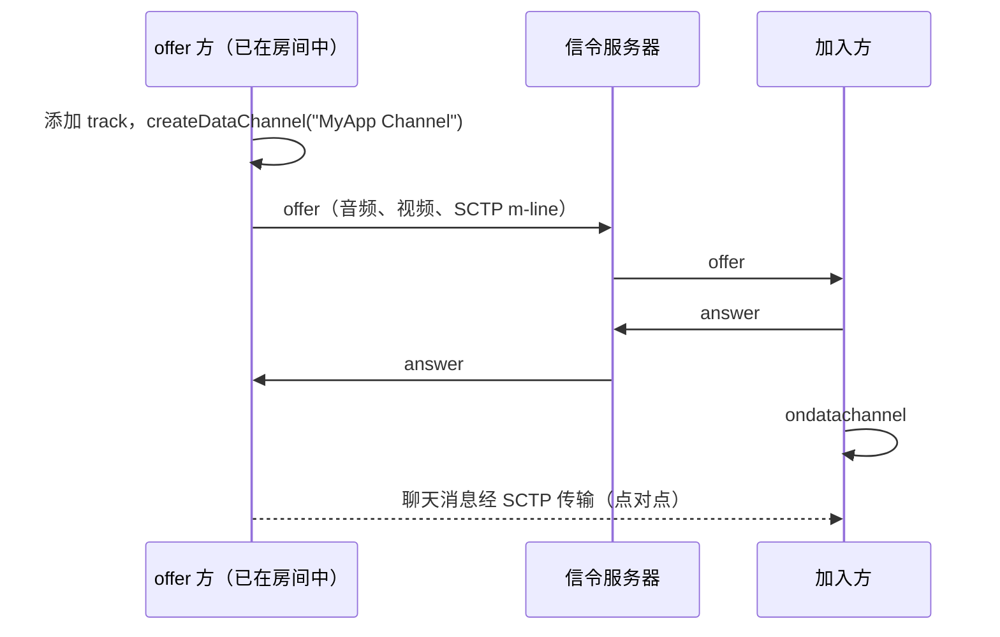

# 聊天

在 1:1 通话中，聊天消息通过 WebRTC data channel 点对点传输，和媒体一样由 DTLS 加密，服务器完全看不到。

## 聊天通道在第一个 offer 时就已存在 {#the-channel-exists-from-the-first-offer}

offer 方（已在房间里的一端）会在发出第一个 offer 之前创建一个名为 `"MyApp Channel"` 的通道。这样 SCTP m-line 会和音频、视频一起完成协商，打开聊天就只是一个界面操作。

answer 方从 `ondatachannel` 拿到这个通道（Android 上是 `onDataChannel`，iOS 上是 `didOpen dataChannel`）。

## 为什么不在打开聊天时再创建？ {#why-not-create-it-when-the-chat-opens}

以前确实是这么做的，结果引出了一个值得了解的 bug。之后再创建通道需要重新协商，而这次重新协商的 offer 可能来自之前一直只做 answer 的一端，比如 iOS 加入了 Android 创建的房间。这个 offer 改变了另一端的接收参数，于是 Android 重建了远端视频解码器，远端视频在几帧之后就卡住了。

如果通话中还没有通道，各客户端仍然可以在打开聊天时添加一个，代价是一次重新协商。只有对方是旧版客户端、发出的 offer 里没有通道时，才会出现这种情况。

## 用通道关闭作为挂断信号 {#the-channel-as-a-hang-up-signal}

原生客户端只在离开时才关闭通道，而 SCTP 的关闭消息会立即到达；相比之下，ICE 要过好几秒才能发现对端已经不在了。所以 Web 客户端在连接仍然有效时检测到通道关闭，就认为对方已经挂断。

## 多人通话 {#group-calls}

多人通话中参与者之间没有点对点连接，所以聊天消息以 `chat` 消息的形式，经由信令 WebSocket 通过 SFU 转发，服务器会附上发送者的 ID 和名字。和 1:1 的 data channel 不同，它在这个 socket 上是明文传输的。见[消息](/zh/reference/messages#group-calls)。

<DemoMedia src="/media/chat-android.png" :width="320">
Android 上的 1:1 通话，聊天面板已打开，双方各有几条消息，输入框中有一条正在输入的回复。
</DemoMedia>
