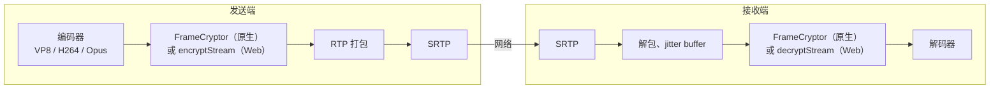
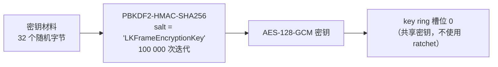
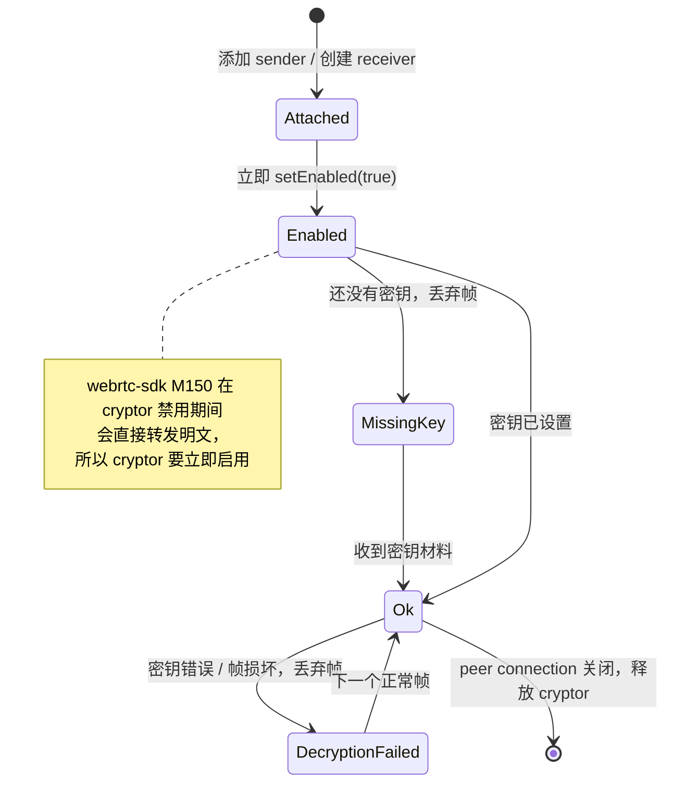

# 端到端加密

WebRTC 的媒体始终会用 DTLS-SRTP 做逐跳加密。这能保护网络传输中的数据，但中间的媒体服务器（比如 SFU）会解开这层加密，能读到每一帧。（TURN 服务器没有这个问题，它只转发加密后的包。）E2EE 在**编码后的帧**上再加一层加密，而且是在帧被拆成 RTP 包之前完成的，所以中继节点只能看到密文。



难点不在加密本身，而在于让浏览器和三套原生 SDK 生成**完全相同的字节**，任意两个客户端之间才能互相解密。

| 平台 | 机制 | 代码 |
| --- | --- | --- |
| Web | Insertable Streams：`createEncodedStreams()`（Chrome）或 `RTCRtpScriptTransform`（Safari、Firefox），在 worker 中运行 | [`e2ee.ts`](gh:web/src/e2ee.ts)、[`encryptionWorker.ts`](gh:web/src/encryptionWorker.ts)、[`frameCrypto.ts`](gh:web/src/call/frameCrypto.ts) |
| Android | webrtc-sdk 的 `FrameCryptor` + `FrameCryptorKeyProvider` | [`E2eeManager.kt`](gh:android/app/src/main/java/com/example/myapplication/webrtc/E2eeManager.kt)、[`FrameCryptors.kt`](gh:android/app/src/main/java/com/example/myapplication/webrtc/FrameCryptors.kt) |
| iOS、macOS | webrtc-sdk 的 `RTCFrameCryptor` + `RTCFrameCryptorKeyProvider` | [`FrameEncryption.swift`](gh:ios/WebRTCDemo/FrameEncryption.swift) |
| Windows | libwebrtc 的 frame cryptor，通过 C shim 调用 | [`shim_peer.cpp`](gh:windows/native/RtcShim/src/shim_peer.cpp) |

原生的 `FrameCryptor` 使用 LiveKit 的帧格式。Web 客户端逐字节实现了同样的格式，Web、Android、iOS、macOS 和 Windows 正是因此才能互通。

## 帧格式 {#the-frame-format}

```text
┌──────────────────────┬───────────────────────────────────┬────────────┬──────┬──────────┐
│ unencrypted header   │ AES-128-GCM ciphertext + 16B tag  │ IV (12 B)  │ 0x0C │ keyIndex │
└──────────────────────┴───────────────────────────────────┴────────────┴──────┴──────────┘
  additional data (AAD)                                       per frame    IV len  1 byte
```

每一帧开头的若干字节保持明文，因为打包器和解码器需要读取它们：

| Codec | 不加密的头部 | 原因 |
| --- | --- | --- |
| VP8 | 关键帧 10 字节，增量帧 3 字节 | 这是 payload header，保留它才能继续解析帧类型和尺寸 |
| H264 | 直到第一个 slice NAL header（含）再加 1 字节 | NAL 结构和 SPS/PPS 保持可读。其余部分经过 RBSP 转义，保证不会出现起始码。 |
| Opus | 1 字节，即 TOC | 帧配置信息 |

头部虽然不加密，但会作为 AES-GCM 的附加数据参与认证，所以篡改头部会导致解密失败。

动手试试。下面这个组件用 Web 客户端的真实代码处理一个示例帧：

<E2eeFrame />

无法加密或解密的帧（还没有密钥、密钥错误、帧已损坏）会被**丢弃**，绝不会以明文形式发送或解码。空帧（比如 Opus 的静音帧）会原样通过，和原生 cryptor 的行为一致。

## 密钥 {#the-key}



在网络上传输的只有 32 字节的密钥材料，以 base64 形式放在 `encryption key` 消息中。每一端在本地自行派生 AES 密钥。在 1:1 通话中，由 offer 方生成密钥材料，并在 offer 之前发送。

key provider 的选项在所有平台上必须完全一致。只要有一项不同，两端派生出的密钥或写入的帧尾（trailer）就会不同，对方便无法解密：

| 选项 | 值 |
| --- | --- |
| Shared key mode | `true` |
| Ratchet salt | `"LKFrameEncryptionKey"` |
| Ratchet window size | `0` |
| Uncrypted magic bytes | 无 |
| Failure tolerance | `-1` |
| Key ring size | `16` |
| Discard frame when cryptor not ready | `false` |
| Key derivation | PBKDF2 |
| Key index | `0` |

## Codec 选择 {#codec-choice}

开启 E2EE 时，所有平台都会在创建 offer 或 answer 之前调用 `setCodecPreferences`，把 **VP8 排在视频 codec 的首位**。VP8 的头部结构最简单，各实现之间也最一致。iOS 则不管是否开启 E2EE 都会把 VP8 排在首位，原因见 [iOS 屏幕共享](/zh/platforms/ios#screen-sharing)。

Web 客户端还会解析协商后的 SDP，把 payload type 映射到具体的 codec（`parseCodecMap`），因为并非所有浏览器都提供 `getMetadata().mimeType`。

## Cryptor 生命周期 {#cryptor-lifecycle}



双方都必须开启 E2EE。如果只有一方开启，另一方收到的帧既无法解码也无法解密，通话会一直黑屏、没有声音。E2EE 在大厅中选择，通话过程中不能切换。

在多人通话中，SFU 转发的是密文，而它对此毫无感知。房间创建者的密钥材料会成为整个房间的密钥。见[多人通话（SFU）](/zh/how-it-works/group-calls#e2ee-in-a-group)。

::: warning 对 Demo 来说够用
密钥材料以明文形式经过信令服务器。真实的应用应该使用密钥协商（比如 ECDH）或通过其他渠道共享的口令，并在有人离开多人通话时轮换密钥。
:::
