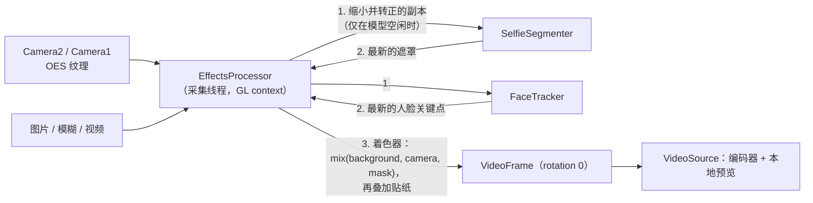
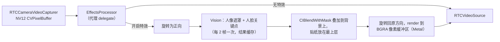
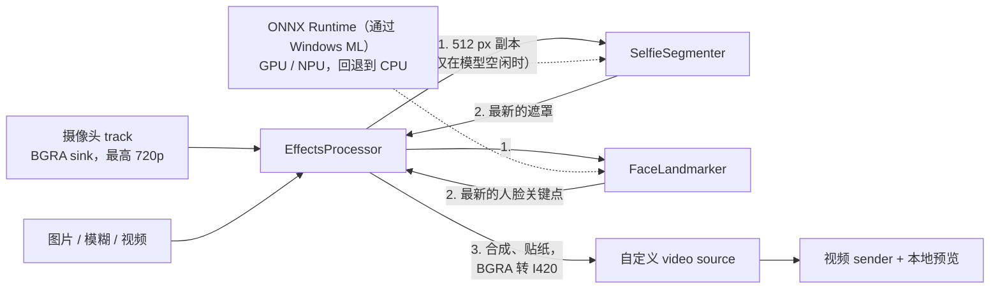
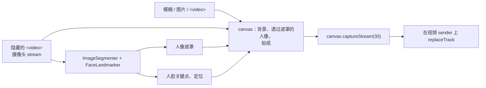

# 背景与特效

**Backgrounds and effects**（在 More 中，桌面端按 `B`）会显示实时预览和两个标签页：**Backgrounds**（无、轻度模糊、模糊、图片和循环视频）和 **Filters**（跟随人脸移动的贴纸，比如耳机、皇冠或眼镜）。背景和贴纸可以同时使用。

<DemoMedia src="/media/background-windows.png" :width="720">
Windows 应用，侧边打开了 Backgrounds and effects 面板：实时预览中你位于一张图片背景前，下方是背景缩略图网格。
</DemoMedia>

特效只作用于**摄像头**画面。屏幕共享和文件共享会原样发送。

## 所有应用共用一个目录 {#one-folder-for-every-app}

仓库根目录下的 [`effects`](gh:effects) 目录是所有应用唯一的素材来源：

- Vite 通过 `import.meta.glob` 导入它。
- Android 在构建时把它复制到 APK 的 `assets/effects` 中（[`build.gradle.kts`](gh:android/app/build.gradle.kts) 里的 `copyEffects`）。
- iOS 和 macOS 以文件夹引用（folder reference）的方式打包它。
- Windows 把它链接到应用的输出目录。

`backgrounds.json` 列出图片和视频，`stickers.json` 列出贴纸。文件缺失的条目会被跳过；如果之前保存的选择已经不存在，会回退到"无"。[自定义](/zh/customize)介绍了如何添加自己的素材。

## 贴纸定位 {#sticker-placement}

<DemoMedia src="/media/sticker-android.png" :width="320">
Android 前置摄像头，开启了人脸贴纸（皇冠或耳机），头部稍微倾斜，以展示贴纸会跟随人脸移动。
</DemoMedia>

每个平台都会把自己的人脸关键点转换成四个点（两只眼睛的中心、鼻尖、嘴巴中心），然后运行同一套定位代码：[`placement.ts`](gh:web/src/effects/placement.ts)、[`StickerPlacement.kt`](gh:android/app/src/main/java/com/example/myapplication/webrtc/effects/StickerPlacement.kt)、[`EffectsCatalog.swift`](gh:ios/WebRTCDemo/EffectsCatalog.swift) 中的 `StickerPlacement`、[`StickerPlacement.cs`](gh:windows/src/WebRtcDemo.Effects/StickerPlacement.cs)。

- "右"是从一只眼睛指向另一只眼睛的方向，"上"是从嘴巴指向眼睛的方向，所以头部倾斜时贴纸也会跟着倾斜。两只眼睛的先后顺序由"上"的方向决定，所以检测器把哪只眼睛叫作左眼都无所谓。
- 单位长度取两眼间距与"眼睛到嘴巴的距离除以 1.2"中较大的那个，这样侧过头时贴纸不会变小。
- 每次的定位结果都会与上一次混合（旧值占 40%），最多连续 6 次没检测到人脸时，仍会保留最后一次的结果。

## 带着特效开始通话 {#starting-with-an-effect-on}

特效选择会被保存。如果通话开始时有已保存的特效，摄像头画面会被暂扣，直到特效加载完成、第一张遮罩准备好为止，所以对方永远不会先看到你真实的房间。如果特效加载失败，会恢复之前的选择并弹出提示。

## 五套处理管线 {#five-pipelines}

| | Web | Android | iOS、macOS | Windows |
| --- | --- | --- | --- | --- |
| 人像遮罩 | MediaPipe `ImageSegmenter` | MediaPipe `tasks-vision`，256 px 输入 | Vision `VNGeneratePersonSegmentationRequest`，每 2 帧处理一次 | ONNX 格式的 `selfie_segmenter`，256 px 输入 |
| 人脸关键点 | MediaPipe `FaceLandmarker` | MediaPipe `FaceLandmarker`，384 px 输入 | Vision `VNDetectFaceLandmarksRequest`，每 2 帧处理一次 | BlazeFace 加人脸关键点模型，均为 ONNX 格式 |
| 模糊 | `ctx.filter = blur()` | 缩小后在两个 FBO 中做可分离高斯模糊 | `CIGaussianBlur` | 缩小后用 C# 做可分离高斯模糊 |
| 视频背景 | 隐藏且静音的 `<video>` | `MediaPlayer` 输出到 OES 纹理 | `AVPlayer` + `AVPlayerItemVideoOutput` | Media Foundation 文件源 |
| 合成 | Canvas 2D | GLES 片段着色器 | 基于 Metal 的 Core Image | 在 CPU 上用 C# 实现 |
| 接入点 | 独立的 `MediaStream`，`replaceTrack` | `VideoSource.setVideoProcessor()` | 代理 `RTCVideoCapturerDelegate` | 摄像头 track 上的第二个 sink，特效 track 替换到 sender 上 |

### Android {#android}

全分辨率的像素始终留在 GPU 上，只有一份小尺寸副本会被读回给模型使用。如果模型还在忙，当前帧会直接使用它上一次的结果，而不是等待。

### iOS 和 macOS {#ios-and-macos}

在一帧处理完成之前，新到的摄像头帧会被丢弃，所以采集队列永远不会阻塞，也不会有未处理的帧漏出去。Mac 运行的是同一套代码，当 Vision 处理较慢时（Intel Mac 没有神经网络引擎），会降到每 3 帧或 4 帧处理一次。

### Windows {#windows}

模型来自 MediaPipe，由 [`convert.sh`](gh:windows/models/convert.sh) 转换成 ONNX。Windows ML 会为当前电脑选择经过认证的 GPU 或 NPU provider，不行就回退到 CPU。由于 GPU provider 有可能不报错却返回错误的结果，加速模型的前几帧还会在 CPU 上再跑一遍，进行比对。

### Web {#web}

MediaPipe 占了打包体积的大头，所以 [`EffectsProcessor.ts`](gh:web/src/effects/EffectsProcessor.ts) 只在第一次开启特效时才加载。标签页被隐藏时，合成循环会从 `requestAnimationFrame` 切换到定时器，这样通话处于画中画时，对方依然能持续收到画面。
