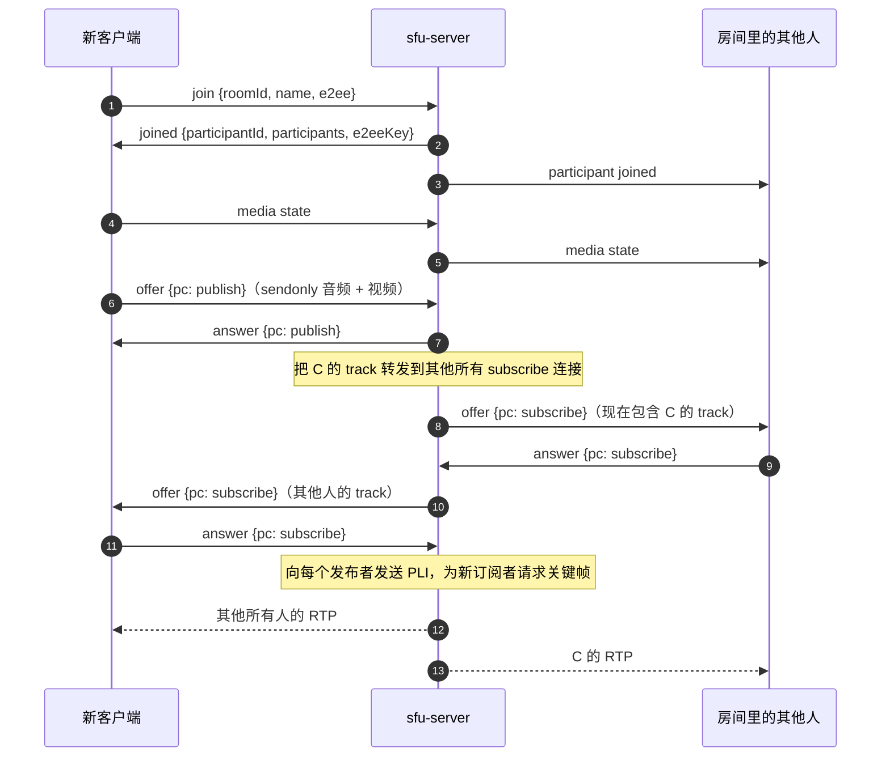

# 多人通话（SFU）

默认的通话是 1:1 点对点。多人通话则经过 [`sfu-server`](gh:sfu-server)：这是为本 Demo 专门编写的一个小型 SFU（Selective Forwarding Unit），基于 [Pion](https://github.com/pion/webrtc) 实现，而不是直接用现成的媒体服务器。每个客户端依然只使用标准 WebRTC API，不依赖任何 SFU SDK，所以你可以从头到尾看清楚多人通话是怎么运作的。

多人通话需要主动开启。1:1 通话及其信令服务器完全不受影响。

<DemoMedia src="/media/group-web.png" :width="720">
Web 客户端中的多人通话，四到五个人来自不同平台：网格排列的画面小窗，带有标签（例如 "Android · 3f2a1c"），其中一个小窗带有绿色的说话圆环，一个显示麦克风关闭图标，还有一个因为摄像头关闭而显示头像。
</DemoMedia>

## 为什么用 SFU {#why-an-sfu}

在 mesh 结构中，每个人都要和其他所有人建立连接，所以每部手机都要为每个对端单独编码并上传一份视频。经过 SFU 时，每个客户端只上传一路 stream，由服务器把数据包复制给其他人，无需解码。拖动滑块看看区别：

<SfuCompare />

MCU 会在服务器上解码、混流再重新编码，对一个 Demo 来说没有必要。

## 服务器 {#the-server}

`sfu-server` 是一个 Go 进程。在 1:1 模式中，这两项工作分别由 Node 服务器和两端承担，在这里则由它一并完成：

- **信令**：一个普通的 WebSocket，地址是 `ws://<host>:4001/ws`，使用 JSON 消息；
- **媒体**：把每个参与者的 RTP 包复制给其他参与者。

| 文件 | 职责 |
| --- | --- |
| [`main.go`](gh:sfu-server/main.go) | 命令行参数、`GET /` 健康检查、`/ws` |
| [`signaling.go`](gh:sfu-server/signaling.go) | 消息类型。每个 socket 一个读循环和一个带队列的写循环，所以持有房间锁时永远不会等待网络。每 20 s 发送一次 ping。 |
| [`room.go`](gh:sfu-server/room.go) | 内存中的房间，加入和离开，把新 track 转发给其他所有人 |
| [`participant.go`](gh:sfu-server/participant.go) | 一个参与者的两个 peer connection、RTP 转发、关键帧请求、重新协商 |
| [`webrtc.go`](gh:sfu-server/webrtc.go) | 所有 peer connection 共用的 Pion 配置：codec、interceptor、单一 UDP 端口 |
| [`sfu_test.go`](gh:sfu-server/sfu_test.go) | 通过 loopback 连接的真实 Pion 客户端 |

所有 peer connection 共用**一个 UDP 端口**（4001，与 TCP 端口号相同），所以防火墙只需要放行 TCP 4001 和 UDP 4001。服务器不做 trickle ICE：它会等自己的 candidate 收集完毕再发送 SDP，所以它发出的 offer 和 answer 里已经包含了 candidate。

## 每个客户端两个 peer connection {#two-peer-connections-per-client}

无论房间有多少人，每个客户端都和服务器建立两个 peer connection：

| | Publish 连接 | Subscribe 连接 |
| --- | --- | --- |
| 方向（客户端视角） | `sendonly`：一个音频、一个视频 transceiver | `recvonly`：每个远端 track 一个 transceiver |
| 由谁发起 offer | 始终是客户端 | 始终是服务器 |
| 是否重新协商 | 从不 | 每当有人的 track 出现或消失时 |

每条连接上由谁发起 offer 是固定的，所以双方永远不会同时发起 offer，一端也永远不会从 answer 方变成 offer 方。有人加入或离开时，只会重新协商 subscribe 连接，发出去的摄像头画面完全不受影响。在摄像头、屏幕和文件之间切换的方式与 1:1 通话完全相同（[切换视频源](/zh/how-it-works/media-sources)）。

## 加入房间 {#joining-a-room}

所有消息见[消息](/zh/reference/messages#group-calls)。

## 转发 {#forwarding}

- **这个 track 是谁的？** 每个被转发 track 的 stream ID（`msid`）就是发布者的 `participantId`，track ID 则是 `<participantId>-audio` 或 `<participantId>-video`。客户端在 `ontrack` 中读取 `streams[0].id`，就知道这个 track 属于哪个小窗。track 可能在 `participant joined` 之前或之后到达。
- **复用的 m-line。** 有人离开后，服务器会把他的 transceiver 复用给后面的 track。对于被复用的 m-line，libwebrtc 并不总会触发新的 track 事件，所以 iOS、macOS 和 Windows 还会从每个 subscribe offer 中读取 `a=mid` 和 `a=msid`，按 `mid` 映射 receiver。Android 按 receiver ID 索引 track，Web 端则会把被复用的 track 从它之前的主人那里移走。
- **Codec。** 服务器只接受 **VP8** 和 **Opus**。每个客户端都能编解码这两种格式，服务器从不在 codec 之间转码。
- **Header extension** 会从转发的数据包中去掉：它们的 ID 是在发布者的连接上协商的，到了订阅者的连接上没有意义。
- **关键帧。** 订阅者只能从关键帧开始解码。subscribe 连接建立时以及每次 subscribe answer 之后，服务器都会向发布者发送 PLI，同时转发订阅者发来的 PLI 和 FIR，每个 track 每 500 ms 最多一次。
- **丢包与拥塞。** Pion 的默认 interceptor 负责 NACK 重传、receiver report 以及 transport-wide 拥塞控制反馈。

## 当前说话人 {#active-speaker}

每个客户端每 250 到 300 ms 从 `inbound-rtp` 统计中读取每个远端音频 receiver 的 `audioLevel`。超过一个较小阈值且音量最大的参与者会显示绿色圆环，并保持约一秒，避免在说话的停顿间来回闪烁。音量必须按 receiver 分别读取，因为从外部看，每个被转发的音频 track 都一模一样。

## 多人通话中的 E2EE {#e2ee-in-a-group}

E2EE 是作用在帧上的 transform，所以服务器在 RTP payload 中只能看到密文，它也不需要知道内容。1:1 的密钥交换方式（offer 方把密钥材料发给唯一的对端）不适用于房间，所以改为：

1. 每个开启 E2EE 加入的客户端都生成 32 个随机字节，放在 `join` 中发送。
2. 房间保留**创建者**的密钥材料作为房间密钥，并在每个 `joined` 中返回。
3. 每个客户端把它设置为共享密钥（key index 0，[派生方式和选项完全相同](/zh/how-it-works/e2ee#the-key)），为自己的 publish sender 挂上加密器，为每个 subscribe receiver 挂上解密器，包括后续重新协商时新增的 receiver。

E2EE 是房间级别的属性。客户端的开关与房间不一致时，会收到致命错误 `E2EE setting does not match the room`。

## 生产级 SFU 还会做什么 {#what-a-production-sfu-adds}

按订阅者选择层级的 simulcast、TURN、多台服务器、身份认证和密钥轮换。如果需要这些功能，可以看看 [LiveKit](https://github.com/livekit/livekit)、[mediasoup](https://mediasoup.org/) 或 [Janus](https://janus.conf.meetecho.com/)。
