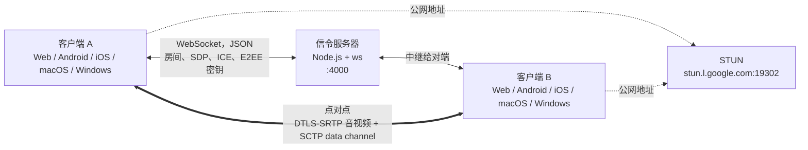

# 工作原理

两端通过一个小型 WebSocket 信令服务器加入同一个房间。服务器只负责中继控制消息：SDP offer 和 answer、ICE candidate 以及 E2EE 密钥。音频、视频和聊天都通过 WebRTC **在两端之间直接传输**。Google 的公共 STUN 服务器帮助每一端获取自己的公网地址。

这是默认模式，一个房间容纳两个人。[多人通话](/zh/how-it-works/group-calls)是一种可选模式，所有人改为连接到一个小型 SFU 服务器。

## 组成部分 {#the-pieces}

| 部分 | 技术栈 | 从这里开始读 |
| --- | --- | --- |
| 信令服务器 | Node.js、`ws` | [`server.js`](gh:signaling-server/server.js) |
| SFU 服务器（可选） | Go、Pion | [`sfu-server/`](gh:sfu-server) |
| Web | Vue 3、TypeScript、Vite | [`useCall.ts`](gh:web/src/call/useCall.ts) |
| Android | Kotlin、Jetpack Compose、webrtc-sdk | [`PeerConnectionClient.kt`](gh:android/app/src/main/java/com/example/myapplication/webrtc/PeerConnectionClient.kt) |
| iOS | Swift、SwiftUI、webrtc-sdk | [`PeerConnectionClient.swift`](gh:ios/WebRTCDemo/PeerConnectionClient.swift) |
| macOS | Swift、SwiftUI + AppKit，复用 iOS 的通话引擎 | [`WebRTCDemoMacApp.swift`](gh:ios/WebRTCDemoMac/WebRTCDemoMacApp.swift) |
| Windows | C#、WinUI 3，通过 C shim 调用 libwebrtc | [`CallViewModel.cs`](gh:windows/src/WebRtcDemo.Core/Call/CallViewModel.cs) |

<PlatformPicker />

## 每个客户端都遵守的规则 {#rules-every-client-follows}

五个相互独立的应用之所以能互相通话，靠的就是下面这几条约定。每一条都有单独的页面详细说明。

- **已在房间里的一端发起 offer**，后加入的一端回复 answer，双方永远不会同时发起 offer。[信令](/zh/how-it-works/signaling)
- **聊天通道在第一个 offer 之前就已创建**，所以打开聊天不会触发重新协商。[聊天](/zh/how-it-works/chat)
- **在摄像头、屏幕和文件之间切换不会重新协商。** 视频 sender 保持不变，变的只是给它输送画面的来源。[切换视频源](/zh/how-it-works/media-sources)
- **摄像头状态通过消息传递。** 被禁用的 track 仍然会发送黑帧，所以每一端都用 `media state` 告诉对端，并在 track 变化前或后 300 ms 发送。[摄像头和麦克风状态](/zh/how-it-works/media-state)
- **E2EE 使用统一的帧格式和统一的密钥选项**，开启时 VP8 排在首位。[端到端加密](/zh/how-it-works/e2ee)
- **不会自动重连。** 信令 socket 一旦关闭，通话就结束。[信令](/zh/how-it-works/signaling#losing-the-signaling-socket)

完整的仓库结构，包括每个文件及其作用，见 [`ARCHITECTURE.md`](gh:ARCHITECTURE.md#2-repository-layout)。
