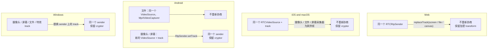
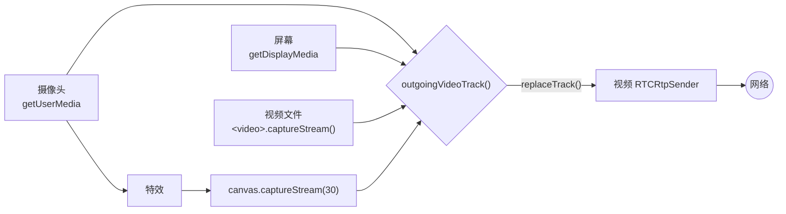

# 切换视频源

通话中可以发送摄像头、屏幕或窗口、视频文件，开启背景时则发送特效处理后的画面。在它们之间切换永远不会重新协商：视频 sender 保持不变，变的只是给它输送画面的来源。

这样做有两个原因：

- **E2EE。** frame cryptor 绑定在一个 sender 和一个 receiver 上。sender 不变，加密就能一直生效。
- **稳定性。** 重新协商会让双方重建接收 stream，视频解码器也随之重建。在 Android 上，这种情况发生后远端视频会在几帧之后卡住。

## 各平台的实现 {#how-each-platform-does-it}

| 平台 | 摄像头 ↔ 屏幕 | 摄像头 ↔ 文件 |
| --- | --- | --- |
| Web | `replaceTrack()` | `replaceTrack()` |
| iOS、macOS | 同一个 `RTCVideoSource`，换一个采集器 | 同一个 `RTCVideoSource`，换一个采集器 |
| Android | 新的视频 track，`RtpSender.setTrack()` | 同一个 `VideoSource`，新的采集器 |
| Windows | 同一个 sender 上换新 track | 同一个 sender 上换新 track |

Android 给屏幕单独创建了一个 `VideoSource`，因为只有 screencast 类型的 source 会在带宽不足时降低帧率而不是分辨率。所有平台都不会替换麦克风 track，所以共享期间静音依然有效。

## 以 Web 客户端为例 {#the-web-client-as-an-example}

每个来源都有自己的 track。[`media.ts`](gh:web/src/call/media.ts) 中的 `outgoingVideoTrack()` 负责选出要发送的那一个：正在共享时选屏幕或文件，否则开启了特效就选特效 canvas，再否则选摄像头。`syncVideo()` 通过 `replaceTrack()` 把它放到 sender 上。

开始共享时会关闭摄像头，停止共享后再重新打开。

## 没有摄像头时开始通话 {#starting-without-a-camera}

通话可以在没有摄像头的情况下开始：摄像头被其他应用占用（Windows 同一时间只允许一个应用使用摄像头）、没有接摄像头，或者访问被阻止。即便如此，视频 sender 依然存在：

- 1:1 通话的 offer 方会添加一个不带 track 的 `sendrecv` 视频 transceiver。
- answer 方在回复之前，会把 offer 中的 `recvonly` 视频 transceiver 改成 `sendrecv`。
- 多人通话的 publish 连接始终带有一个 `sendonly` 视频 transceiver。
- Windows 会在 sender 上放一个占位 track。

之后打开摄像头时，只需要把一个 track 放到这个 sender 上。如果摄像头打不开，会弹出提示说明原因：被其他应用占用、被阻止，或者没有摄像头。

## 各平台的屏幕共享 {#screen-sharing-per-platform}

| 平台 | 实现方式 |
| --- | --- |
| Web | `getDisplayMedia()` |
| Android | `MediaProjection` 加前台服务（[`ScreenCaptureService.kt`](gh:android/app/src/main/java/com/example/myapplication/ScreenCaptureService.kt)）。旋转手机时会调整虚拟显示器的尺寸。 |
| iOS | 由 ReplayKit 广播扩展通过 Unix socket 把 JPEG 帧发送给应用。见 [iOS](/zh/platforms/ios#screen-sharing)。 |
| macOS | ScreenCaptureKit（`SCStream`），选择器中显示实时缩略图。 |
| Windows | libwebrtc 的桌面采集器，选择器中显示实时缩略图。 |

读取视频文件的方式：Web 用 `<video>.captureStream()`，Android 用 `Mp4VideoCapturer`，iOS 用 `RTCFileVideoCapturer`，Mac 用 `AVAssetReader`，Windows 用 Media Foundation。所有平台都会循环播放。
