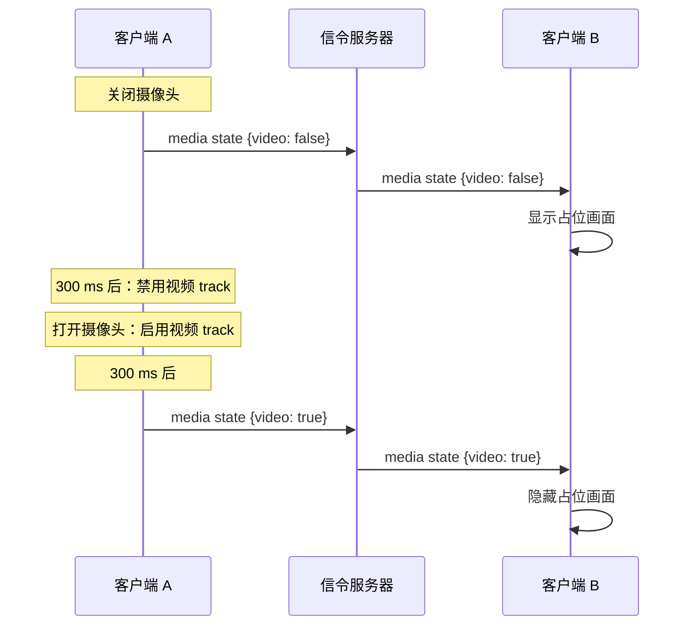

# 摄像头和麦克风状态

被禁用的视频 track 并不会停止发送，而是改为发送黑帧。所以对端仅凭画面无法区分"摄像头关了"和"房间太暗"。因此每个客户端都会用一条 `media state` 消息报告自己的状态：

```json
{ "type": "media state", "state": { "audio": true, "video": false, "screen": false } }
```

每次状态变化时都会发送，在两端连接成功时还会再发一次，这样后加入的人也能拿到当前状态。共享屏幕或视频文件期间，`screen` 为 true，接收方会以 fit 方式（显示完整画面）而不是裁剪的方式显示这路视频。

## 300 ms 规则 {#the-300-ms-rule}



- **关闭摄像头**时，先发送状态，300 ms 后再禁用 track。对端会在第一帧黑帧到达之前切换到占位画面。
- **打开摄像头**时，先启用 track，300 ms 后再发送状态。对端要等真实画面开始传输才切换回来，所以永远不会显示卡住的最后一帧。

关闭摄像头时也会释放摄像头设备，所以摄像头指示灯会熄灭。

## 占位画面 {#the-placeholder}

<DemoMedia src="/media/camera-off.png" :width="320">
手机（Android 或 iOS）上的 1:1 通话，对方已关闭摄像头：对方模糊处理过的最后一帧铺满屏幕，前面是一个圆形渐变头像。最好在对方说话时截图，这样能看到头像周围的圆环。
</DemoMedia>

当对方的视频关闭时（无论是对方自己关的，还是你隐藏的），每个应用都会在渐变头像后面显示一张模糊处理过的对方最后一帧：

- 这张图很小，只有 36 px 宽，每 500 ms 截取一次。接近全黑的帧（比如被禁用的 track 发出的帧）会被跳过。
- 头像颜色由房间 ID 的哈希值决定，所以同一个房间在每个平台上画出的头像都一样。
- 头像周围的圆环跟随 `getStats()` 中远端的 `audioLevel`（`inbound-rtp`，音频）变化，只在占位画面可见时才轮询。

各平台怎么截取这张快照，比看上去要重要。iOS 在一个小型 video sink 中从 CPU 帧上拷贝。Android 则在渲染器绘制完成后从中读回（`EglRenderer.addFrameListener`），因为在 track sink 里用 `toI420()` 转换解码器纹理会阻塞解码器线程，导致远端视频卡住。

| 平台 | 代码位置 |
| --- | --- |
| Web | [`PeerPlaceholder.vue`](gh:web/src/components/call/PeerPlaceholder.vue) |
| Android | [`FrameSnapshotter.kt`](gh:android/app/src/main/java/com/example/myapplication/ui/video/FrameSnapshotter.kt)、[`PeerPlaceholder.kt`](gh:android/app/src/main/java/com/example/myapplication/ui/call/PeerPlaceholder.kt) |
| iOS、macOS | [`VideoView.swift`](gh:ios/WebRTCDemo/VideoView.swift)、[`PeerPlaceholderView.swift`](gh:ios/WebRTCDemo/PeerPlaceholderView.swift) |
| Windows | [`RemoteSnapshotter.cs`](gh:windows/src/WebRtcDemo.Core/Media/RemoteSnapshotter.cs)、[`RemotePlaceholder.cs`](gh:windows/src/WebRtcDemo.App/Views/RemotePlaceholder.cs) |

## 自己的麦克风音量 {#your-own-microphone-level}

麦克风打开时，你自己的小窗上会显示三根随声音跳动的小音量条，让你确认麦克风在正常工作。Web 客户端用 Web Audio 的 analyser 测量麦克风 track。原生应用在通话中测量的是 WebRTC 实际发送的音频。在 1:1 房间里独自等待时还没有 peer connection，所以它们会直接读取麦克风来显示音量，并在 WebRTC 开始录音之前释放麦克风。

## 只在本地生效的操作 {#things-that-stay-local}

把对方静音或隐藏对方的视频，只是在你的设备上禁用远端 track，不会发送任何消息。在 iOS 上，`setRemoteAudioEnabled()` 也会作用于之后重新协商时新增的 receiver。

这条规则在每个平台上都集中在一处实现，由 1:1 和多人通话引擎共用：Web 端是 [`media.ts`](gh:web/src/call/media.ts)，Android 是 [`LocalMedia.kt`](gh:android/app/src/main/java/com/example/myapplication/webrtc/LocalMedia.kt)，iOS 和 macOS 是 [`CallViewModel.swift`](gh:ios/WebRTCDemo/CallViewModel.swift)，Windows 是 [`CallViewModel.cs`](gh:windows/src/WebRtcDemo.Core/Call/CallViewModel.cs)。
