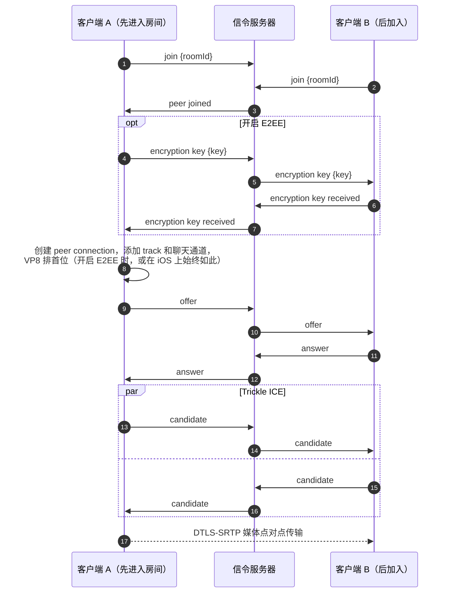
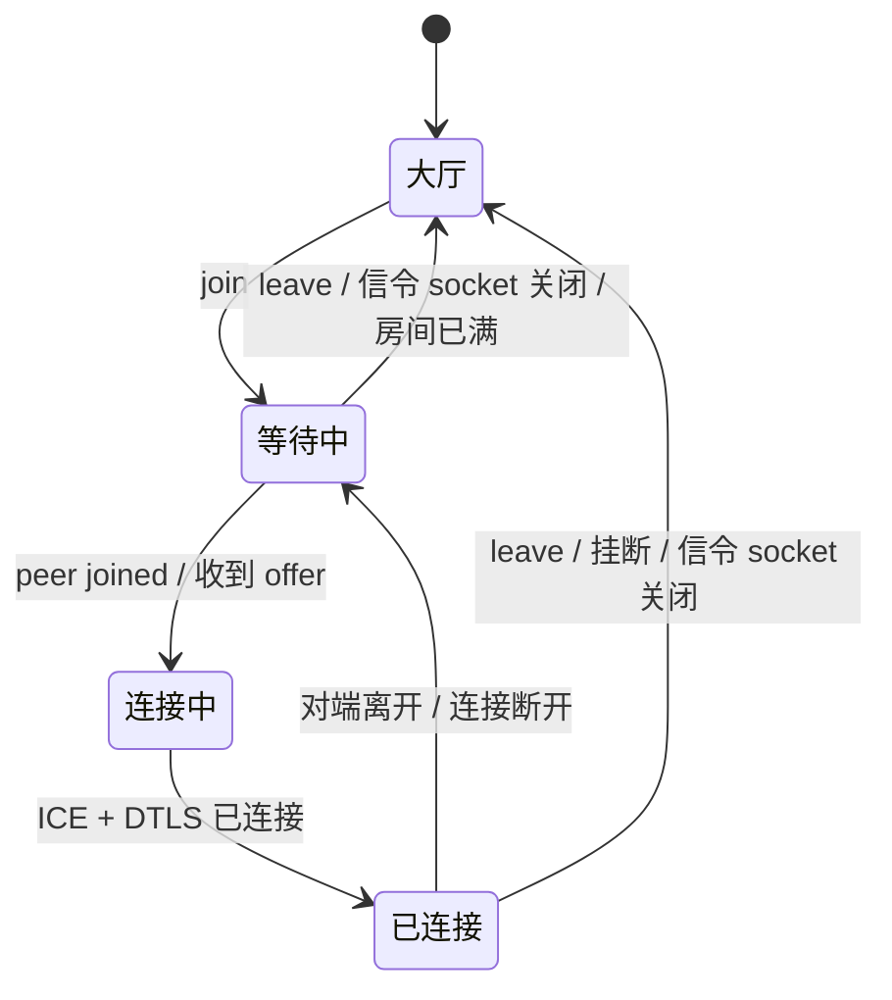

# 信令与建立通话

WebRTC 本身并不规定两端如何找到彼此。在媒体开始传输之前，双方必须通过其他某个通道交换 SDP offer、SDP answer 和 ICE candidate。在这里，这个通道就是连接到一个小型服务器的 WebSocket。

## 服务器 {#the-server}

[`signaling-server/server.js`](gh:signaling-server/server.js) 是一个普通的 Node.js HTTP 服务器，在 `/ws` 上提供 WebSocket 端点。每条消息都是带有 `type` 字段的 JSON 文本帧。服务器在内存中维护房间，每个房间最多配对两个 socket，并把消息中继给房间里的**另一个** socket。它从不解析 SDP，也从不接触媒体。

- `GET /` 返回 `{"name":"signaling-server","ok":true}`。各客户端的大厅每 5 秒轮询一次，用来显示状态指示点。
- 服务器每 25 秒 ping 一次所有 socket，没有响应的会被断开。这样断网的手机会释放它占用的位置。
- WebSocket 保证消息顺序，所以在 offer 之前发送的密钥一定会先于这个 offer 到达。

## 一次通话的完整过程 {#a-call-step-by-step}

逐条点击查看一次真实通话中的消息。关闭 E2EE 可以看到更短的流程。

<CallFlow />

用时序图表示是这样的：

所有消息及其字段见[消息](/zh/reference/messages#one-to-one-calls)。

## 由谁发起 offer {#who-makes-the-offer}

**已经在房间里**的一端总是发起 offer，后来的一端回复 answer。这一条规则就消除了一整类问题：双方永远不会同时发起 offer（glare），一端也永远不会从 answer 方变成 offer 方。

重新协商复用同样的 `offer` 和 `answer` 消息，但在正常通话中，没有哪个客户端需要它。切换视频源不会重新协商（[原因](/zh/how-it-works/media-sources)），聊天通道也在第一个 offer 时就已存在（[原因](/zh/how-it-works/chat)）。

## 连接状态 {#connection-states}

通话过程中界面显示的状态：

## 挂断 {#hanging-up}

发送 `leave` 会释放位置，直接关闭 socket 也一样。服务器不会通知对端，对端要靠自己发现：

- data channel 关闭。SCTP 的关闭消息会立即到达，所以 Web 客户端在连接仍然有效时收到它，就当作对方已挂断；
- ICE 连接状态变为 `disconnected` 或 `failed`，这需要几秒钟。

## 信令 socket 断开 {#losing-the-signaling-socket}

没有自动重连。每个客户端在加入时打开 socket，离开时关闭。如果它在通话中关闭（服务器停止、Wi-Fi 切换到 4G、断网时间超过 ping 超时），即使媒体仍在传输，客户端也会**结束通话**，并提示 "Lost the connection to the signaling server"。服务器此时已经释放了位置，所以重新加入就能直接成功。

这样每个客户端都能保持简单。生产环境的应用应该重连并恢复会话。

所有平台还有一条规则：来自已被替换或已关闭的 peer connection 的回调一律忽略。在 Android 上，调用已释放的原生 `PeerConnection` 会导致进程崩溃。

## 服务器地址 {#the-server-address}

每个客户端的大厅都会把你输入的内容规范化为 `scheme://host[:port]`（WebSocket 固定在 `/ws`），与默认值不同时会保存下来。Web 端的实现在 [`serverUrl.ts`](gh:web/src/call/serverUrl.ts)，Android 在 [`SignalingServer.kt`](gh:android/app/src/main/java/com/example/myapplication/settings/SignalingServer.kt)，iOS 和 macOS 在 [`SignalingServer.swift`](gh:ios/WebRTCDemo/SignalingServer.swift)。iOS 和 macOS 允许明文 HTTP（`NSAllowsArbitraryLoads`），Android 设置了 `usesCleartextTraffic`，所以任何局域网服务器都能用。
