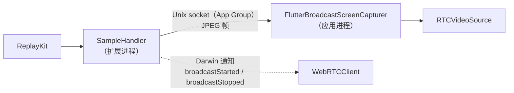

# iOS

一个使用 Liquid Glass 的 SwiftUI 应用，基于 webrtc-sdk `150.7871.01` 二进制包，要求 iOS 26 或更高版本，用 Xcode 26 构建。

<DemoMedia src="/media/call-ios.png" :width="320">
iPhone 停留在主屏幕（或另一个应用中），通话显示在系统画中画窗口里，窗口中是对方的视频。
</DemoMedia>

打开 [`ios/WebRTCDemo.xcodeproj`](gh:ios/WebRTCDemo.xcodeproj)，选择 `WebRTCDemo` scheme，在真机上运行。摄像头和屏幕共享都需要真实硬件。

## 代码结构 {#where-things-are}

文件位于 [`ios/WebRTCDemo`](gh:ios/WebRTCDemo)，其中大部分也会编译进 [Mac 应用](/zh/platforms/macos)。

| 文件 | 作用 |
| --- | --- |
| [`CallViewModel.swift`](gh:ios/WebRTCDemo/CallViewModel.swift) | `@Observable` 的通话状态，持有 `LocalMedia` 以及 1:1 或多人通话引擎。 |
| [`LocalMedia.swift`](gh:ios/WebRTCDemo/LocalMedia.swift) | Factory、本地 track、唯一的 `RTCVideoSource`、共享、音频会话、VP8 优先 |
| [`PeerConnectionClient.swift`](gh:ios/WebRTCDemo/PeerConnectionClient.swift) | `WebRTCClient`，即 1:1 通话引擎：一个 peer connection 和一个 data channel |
| [`GroupCallClient.swift`](gh:ios/WebRTCDemo/GroupCallClient.swift) | 多人通话引擎：SFU WebSocket、publish 和 subscribe 连接 |
| [`SignalingSocket.swift`](gh:ios/WebRTCDemo/SignalingSocket.swift) | 基于 `URLSessionWebSocketTask` 收发 JSON。两个引擎共用。 |
| [`FrameEncryption.swift`](gh:ios/WebRTCDemo/FrameEncryption.swift) | E2EE 的 key provider 和 frame cryptor |
| [`EffectsProcessor.swift`](gh:ios/WebRTCDemo/EffectsProcessor.swift) | Vision + Core Image，作为代理采集器 delegate |
| [`PictureInPicture.swift`](gh:ios/WebRTCDemo/PictureInPicture.swift) | 通过 `AVSampleBufferDisplayLayer` 实现系统画中画 |
| [`VideoView.swift`](gh:ios/WebRTCDemo/VideoView.swift) | `RTCMTLVideoView` 的封装和占位画面的截帧器 |
| [`CallView.swift`](gh:ios/WebRTCDemo/CallView.swift)、[`GroupCallView.swift`](gh:ios/WebRTCDemo/GroupCallView.swift) | 通话界面 |
| [`WebRTCDemoScreenBroadcast/`](gh:ios/WebRTCDemoScreenBroadcast) | ReplayKit 广播扩展 |

`WebRTCClient` 在 WebRTC 线程上调用它的 delegate，view model 会先切换到主队列再修改状态。

## 屏幕共享 {#screen-sharing}

iOS 只允许应用通过 ReplayKit 广播上传扩展（broadcast upload extension）采集整个屏幕，包括离开应用之后的画面。扩展运行在独立的进程中，无法运行 WebRTC，所以它通过共享 App Group 中的 Unix domain socket 把帧发送给应用。然后 `FlutterBroadcastScreenCapturer` 把这些帧送入摄像头所用的**同一个** `RTCVideoSource`。

每一帧都是一条类似 HTTP 的消息：先是 `Content-Length`、`Buffer-Width`、`Buffer-Height` 和 `Buffer-Orientation` 这几个 header，然后是 JPEG 正文。socket 的应用端代码复制自 [flutter-webrtc 插件](https://github.com/flutter-webrtc/flutter-webrtc)。请保持其中的读取逻辑原样不动：只要读取端向 stream 请求读取 0 字节，iOS 就会报告 stream 已结束，广播会在第一帧之后立刻停止。

离开应用后共享还能继续，这需要满足两个条件：

- **应用保持存活。** `UIBackgroundModes` 中包含 `audio` 和 `voip`，并且通话期间会保持一个 `playAndRecord` 音频会话处于激活状态，这样 iOS 就不会挂起应用和它的 socket。
- **编码器保持工作。** 在后台时，iOS 会让 VideoToolbox 的 H264 硬件编码器失效，导致每一帧都编码失败，对方看到的画面就会卡住。因此无论是否开启 E2EE，iOS 都会把 **VP8**（软件编码）排在首位。代价是更耗 CPU 和电量。

应用和扩展必须使用同一个 App Group（`group.com.ducmai.webrtc.broadcast`）。如果你修改了 team 或 bundle ID，需要同步更新两个 `.entitlements` 文件、`Info.plist` 中的 `RTCAppGroupIdentifier`、`SampleHandler.swift`，以及 `RTCScreenSharingExtension` 中的扩展 bundle ID。

## 音频会话 {#the-audio-session}

应用会自己配置音频会话：每次通话前，`CallViewModel.configureCallAudio()` 都会把 WebRTC 的配置设为 `playAndRecord` + `voiceChat`。否则 webrtc-sdk fork 会沿用会话启动时的 category（`soloAmbient`），而 iOS 不接受它与 Bluetooth HFP 选项的组合，结果通话既没有麦克风也没有声音。见[常见问题](/zh/guide/troubleshooting#ios-and-macos)。

## 各部分的实现 {#how-it-does-each-part}

- **切换视频源。** 摄像头、文件和屏幕采集器都向同一个 `RTCVideoSource` 供帧，所以 track、sender 和它的 cryptor 都不会变。[切换视频源](/zh/how-it-works/media-sources)
- **E2EE。** `RTCFrameCryptor`，使用[统一的选项](/zh/how-it-works/e2ee#the-key)。
- **特效。** 在摄像头和 source 之间插入一个代理 `RTCVideoCapturerDelegate`，在 Metal 上运行 Vision 和 Core Image。[背景与特效](/zh/how-it-works/effects#ios-and-macos)
- **画中画。** 视频通话画中画，仅支持 1:1。[画中画](/zh/how-it-works/picture-in-picture#ios)
- **多人通话。** 每个 subscribe offer 都会被解析出 `a=mid` 和 `a=msid`，因为当一个 m-line 被复用给其他人时，libwebrtc 不会触发新的 receiver 事件。[多人通话（SFU）](/zh/how-it-works/group-calls#forwarding)

## 备注 {#notes}

- WebRTC 来自本地 Swift package [`ios/Packages/WebRTC`](gh:ios/Packages/WebRTC)，因为这个版本的 Specs manifest 无法解析。升级时修改它的 `Package.swift` 中的 URL 和校验和即可。
- `Info.plist` 允许明文 HTTP（`NSAllowsArbitraryLoads`），所以任何局域网服务器都能用。
