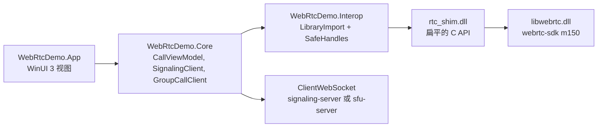

# Windows

一个基于 .NET 10 的 WinUI 3 应用，非打包（unpackaged）、自包含（self-contained），支持 x64 和 ARM64。WebRTC 使用预编译的 [webrtc-sdk/libwebrtc](https://github.com/webrtc-sdk/libwebrtc) `m150.7871.03` 版本，与 Android 和 Apple SDK 同一分支，通过一层很薄的 C shim 调用。

<DemoMedia src="/media/windows-call.png" :width="720">
Windows 应用中的 1:1 通话：对方的视频铺满窗口，你自己的圆角小窗浮在一角，带有 "You" 标签和三根麦克风音量条，底部显示工具栏。
</DemoMedia>

```powershell
cd windows
./native/RtcShim/scripts/build-shim.ps1   # 下载 libwebrtc，构建 rtc_shim.dll
dotnet run --project src/WebRtcDemo.App -p:Platform=x64
```

也可以用 Visual Studio 2026 打开 `WebRtcDemo.slnx`，运行 x64 或 ARM64 配置。测试、发布和故障排查见 [`windows/README.md`](gh:windows/README.md)。

## 分层结构 {#layers}



| 项目 | 作用 |
| --- | --- |
| [`native/RtcShim`](gh:windows/native/RtcShim) | C shim。[`rtc_shim.h`](gh:windows/native/RtcShim/include/rtc_shim.h) 就是它的全部 API。 |
| [`WebRtcDemo.Interop`](gh:windows/src/WebRtcDemo.Interop) | `LibraryImport` 绑定，每个原生对象对应一个 `SafeHandle`，原生回调 |
| [`WebRtcDemo.Core`](gh:windows/src/WebRtcDemo.Core) | 信令、通话状态机、媒体、多人通话引擎。不含 UI，可以在任何操作系统上跑单元测试。 |
| [`WebRtcDemo.Effects`](gh:windows/src/WebRtcDemo.Effects) | 背景和贴纸：ONNX 模型、合成。不含 UI。 |
| [`WebRtcDemo.App`](gh:windows/src/WebRtcDemo.App) | WinUI 3 应用，UI 用 C# 代码构建，而不是 XAML 页面 |

## 为什么需要 C shim {#why-a-c-shim}

libwebrtc 的 API 是 C++ 类：虚方法、`scoped_refptr`、observer 接口，C# 没法直接调用。shim 用 MSVC 和静态 CRT 构建，以匹配 `libwebrtc.dll`，对外导出的是纯 C 接口：

- 需要显式释放的不透明句柄、UTF-8 字符串，以及带 `void* user` 参数的回调；
- 通过回调完成的异步调用（创建 offer、设置 description、获取统计信息）；
- 已关闭的 peer connection 会拒绝调用，而不是直接崩溃；
- video sink 输出的是 BGRA 格式，已经旋转好，并可选缩小尺寸。

在 C# 这一侧，回调是 `UnmanagedCallersOnly` 函数，按 ID 查找目标对象，所以不需要 pin 任何东西，也不会有异常回卷进原生代码。如果你想把 libwebrtc 带到另一种语言，这个头文件很好地展示了一次通话实际需要哪些东西。

## 各部分的实现 {#how-it-does-each-part}

- **信令。** 每次通话一个 `ClientWebSocket`，见 [`SignalingClient.cs`](gh:windows/src/WebRtcDemo.Core/Signaling/SignalingClient.cs)。和其他客户端一样，socket 关闭就结束通话。
- **通话状态。** [`CallViewModel.cs`](gh:windows/src/WebRtcDemo.Core/Call/CallViewModel.cs) 遵循与 Web 和 iOS 客户端相同的流程：房间里已有的一端发起 offer，密钥先于 offer 发送，遵守 300 ms 规则。
- **切换视频源。** [`NativeCallMedia.cs`](gh:windows/src/WebRtcDemo.Core/Media/NativeCallMedia.cs) 在摄像头、屏幕或窗口、文件和特效之间替换视频 sender 上的 track，从而保留 sender 的 cryptor。[切换视频源](/zh/how-it-works/media-sources)
- **摄像头。** shim 和 Windows 自带的"相机"应用一样，通过 Media Foundation 读取摄像头，并从最接近 1280×720、30 fps 的格式开始依次尝试，直到某个格式在 4 s 内输出画面。Media Foundation 读不了的摄像头会改用 libwebrtc 的 DirectShow 采集器。
- **特效。** 把 MediaPipe 模型转换成 ONNX，通过 Windows ML 由 ONNX Runtime 在 GPU 或 NPU 上运行，合成用 C# 实现。[背景与特效](/zh/how-it-works/effects#windows)
- **画中画。** `CompactOverlay` presenter。[画中画](/zh/how-it-works/picture-in-picture#windows)

## 两个值得了解的 Windows 特有问题 {#two-windows-specific-problems-worth-knowing}

**麦克风。** libwebrtc 在 Windows 上的音频设备会把回声消除交给 Windows 的语音采集 DMO，而这个 DMO 只在有音频播放时才会采集。通话通常在收到任何音频之前就开始发送了，多人通话的 publish 连接更是从不播放任何声音，所以录音会失败，而且之后不会重试，结果其他人什么都听不到。shim 把 DMO 排除在音频设备之外，采集直接走 WASAPI，回声消除则由 libwebrtc 自己的 AEC3 完成。

**圆角视频。** `SwapChainPanel` 属于"外部内容"：Windows 会把它绘制在 WinUI 自身渲染层的下方，透过一个"洞"显示出来，所以圆角裁剪对它不起作用。因此这里的每个视频视图改为一个 composition sprite，它的 brush 显示一块与画面同样大小的绘图表面（在 D3D11 设备上调用 `ICompositorInterop::CreateGraphicsDevice` 创建）。这块表面由 compositor 自己绘制，所以视图可以给它加上圆角裁剪。来自 WebRTC 线程的帧会放进一个单槽位的 mailbox，UI 线程在下一次 composition tick 时把它画出来。

## 不用 Windows 也能测试 {#testing-without-windows}

[`windows/scripts/verify.sh`](gh:windows/scripts/verify.sh) 会基于 Linux 版 libwebrtc 构建 shim，运行它的 loopback 测试（同一进程内的两个加密对端），针对它运行所有 .NET 测试，并为 x64 和 ARM64 编译应用。Linux 上需要有音频服务器，否则 libwebrtc 会直接 abort。用 PulseAudio 加一个 null sink 就够了。
